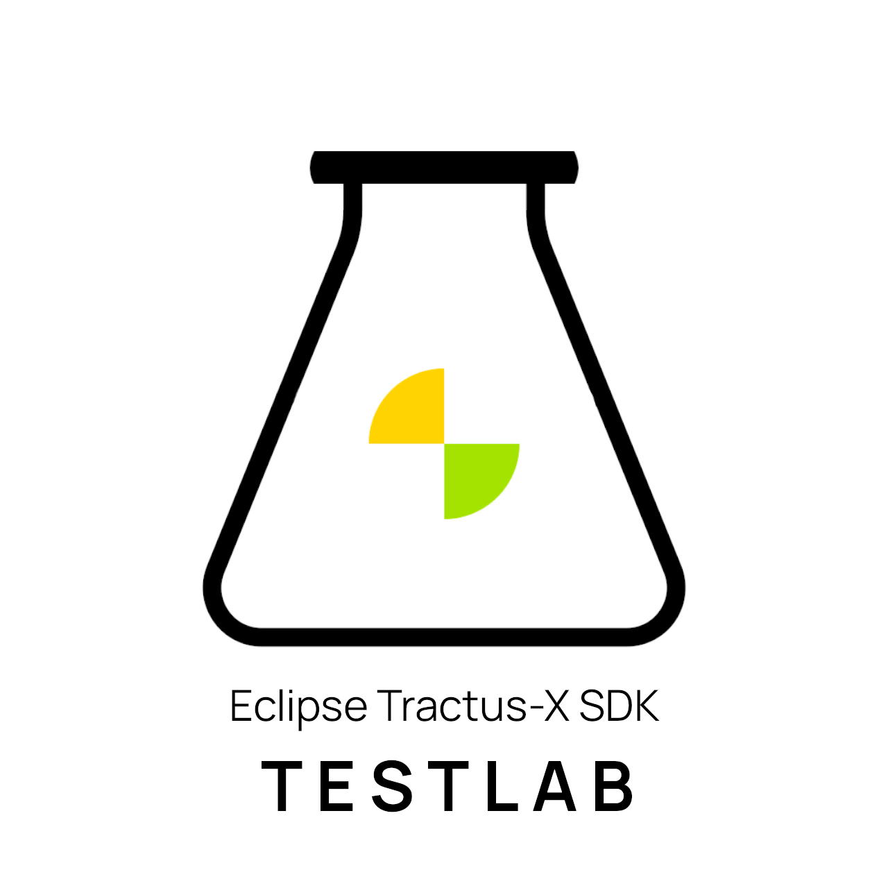

<p align="center">
  <picture>
    <source media="(prefers-color-scheme: dark)" srcset="docs/media/test-lab-app-logo-black-claim.png">
    <source media="(prefers-color-scheme: light)" srcset="docs/media/test-lab-app-logo-white-claim.png">
    
  </picture>
</p>

# Eclipse Tractus-X Test Lab

[](LICENSE)
[](https://www.python.org/downloads/)
[](https://eclipse-tractusx.github.io/tractusx-testlab/main/)

**TestLab** is the testing framework built into the [Tractus-X SDK](https://github.com/eclipse-tractusx/tractusx-sdk). It enables you to author, compile, distribute, and execute automated test cases against dataspace connectors and industry services — without writing any Python code.

Test authors write **declarative YAML tests** describing the steps to execute, the services to connect to, the assertions to evaluate, and the cleanup to perform. TestLab takes care of the rest: validation, encryption, packaging, execution, and structured reporting.

## Table of Contents

- [Key Components](#key-components)
- [How It Works](#how-it-works)
- [Getting Started](#getting-started)
- [Usage](#usage)
- [Documentation](#documentation)
- [Contributing](#contributing)
- [License](#license)
- [NOTICE](#notice)

## Key Components

- **Tests** — YAML-defined test sequences composed of reusable, predefined steps
- **Compiler** — Validates tests at compile time and packages them into portable, encrypted-by-default `.tckpkg` artifacts
- **Player** — An async executor deployable as standalone CLI or embeddable in an existing application, with cryptographic identity for package authorization
- **Services** — Managed SDK service lifecycle for connector, provider, and DTR instances with automatic initialization and reuse across steps
- **Server** — FastAPI-based callback/webhook engine with dynamically mounted routes for async request/response patterns

## How It Works

Tests can declare long-lived services that persist for the test duration (avoiding repeated initialization), configure callback endpoints to receive async responses, and leverage runtime variable resolution. These tests are compiled with strict validation, packaged into distributable artifacts, and executed by the Player — which resolves runtime variables, manages step sequencing, evaluates assertions, orchestrates managed services, and provides live execution status.

Tests with steps like (e.g., `provision_asset`, `negotiate_contract`, `validate_aspect_model`) can be included inside of test cases, which enable reusability and personalized configurations for different scenarios.

## Getting Started

Please refer to the [INSTALL.md](INSTALL.md) for installation instructions.

## Usage

Once installed, the `testlab` command-line interface is available. The typical workflow is **generate keys → validate → compile → run**:

```bash
# Generate the cryptographic identities used to sign and encrypt packages
testlab keygen --out-dir ./keys

# Validate a YAML test script before compiling
testlab validate my-test.yaml

# Compile a validated script into a portable, encrypted .tckpkg artifact
testlab compile my-test.yaml --compiler-keys ./keys/compiler --player-pub ./keys/player/encryption.pub --output my-test.tckpkg

# Run a YAML manifest or a compiled .tckpkg package
testlab run my-test.tckpkg --config config.yaml

# Start the FastAPI callback/webhook server
testlab serve --host 0.0.0.0 --port 8000
```

Run `testlab --help` (or `testlab <command> --help`) to see all available commands and options.

## Documentation

Detailed documentation is available in the [docs](docs/) directory and is published online at
[eclipse-tractusx.github.io/tractusx-testlab](https://eclipse-tractusx.github.io/tractusx-testlab/main/).

- [IDE Guide](docs/ide/index.md) — Author tests visually with the block editor, no code required
- [YAML Specification](docs/specification/index.md) — Test file format reference
- [Tutorials](docs/tutorials/index.md) — Step-by-step walkthroughs
- [API Reference](docs/api-reference/index.md) — Python library docs

## Contributing

Please refer to the [CONTRIBUTING.md](CONTRIBUTING.md) file for information on how to contribute to this project.

## License

Distributed under the Apache License 2.0. See [LICENSE](LICENSE) for code and [LICENSE_non-code](LICENSE_non-code) for non-code content.

## NOTICE

This work is licensed under the [Apache-2.0](https://www.apache.org/licenses/LICENSE-2.0).

- SPDX-License-Identifier: Apache-2.0
- SPDX-FileCopyrightText: 2026 Contributors to the Eclipse Foundation
- SPDX-FileCopyrightText: 2026 Catena-X Automotive Network e.V.
- Source URL: https://github.com/eclipse-tractusx/tractusx-testlab
