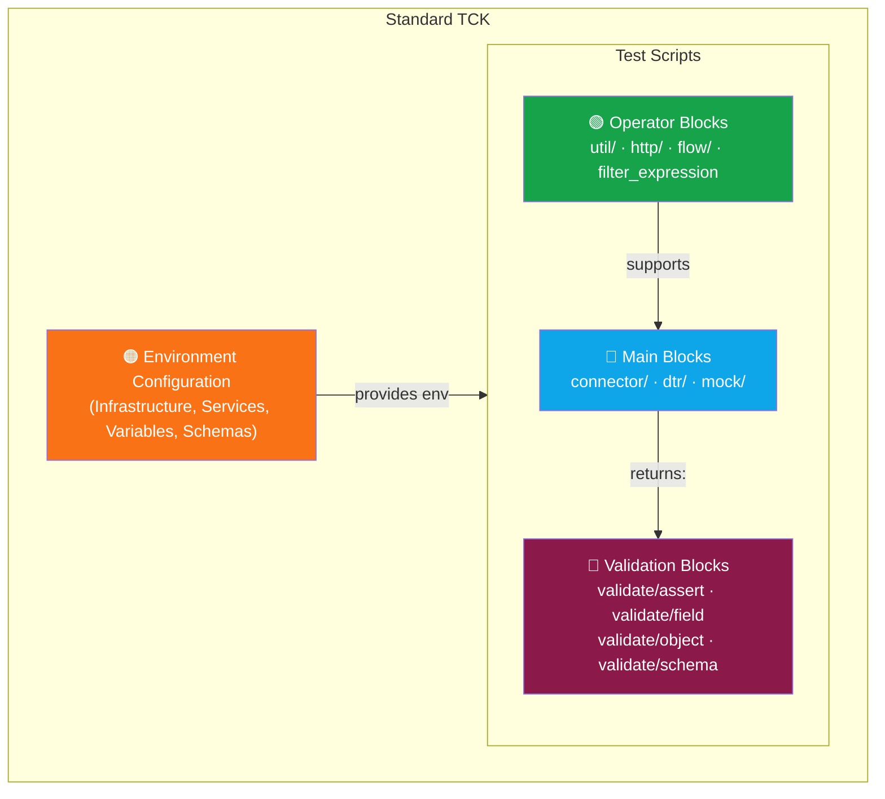

<!--
 Eclipse Tractus-X - Tractus-X TestLab

 Copyright (c) 2025 Contributors to the Eclipse Foundation

 See the NOTICE file(s) distributed with this work for additional
 information regarding copyright ownership.

 This program and the accompanying materials are made available under the
 terms of the Apache License, Version 2.0 which is available at
 https://www.apache.org/licenses/LICENSE-2.0.

 Unless required by applicable law or agreed to in writing, software
 distributed under the License is distributed on an "AS IS" BASIS,
 WITHOUT WARRANTIES OR CONDITIONS OF ANY KIND, either express or implied.
 See the License for the specific language governing permissions and
 limitations under the License.

 SPDX-License-Identifier: Apache-2.0
-->
<!-- This code was partially generated using artificial intelligence (AI) (Tool: Copilot, Model: Claude Opus 4.6). -->
<!-- It was reviewed and tested by a human committer. -->

# API Reference

Reference documentation for TestLab's block-based test authoring system.

---

## Architecture Overview

A standard TCK test suite has three block tiers plus one configuration layer:



### Three Tiers

- **Main Blocks** (blue) are domain-specific. They understand Tractus-X protocols (DSP, EDC Management API, AAS). They interact with connectors, registries, and mock services.
- **Operator Blocks** (green) are generic utilities. They handle HTTP, JSON extraction, flow control, and filtering. They support main blocks without knowing about Tractus-X.
- **Validation Blocks** (red) check results. They receive return variables from steps and assert conditions. They never execute actions — only verify.
- **Environment Configuration** (orange) is defined in the TCK manifest. Services, variables, and schemas provide the runtime context for all test scripts.

Data flows: Main blocks `returns:` values → Validation blocks check them. Operator blocks support main blocks (HTTP calls, retries, UUID generation). Environment config provides services and variables to all blocks via `${{ env.x }}` interpolation.

### Design Rationale

The TestLab YAML syntax draws inspiration from established CI/CD and infrastructure-as-code tools:

| Inspiration | What We Took |
|-------------|-------------|
| **GitHub Actions** | `uses:` / `with:` pattern, namespaced identifiers, composable steps |
| **Bruno / Newman** | Variable scoping model: `env.` vs `vars.`, secret masking |
| **Terraform / OpenTofu** | Services declared once, referenced by name — same test logic across environments |
| **pytest / JUnit** | Setup/teardown model: setup → test → implicit teardown |

| Decision | Rationale |
|----------|-----------|
| `uses:` not `type:` | `uses:` is a verb — "this step uses this capability" |
| Namespaces (`connector/provider/create_asset`) | Flat names don't scale across 27+ blocks. Reads like a REST path. |
| `with:` not positional args | Named parameters are self-documenting |
| `returns:` not `outputs:` | Functions "return" values. "Output" is overloaded. |
| Separate Main / Operators / Validators | Three distinct concerns: DO things, CONFIGURE behavior, CHECK results |

For detailed rationale: [ADR-0010: YAML Syntax v2](../developer/decision-records/shared/ADR-0010-yaml-syntax-v2.md)

---

## Sections

| Section | Description |
|---------|-------------|
| [Block & Assertion Reference](blocks.md) | Full catalog of all blocks by category |
| [TCK Manifest](blocks/manifest.md) | Environment configuration format |

---

## CLI Reference

| Command | Description |
|---------|-------------|
| `testlab compile <source>` | Compile a TCK source directory into a `.tck` or `.stck` package |
| `testlab run <package>` | Execute a compiled TCK package against a live dataspace |
| `testlab validate <package>` | Validate a compiled TCK package without executing steps |
| `testlab inspect <package>` | Extract and display static metadata (name, steps, validations) without running the TCK |

### `testlab inspect`

Inspects a compiled `.tck` or `.stck` package and prints its static metadata without
executing any steps against a live environment.

```
testlab inspect <package> [--player-keys <path>] [--compiler-pub <path>] [--variables] [--infrastructure] [--json]
```

| Option | Description |
|--------|-------------|
| `<package>` | Path to a `.tck` (plain) or `.stck` (encrypted) file |
| `--player-keys` | Path to player RSA private key file — required for `.stck` packages |
| `--compiler-pub` | Path to compiler RSA public key file — required for `.stck` packages |
| `--variables` | Also print the variable list (ID, source, scope, type) declared in the TCK |
| `--infrastructure` | Also print the infrastructure requirements (capability, side, required, standard) declared in the TCK |
| `--json` | Output a machine-readable JSON envelope instead of the human-readable table |

**Default output** (human-readable table):

```
TCK: Certificate Management Conformity
  Total Steps       : 12
  Total Validations : 8

  Script: request-certificate  |  ID: request_certificate.yaml  |  Skippable: No
  ┌────────────────────────────────────────────────┬────────────────────────────────────────────────┬───────────┬─────────────┐
  │ Step Name                                      │ Uses                                           │ Phase     │ Validations │
  ├────────────────────────────────────────────────┼────────────────────────────────────────────────┼───────────┼─────────────┤
  │ Request certificate                            │ connector/consumer/request_certificate         │ Execution │ 2           │
  └────────────────────────────────────────────────┴────────────────────────────────────────────────┴───────────┴─────────────┘

  Script: catalog_policy_validation  |  ID: catalog_policy_validation.yaml  |  Skippable: Yes
  ┌────────────────────────────────────────────────┬────────────────────────────────────────────────┬───────────┬─────────────┐
  │ Step Name                                      │ Uses                                           │ Phase     │ Validations │
  ├────────────────────────────────────────────────┼────────────────────────────────────────────────┼───────────┼─────────────┤
  │ Validate catalog policy                        │ validate/assert                                │ Execution │ 3           │
  └────────────────────────────────────────────────┴────────────────────────────────────────────────┴───────────┴─────────────┘
```

**JSON output** (`--json` flag) — returns an envelope with the requested sections:

```json
{
  "inspection": {
    "name": "Certificate Management Conformity",
    "total_steps": 12,
    "total_validations": 8,
    "scripts": [
      {
        "name": "request-certificate",
        "test_id": "request_certificate.yaml",
        "skippable": false,
        "steps": [
          {
            "step_name": "Request certificate",
            "uses": "connector/consumer/request_certificate",
            "phase": "EXECUTION",
            "validation_count": 2
          }
        ]
      },
      {
        "name": "catalog_policy_validation",
        "test_id": "catalog_policy_validation.yaml",
        "skippable": true,
        "steps": [
          {
            "step_name": "Validate catalog policy",
            "uses": "validate/assert",
            "phase": "EXECUTION",
            "validation_count": 3
          }
        ]
      }
    ]
  },
  "variables": [
    { "id": "provider_bpn", "source": "input", "scope": "sut",    "type": "string" },
    { "id": "testlab_management_url", "source": "input", "scope": "engine", "type": "string" },
    { "id": "certificate_type",  "source": "value", "scope": null, "type": "string" }
  ],
  "infrastructure": {
    "engine": { "connector": { "required": true, "standard": null } },
    "sut":    { "connector": { "required": true, "standard": null } }
  }
}
```

`variables` and `infrastructure` keys are only populated when their respective flags
(`--variables`, `--infrastructure`) are passed; otherwise their values are `null`.

The `inspection` key (step/validation counts) is always populated. Import the result
models directly from the library:

```python
from tractusx_testlab.models import (
    TckInspectionResult, ScriptInspection, StepMeta,   # inspection
    VariableDefinition, VariableScope, VariableSource,  # variables
    InfrastructureConfig, CapabilityRequirement,        # infrastructure
    ScriptStatus, SkipNotAllowedError,                  # skip configuration
)
```

---

### `testlab run` — Skipping Optional Tests

Tests marked `skippable: true` in the TCK manifest can be bypassed at runtime via the
`skip_tests` runtime variable. Skipped tests produce a `SKIPPED` result and are **not**
counted as failures.

**Single test:**

```bash
testlab run index.yaml \
  --var skip_tests=catalog_policy_validation.yaml \
  --config your-env.yaml
```

**Multiple tests** — use a config YAML (repeating `--var` overwrites the previous value):

```yaml
# skip.yaml
skip_tests:
  - catalog_policy_validation.yaml
  - error_handling.yaml
```

```bash
testlab run index.yaml --config skip.yaml
```

**Error handling** — validation runs *before* any test executes. Requesting a skip on
an unknown or non-skippable test raises `SkipNotAllowedError` immediately:

```
Error: Cannot skip test(s) 'request_certificate.yaml': not marked skippable.
Set skippable: true on the test entry in the TCK manifest to allow skipping.
```

!!! note "Author opt-in required"
    A test can only be skipped at runtime when the TCK author has set
    `skippable: true` on that test entry. Tests without this flag cannot be bypassed,
    protecting mandatory conformance checks.

For the architectural rationale see
[ADR-0024: Test-Level Skip Configuration](../developer/decision-records/backend/ADR-0024-test-skip-configuration.md).
