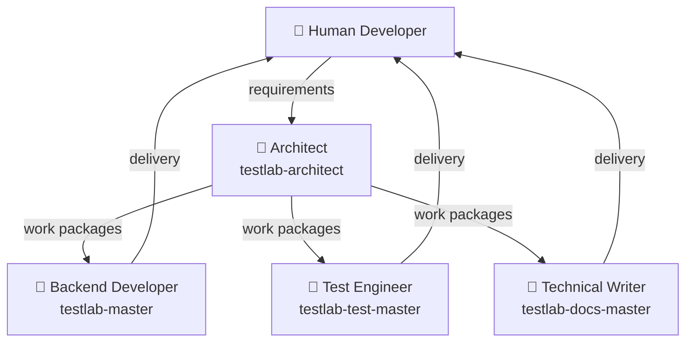

<!--
 Eclipse Tractus-X - Tractus-X TestLab

 Copyright (c) 2026 Contributors to the Eclipse Foundation

 See the NOTICE file(s) distributed with this work for additional
 information regarding copyright ownership.

 This program and the accompanying materials are made available under the
 terms of the Apache License, Version 2.0 which is available at
 https://www.apache.org/licenses/LICENSE-2.0.

 Unless required by applicable law or agreed to in writing, software
 distributed under the License is distributed on an "AS IS" BASIS, WITHOUT
 WARRANTIES OR CONDITIONS OF ANY KIND, either express or implied. See the
 License for the specific language governing permissions and limitations
 under the License.

 SPDX-License-Identifier: Apache-2.0
-->
<!-- This code was partially generated using artificial intelligence (AI) (Tool: Copilot, Model: Claude Opus 4.6). -->
<!-- It was reviewed and tested by a human committer. -->

# AI-Assisted Development

This project uses a **multi-agent AI architecture** to accelerate development while maintaining quality standards. This guide explains how to work with the AI agents, how to give them effective instructions, and what guardrails are in place.

## Agent Architecture

The project has four specialized AI agents, organized as a team. The architect plans and hands approved work packages directly to the owning specialist — there is no orchestrator.



| Agent | File | Expertise |
|-------|------|-----------|
| **Architect** | `.github/agents/testlab-architect.agent.md` | Planning, impact analysis, work package design — never writes code |
| **Backend Developer** | `.github/agents/testlab-master.agent.md` | Python 3.12+, Pydantic, async, tractusx-sdk |
| **Test Engineer** | `.github/agents/testlab-test-master.agent.md` | pytest, fixtures, factories, mocking, coverage |
| **Technical Writer** | `.github/agents/testlab-docs-master.agent.md` | MkDocs, tutorials, API docs, diagrams, guides |

## How to Use the Agents

### Option 1: Plan with the Architect (Recommended)

For any non-trivial task, talk to `testlab-architect`. It will:

1. Analyze the requirement
2. Break it into work packages
3. Identify the owning specialist for each package
4. Hand the approved work packages directly to that specialist

The architect never writes code — it plans and advises. The specialist that receives a work package delivers it.

!!! tip "Best for"
    Complex refactors, multi-file changes, anything requiring planning before implementation.

**Example prompt:**

```
Add a new "Notification" capability with send and receive step types.
Plan the work packages and hand them to the backend and test specialists.
```

### Option 2: Talk to a Specialist Agent Directly

For focused, single-concern tasks, you can talk directly to the specialized agent.

!!! tip "Best for"
    Bug fixes in one file, adding a single Python step executor, documenting one command.

**Example — Backend agent:**

```
@testlab-master Add a new step executor `http_download` that downloads
a file from a URL and saves it to a temp directory. Follow the pattern
in steps/http/request.py.
```

**Example — Test engineer:**

```
@testlab-test-master The scripting parser has zero test coverage.
Write tests for `src/tractusx_testlab/scripting/parser.py` covering
valid YAML parsing, malformed input rejection, and dependency resolution.
```

**Example — Technical writer:**

```
@testlab-docs-master Document the new CLI `testlab compile` command.
Add a page under Tutorials explaining the compile workflow with
examples. Update the nav in mkdocs.yml.
```

## Writing Effective Prompts

The quality of AI output is directly proportional to the quality of your prompt. Follow these patterns:

### The 5-Part Prompt Formula

Every non-trivial task should include:

1. **Goal** — What to build (one sentence)
2. **Context** — Which files to read, which patterns to follow
3. **Scope** — Exact files to create or modify
4. **Acceptance criteria** — How to verify success
5. **Constraints** — What NOT to do

### Good Prompt Example

```
TASK: Add a `wait_for_callback` step executor.

CONTEXT: Read `src/tractusx_testlab/steps/connector/consume.py` for the
pattern. This step waits for an HTTP callback on the mock server.

CREATE: `src/tractusx_testlab/steps/flow/wait_callback.py`
UPDATE: Register in `src/tractusx_testlab/steps/__init__.py`

ACCEPTANCE:
- `python -m pytest tests/ -x -q` passes
- `python -c "from tractusx_testlab.steps.flow.wait_callback import WaitCallbackStep"` works

CONSTRAINTS:
- Do NOT modify the mock server code
- Do NOT add new dependencies
- Keep the file under 300 lines
```

### Bad Prompt Example

```
Add a wait step that waits for callbacks
```

This is bad because it's missing context, scope, acceptance criteria, and constraints. The agent will guess, and guesses produce spaghetti.

### Prompt Patterns by Task Type

=== "New Feature"

    ```
    TASK: [one-sentence goal]
    READ FIRST: [existing file with the pattern to follow]
    CREATE: [new files]
    UPDATE: [existing files to modify]
    ACCEPTANCE: [commands that must succeed]
    CONSTRAINT: [what NOT to do]
    ```

=== "Bug Fix"

    ```
    BUG: [what's broken — exact symptoms]
    EXPECTED: [what should happen]
    ACTUAL: [what happens instead]
    REPRODUCE: [steps or commands to see the bug]
    LIKELY CAUSE: [your hypothesis, if any]
    ```

=== "Refactoring"

    ```
    REFACTOR: [file] is [N] lines, violating the 300-line limit.
    EXTRACT: [what to move and where]
    KEEP: [what must stay in the original file]
    VERIFY: [commands to run after]
    CONSTRAINT: No behavior changes — pure refactor.
    ```

=== "Code Review"

    ```
    REVIEW: [file or directory]
    CHECK FOR: [specific concerns — performance, security, patterns]
    REPORT: issues found with specific fixes
    ```

## Quality Guardrails

Every agent has a **Mandatory Self-Review Checklist** that runs before delivering code. These are enforced automatically:

### Python Quality Gates

| Check | Command | Expected |
|-------|---------|----------|
| File size | `find src -name '*.py' \| xargs wc -l \| awk '$1 > 300'` | Empty output |
| Exception handling | `grep -rn "except Exception:" src/` | Zero matches |
| No print | `grep -rn "print(" src/ --include="*.py"` | Zero matches |
| Tests | `python -m pytest tests/ -x -q` | All pass |

### Universal Rules

- **300-line limit** — No source file may exceed 300 lines
- **No bare exceptions** — Catch the narrowest type, never `except Exception:`
- **No magic strings** — Use constants, enums, or configuration
- **Type annotations** — All public functions must be typed
- **Single responsibility** — One module, one concern

## Instruction Files

The agents are configured through instruction files in `.github/instructions/`:

| File | Scope | Purpose |
|------|-------|---------|
| `copilot-instructions.md` | `**/*` | Project-wide conventions and design principles |
| `python.instructions.md` | `src/**/*.py` | Python-specific coding standards |
| `ai_generated_code.instructions.md` | `**/*` | AI subtitle requirement for license headers |

These files are automatically loaded by the AI agents when working on matching file paths. To update a convention, edit the relevant instruction file — it takes effect immediately.

## How to Split Oversized Files

When a file exceeds 300 lines, use these extraction patterns:

### Python

| What to extract | Where to put it |
|-----------------|-----------------|
| One step class per file | `steps/category/step_name.py` |
| Shared constants | `package/_constants.py` |
| Helper functions (private) | `package/_helpers.py` |
| CLI command groups | `cli/command_group.py` |
| Parsing sub-phases | `scripting/_builders.py` |

## Adding a New Agent

To create a new specialized agent:

1. Create `.github/agents/agent-name.agent.md`
2. Include the YAML frontmatter with `description` and `tools`
3. Define identity, expertise, constraints
4. Add the **Mandatory Self-Review Checklist** (copy from an existing agent)
5. Add the **How to Split Oversized Files** patterns relevant to the agent's domain
6. Add the agent to the team table in this guide

!!! warning
    Every agent MUST include a self-review checklist. Agents without one will produce unchecked code.

## Codex Compatibility

The `.agent.md` files are GitHub Copilot-specific. For OpenAI Codex, consolidate the key rules into an `AGENTS.md` file at the repository root. Codex reads this file automatically. The content (quality rules, split patterns, naming conventions) transfers directly — only the file format differs.
