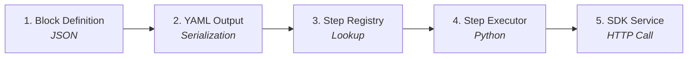
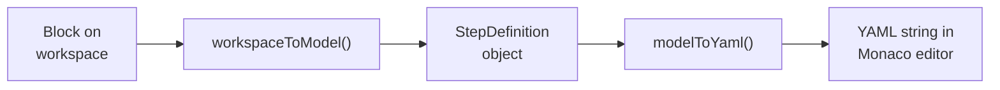
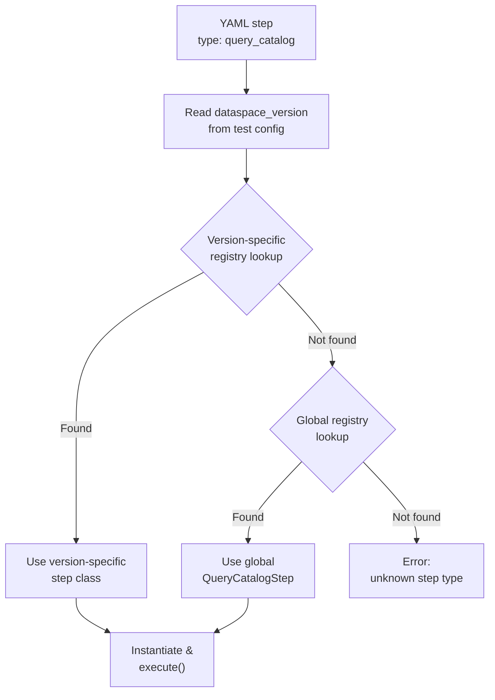
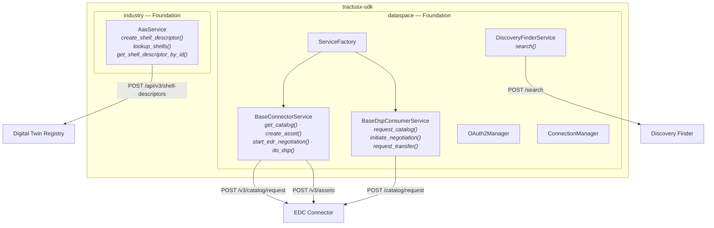
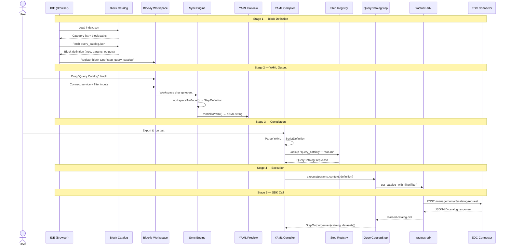
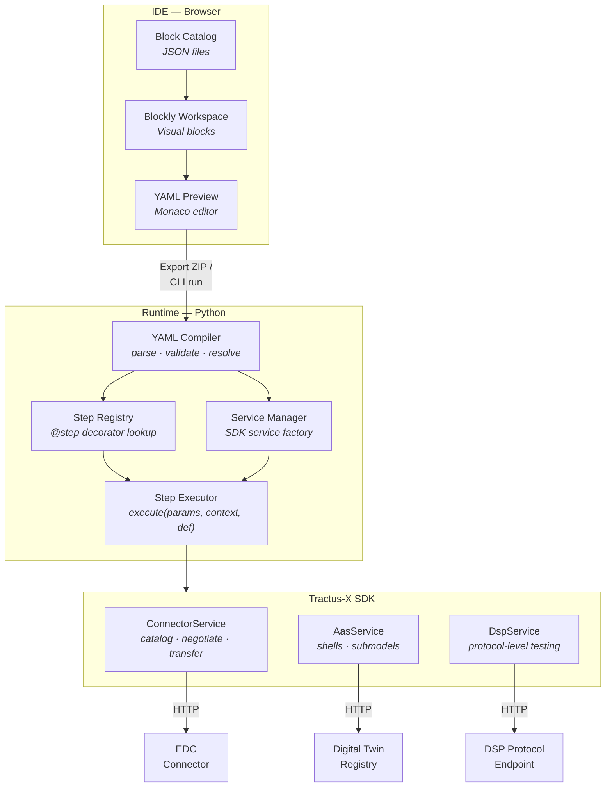

<!--
 Eclipse Tractus-X - Tractus-X TestLab

 Copyright (c) 2026 Contributors to the Eclipse Foundation

 See the NOTICE file(s) distributed with this work for additional
 information regarding copyright ownership.

 This program and the accompanying materials are made available under the
 terms of the Apache License, Version 2.0 which is available at
 https://www.apache.org/licenses/LICENSE-2.0.

 Unless required by applicable law or agreed to in writing, software
 distributed under the License is distributed on an "AS IS" BASIS, WITHOUT
 WARRANTIES OR CONDITIONS OF ANY KIND, either express or implied. See the
 License for the specific language governing permissions and limitations
 under the License.

 SPDX-License-Identifier: Apache-2.0
-->
<!-- This code was partially generated using artificial intelligence (AI) (Tool: Copilot, Model: Claude Opus 4.6). -->
<!-- It was reviewed and tested by a human committer. -->

# How a Block Works — From Visual Editor to SDK Call

This guide explains the full lifecycle of a block: how it appears in the IDE, how it becomes YAML, how the YAML compiles into an executable test, and how the test runner maps it to a real Tractus-X SDK call against connectors, registries, or discovery services.

## The Big Picture

A block goes through **five stages** from visual authoring to execution:



| Stage | Environment | Technology |
|-------|------------|------------|
| 1. Block Definition | IDE (browser) | JSON files |
| 2. YAML Output | IDE (browser) | TypeScript sync |
| 3. Step Registry | Runtime (Python) | `@step` decorator |
| 4. Step Executor | Runtime (Python) | `BaseStep.execute()` |
| 5. SDK Service | Runtime (Python → HTTP) | `tractusx-sdk` |

Let's trace a real block — **"Query Catalog"** — through every stage.

---

## Stage 1: Block Definition (JSON)

Every block starts as a JSON file in `ide/public/blocks/`. This is the **single source of truth** for what the block looks like, what inputs it accepts, and what outputs it produces.

**File:** `ide/public/blocks/edc-connector/query_catalog.json`

```json
{
  "type": "query_catalog",
  "label": "Query Catalog",
  "description": "Send a catalog request to the connector and retrieve available offers.",
  "params": [
    {
      "name": "service",
      "type": "service_ref",
      "required": true,
      "description": "EDC connector service to query"
    },
    {
      "name": "counter_party_address",
      "type": "string",
      "required": true,
      "description": "DSP endpoint of the counter-party connector"
    },
    {
      "name": "filter",
      "type": "json",
      "required": false,
      "description": "Optional filter criteria for the catalog request"
    }
  ],
  "outputs": [
    { "name": "catalog", "description": "The full catalog response" },
    { "name": "datasets", "description": "Array of datasets (offers) in the catalog" }
  ]
}
```

**What this defines:**

| Field | Value | Effect |
|-------|-------|--------|
| `type` | `"query_catalog"` | The step type name. This exact string links the block to its Python executor. |
| `label` | `"Query Catalog"` | Text shown on the block in the Blockly workspace. |
| `params` | 3 entries | Each becomes an input field on the block. `service_ref` renders as a dropdown of configured EDC services. |
| `outputs` | 2 entries | `catalog` and `datasets` become auto-stored variables via `store_in_memory`. They appear in variable dropdowns of downstream blocks. |

**How it reaches the browser:**

1. On IDE startup, `catalogLoader.ts` fetches `public/blocks/index.json` (the manifest)
2. The manifest lists `"edc-connector/query_catalog.json"` under the "EDC Connector" category
3. The loader fetches the JSON file and caches it in `BlockCatalog`
4. `catalogBlocks.ts` reads the JSON and dynamically registers a Blockly block type `step_query_catalog`
5. `toolboxBuilder.ts` adds `step_query_catalog` to the "EDC Connector" toolbox category

No TypeScript code is written for individual blocks. The system is fully data-driven.

---

## Stage 2: YAML Output (Serialization)

When the user drags the "Query Catalog" block onto the workspace and connects value blocks to its inputs, the sync loop converts it to YAML.

**The sync chain:**



**What `workspaceToModel()` does for this block:**

1. Reads block type `step_query_catalog` → strips prefix → `type: "query_catalog"`
2. Reads `NAME` field → `name: "Ping Catalog"`
3. For each param in the catalog entry, reads the connected value block:
    - `service` (service_ref dropdown) → `params.service: "testbed"`
    - `counter_party_address` (value_string) → `params.counter_party_address: "@counter_party_address"`
    - `filter` (key_value_pair chain) → `params.filter: { ... }`
4. Reads the EXPECT chain (assertion blocks) → `expect: [...]`
5. **Auto-generates `store_in_memory`** from the catalog's `outputs` array:
    - `catalog` → `store_in_memory.catalog: "$"`
    - `datasets` → `store_in_memory.datasets: "$"`

**Resulting YAML:**

```yaml
steps:
  - type: query_catalog
    name: Ping Catalog
    params:
      service: testbed
      counter_party_address: "@counter_party_address"
      filter:
        filter_expression:
          - operand_left: "https://w3id.org/edc/v0.0.1/ns/type"
            operator: "like"
            operand_right: "%"
    store_in_memory:
      catalog: "$"
      datasets: "$"
    expect:
      - output: status_code
        equals: 200
      - output: datasets
        not_null: true
```

!!! note "The `type` field is the bridge"
    The `type: query_catalog` in the YAML is the same string as the `type` field in the block JSON and the `@step("query_catalog")` decorator in Python. This is how the three layers connect.

---

## Stage 3: Step Registry (Lookup)

When the test runs, the Python runtime loads the YAML and needs to find the right Python class to execute each step. This is the **Step Registry**.

**File:** `src/tractusx_testlab/scripting/registry.py`

```python
# The registry maps (step_type, dataspace_version) → BaseStep class
_REGISTRY: dict[tuple[str, str], type[BaseStep]] = {}
_GLOBAL_REGISTRY: dict[str, type[BaseStep]] = {}

class StepRegistry:
    @staticmethod
    def register(step_type: str, dataspace_version: Optional[str] = None):
        """Decorator to register a BaseStep class."""
        def decorator(cls):
            if dataspace_version:
                _REGISTRY[(step_type, dataspace_version)] = cls
            else:
                _GLOBAL_REGISTRY[step_type] = cls
            return cls
        return decorator

    @staticmethod
    def get(step_type: str, dataspace_version: str) -> Optional[type[BaseStep]]:
        """Look up by type + version. Version-specific wins over global."""
        return _REGISTRY.get((step_type, dataspace_version)) or _GLOBAL_REGISTRY.get(step_type)

# Convenience alias
step = StepRegistry.register
```

**Resolution flow:**



**Version-specific steps:** Some steps behave differently on Jupiter vs Saturn. These register with a version constraint:

```python
@step("query_catalog", dataspace_version="saturn")
class QueryCatalogSaturnStep(BaseStep): ...

@step("query_catalog", dataspace_version="jupiter")
class QueryCatalogJupiterStep(BaseStep): ...
```

Version-specific registrations always take priority over global ones.

---

## Stage 4: Step Executor (Python)

The step executor is a Python class that implements the actual logic. It receives the resolved params (with `@variable` references substituted) and a runtime context that provides access to SDK services.

**File:** `src/tractusx_testlab/steps/connector/consume.py`

```python
from tractusx_sdk.extensions.testlab.scripting.registry import step
from tractusx_sdk.extensions.testlab.steps.base import BaseStep, StepOutput

@step("query_catalog")
class QueryCatalogStep(BaseStep):
    async def execute(self, params, context, definition):
        # 1. Get the SDK service instance from the runtime context
        consumer = context.get_consumer_service()

        # 2. Read resolved parameters (variables already substituted)
        counter_party_address = params["counter_party_address"]
        filter_expression = params.get("filter_expression")

        # 3. Call the tractusx-sdk method
        result = consumer.get_catalog_with_filter(
            counter_party_id=params.get("counter_party_id", ""),
            counter_party_address=counter_party_address,
            filter_expression=filter_expression,
        )

        # 4. Return structured output
        return StepOutput(
            value=result,
            request=HttpRequest(method="POST", url=f"{base_url}/v3/catalog/request", body=params),
            response=HttpResponse(status_code=200 if result else 500, body=result),
        )
```

**What the executor receives:**

| Argument | Source | Content |
|----------|--------|---------|
| `params` | YAML `params:` section, with `@variables` resolved | `{"service": "testbed", "counter_party_address": "https://...", "filter": {...}}` |
| `context` | Runtime `StepContext` | Provides `get_consumer_service()`, `get_provider_service()`, `get_aas_service()`, `set_variable()`, `get_variable()` |
| `definition` | Full `StepDefinition` model | Includes `expect`, `store_in_memory`, `on_failure`, `timeout_s` |

**What the executor returns:**

| Field | Purpose |
|-------|---------|
| `value` | The step's output data. Gets stored in memory via `store_in_memory` mapping. |
| `request` | HTTP request details for debugging/logging. |
| `response` | HTTP response details for assertion evaluation and logging. |

After execution, the runtime:

1. Evaluates `store_in_memory`: stores `value["catalog"]` as variable `catalog`, etc.
2. Evaluates `expect`: runs each assertion against the output
3. Records the result as a `StepResult` with pass/fail status

---

## Stage 5: SDK Service Call (Tractus-X SDK)

The step executor doesn't implement HTTP calls directly. It delegates to **tractusx-sdk** service classes that handle the actual protocol communication.

### How services are created

The `ServiceManager` (`src/tractusx_testlab/services/manager.py`) reads the `services:` section from the YAML and creates SDK service instances:

```yaml
services:
  - name: testbed
    type: edc_connector_saturn
    config:
      management_url: "https://connector.tractusx.io"
      dma_path: "/management"
```

This translates to:

```python
from tractusx_sdk.dataspace.services.connector import ServiceFactory

consumer_service = ServiceFactory.get_connector_consumer_service(
    dataspace_version="saturn",
    base_url="https://connector.tractusx.io",
    dma_path="/management",
    headers={"X-Api-Key": "..."},
    connection_manager=MemoryConnectionManager(),
)
```

### The SDK layer

The `tractusx-sdk` library provides service classes that handle the actual HTTP communication with dataspace components:



**The SDK call for "Query Catalog":**

When `QueryCatalogStep.execute()` calls `consumer.get_catalog_with_filter(...)`, the SDK:

1. Builds a JSON-LD catalog request body per the DSP specification
2. Sends `POST {management_url}/v3/catalog/request` with the filter expression
3. Handles authentication (OAuth2 token or API key)
4. Parses the JSON-LD response into a Python dict
5. Returns the catalog containing datasets (offers)

The step executor then wraps this in a `StepOutput` for the runtime to process.

---

## Complete Trace: "Query Catalog" End-to-End



Here's every file involved when a user drags a "Query Catalog" block and runs the test:

### 1. Block appears in IDE

```
ide/public/blocks/index.json
  → lists "edc-connector/query_catalog.json" under "EDC Connector" category

ide/public/blocks/edc-connector/query_catalog.json
  → defines type, label, params, outputs

ide/src/components/BlockEditor/blocks/catalogLoader.ts
  → fetches and caches the JSON at startup

ide/src/components/BlockEditor/blocks/catalogBlocks.ts
  → reads JSON, registers Blockly block type "step_query_catalog"

ide/src/components/BlockEditor/toolbox/toolboxBuilder.ts
  → adds "step_query_catalog" to "EDC Connector" toolbox category
  → category only visible if an EDC service is configured
```

### 2. Block becomes YAML

```
User drags block, connects inputs

ide/src/components/BlockEditor/serialization/workspaceToModel.ts
  → reads block fields → StepDefinition {type: "query_catalog", params: {...}}
  → auto-generates store_in_memory from catalog outputs

ide/src/sync/modelToYaml.ts
  → serializes StepDefinition → YAML text

ide/src/store/useTestLabStore.ts
  → stores YAML, displays in Monaco editor
```

### 3. YAML is compiled and run

```
User exports project as ZIP or runs via CLI

src/tractusx_testlab/compiler/yaml_compiler.py
  → parses YAML → ScriptDefinition (Pydantic model)
  → validates step types against registry

src/tractusx_testlab/compiler/validator.py
  → checks "query_catalog" is a registered step type
  → validates required params are present
```

### 4. Step executor runs

```
src/tractusx_testlab/scripting/registry.py
  → StepRegistry.get("query_catalog", "saturn") → QueryCatalogStep

src/tractusx_testlab/services/manager.py
  → reads services: [{name: "testbed", type: "edc_connector_saturn", ...}]
  → creates SDK BaseConnectorService via ServiceFactory

src/tractusx_testlab/steps/connector/consume.py
  → QueryCatalogStep.execute(params, context, definition)
  → calls context.get_consumer_service() → BaseConnectorService
  → calls consumer.get_catalog_with_filter(...)
```

### 5. SDK makes HTTP call

```
tractusx_sdk.dataspace.services.connector.BaseConnectorService
  → builds JSON-LD catalog request
  → POST https://connector.tractusx.io/management/v3/catalog/request
  → handles auth (OAuth2Manager or API key header)
  → parses response → Python dict

  → returns to QueryCatalogStep
  → step wraps in StepOutput(value=catalog_dict)
  → runtime stores value in memory as "catalog" and "datasets"
  → runtime evaluates assertions (expect: status_code equals 200)
  → records StepResult with pass/fail
```

---

## The Mapping Table

Every block type maps to an SDK capability through this chain:

### EDC Connector Blocks

| Block (IDE) | Step Type | Step Executor | SDK Service | SDK Method |
|-------------|-----------|---------------|-------------|------------|
| Query Catalog | `query_catalog` | `QueryCatalogStep` | `BaseConnectorService` | `get_catalog_with_filter()` |
| Negotiate Contract | `negotiate_contract` | `NegotiateContractStep` | `BaseConnectorService` | `start_edr_negotiation()` |
| Transfer Data | `transfer_data` | `TransferDataStep` | `BaseConnectorService` | `get_edr_entry()` |
| Create Asset | `create_asset` | `CreateAssetStep` | `BaseConnectorService` | `create_asset()` |
| Create Policy | `create_policy` | `CreatePolicyStep` | `BaseConnectorService` | `create_policy()` |
| Create Contract Def | `create_contract_definition` | `CreateContractDefinitionStep` | `BaseConnectorService` | `create_contract()` |
| Full DSP Flow | `do_dsp` | `DoDspStep` | `BaseConnectorService` | `do_dsp()` |

### DSP Protocol Blocks (Direct Protocol Testing)

| Block (IDE) | Step Type | Step Executor | SDK Service | SDK Method |
|-------------|-----------|---------------|-------------|------------|
| DSP Version | `dsp_version` | `DspVersionStep` | `BaseDspConsumerService` | `get_version()` |
| DSP Catalog Request | `dsp_catalog_request` | `DspCatalogRequestStep` | `BaseDspConsumerService` | `request_catalog()` |
| DSP Negotiate | `dsp_negotiate` | `DspNegotiateStep` | `BaseDspConsumerService` | `initiate_negotiation()` |
| DSP Transfer Request | `dsp_transfer_request` | `DspTransferRequestStep` | `BaseDspConsumerService` | `request_transfer()` |

### Digital Twin Registry Blocks

| Block (IDE) | Step Type | Step Executor | SDK Service | SDK Method |
|-------------|-----------|---------------|-------------|------------|
| Register Shell | `create_shell_descriptor` | `CreateShellDescriptorStep` | `AasService` | `create_asset_administration_shell_descriptor()` |
| Lookup Shell | `lookup_shell` | `LookupShellStep` | `AasService` | `lookup_shells()` |
| Get Shell | `get_shell_descriptor` | `GetShellDescriptorStep` | `AasService` | `get_asset_administration_shell_descriptor_by_id()` |

### Discovery Blocks

| Block (IDE) | Step Type | Step Executor | SDK Service | SDK Method |
|-------------|-----------|---------------|-------------|------------|
| Configure Discovery | `configure_discovery` | `ConfigureDiscoveryStep` | `DiscoveryFinderService` | `search()` |

---

## The Linking Rules

Understanding these rules is critical when adding new blocks:

### Rule 1: The `type` field is the universal key

```
Block JSON:     "type": "query_catalog"
YAML output:    type: query_catalog
Python:         @step("query_catalog")
```

All three must use the **exact same string**. A mismatch means the block will serialize to YAML but fail at runtime ("unknown step type").

### Rule 2: Block outputs become runtime variables

```
Block JSON:     "outputs": [{ "name": "catalog" }, { "name": "datasets" }]
YAML:           store_in_memory: { catalog: "$", datasets: "$" }
Python:         StepOutput(value={"catalog": ..., "datasets": ...})
Runtime:        context.get_variable("catalog")  # available to next steps
```

The IDE auto-generates `store_in_memory` from `outputs`. The Python executor must return a `value` dict whose keys match the output names.

### Rule 3: Services are the bridge to SDK

```
Block JSON:     "params": [{ "name": "service", "type": "service_ref" }]
YAML:           params: { service: "testbed" }
Runtime:        context.get_consumer_service()  → SDK BaseConnectorService
```

The `service_ref` param type creates a dropdown of configured services. At runtime, the `StepContext` resolves the service name to a live SDK service instance created by `ServiceManager`.

### Rule 4: Dataspace version selects the right code path

```
YAML service:   type: edc_connector_saturn
Runtime:        dataspace_version = "saturn"
Registry:       StepRegistry.get("query_catalog", "saturn")
SDK:            ServiceFactory.get_connector_consumer_service(dataspace_version="saturn")
```

The service type in YAML determines which SDK protocol version is used. Saturn uses DSP 2025-1 (EDC v0.11.x). Jupiter uses legacy DSP (EDC v0.8.x–0.10.x).

### Rule 5: Variables flow through `@` references

```
Step 1 output:  store_in_memory: { catalog: "$" }
Step 2 input:   params: { data: "@catalog" }
Runtime:        params["data"] = context.get_variable("catalog")  # resolved before execute()
```

The runtime resolves `@variable` references before calling the step executor. The executor receives plain values, not variable references.

---

## Architecture Diagram



---

## Summary

| Layer | Technology | Files | What it does |
|-------|-----------|-------|-------------|
| Block Definition | JSON | `ide/public/blocks/{category}/{type}.json` | Defines the visual shape, inputs, outputs |
| Block Registration | TypeScript | `blocks/catalogBlocks.ts`, `blocks/catalogLoader.ts` | Loads JSON, registers with Blockly at runtime |
| Serialization | TypeScript | `serialization/workspaceToModel.ts`, `sync/modelToYaml.ts` | Converts blocks ↔ YAML via `TestLabDocument` model |
| Step Registry | Python | `scripting/registry.py` | Maps `type` string → Python class via `@step` decorator |
| Step Executor | Python | `steps/connector/*.py`, `steps/industry/*.py` | Implements step logic, calls SDK services |
| Service Manager | Python | `services/manager.py` | Creates SDK service instances from YAML `services:` config |
| SDK Services | Python (tractusx-sdk) | `tractusx_sdk.dataspace.services.*`, `tractusx_sdk.industry.services.*` | Handles HTTP communication with connectors, DTR, discovery |

The block JSON `type` field is the universal key that ties everything together. If you remember one thing from this guide: **`type` in JSON = `type` in YAML = `@step("type")` in Python**.
