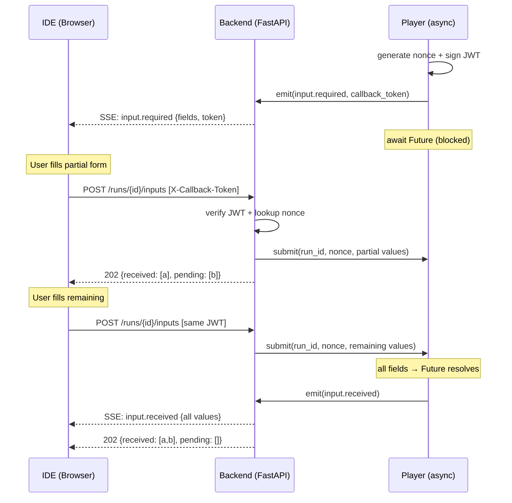

<!--
 Eclipse Tractus-X - Tractus-X TestLab

 Copyright (c) 2026 Contributors to the Eclipse Foundation

 See the NOTICE file(s) distributed with this work for additional
 information regarding copyright ownership.

 This work is made available under the terms of the
 Creative Commons Attribution 4.0 International (CC-BY-4.0) license,
 which is available at
 https://creativecommons.org/licenses/by/4.0/legalcode.

 SPDX-License-Identifier: CC-BY-4.0
-->

<!-- This code was partially generated using artificial intelligence (AI) (Tool: Copilot, Model: Claude Opus 4.6). -->
<!-- It was reviewed and tested by a human committer. -->

# ADR-0017: Input Callback Endpoint

## Status

Proposed

## Date

2026-05-29

## Context

ADR-0016 defines `tck.precondition.input.required` and `tck.precondition.input.received` CloudEvents for interactive precondition inputs. The SSE stream is unidirectional (server→client); a client→server channel is needed for the IDE to submit values back.

Requirements: no external infrastructure, in-process signaling via `asyncio.Future`, field validation, anti-replay protection, and support for partial submissions. The previous correlation_id approach is replaced by a JWT-based callback token that bundles correlation, authorization, and integrity into a single artifact.

## Decision

### Endpoint

```
POST /api/v1/runs/{run_id}/inputs
```

**Headers:**

| Header | Purpose |
|--------|---------|
| `Authorization: Bearer <OAuth token>` | Identity (who is calling) |
| `X-Callback-Token: <JWT>` | Correlation + authorization (which input, proof of delivery) |

**Request body** (`InputSubmission`):

```json
{
  "values": {
    "counter_party_id": "BPNL000000000SUT",
    "counter_party_address": "https://sut-connector.example.com/api/v1/dsp"
  }
}
```

No correlation field in the body — the JWT **is** the correlation.

**Responses:**

| Code | Condition | Body |
|------|-----------|------|
| 202 | Accepted (partial or complete) | `{received: [], pending: []}` |
| 403 | Invalid/expired JWT or nonce not pending | |
| 404 | `run_id` unknown | |
| 409 | All fields already submitted (nonce consumed) | |
| 422 | Values fail field validation | `{error, details}` |

### Security Model — Three Layers

| Layer | Mechanism | Protects Against |
|-------|-----------|-----------------|
| Identity | OAuth Bearer token | Unauthenticated access |
| Integrity | JWT HS256 signature | Token tampering |
| Authorization | blake2b nonce (delivered only via authenticated SSE) | Replay, unauthorized submission by other authenticated users |

The nonce is only delivered inside the `input.required` SSE event on an authenticated stream. Only the user connected to that run can obtain it.

### JWT Callback Token

- **Algorithm**: HS256
- **Signing key**: Server-side secret (per-run)
- **Claims** (JWT carries field names only — full typed schema is in the SSE event):

```json
{
  "run_id": "run-abc-123",
  "name": "sut_connection_details",
  "fields": ["counter_party_id", "counter_party_address"],
  "nonce": "a1b2c3d4e5f6...32hex",
  "iat": 1748505600,
  "exp": 1748505900
}
```

### Nonce Generation

16 random bytes → blake2b digest → 32 hex characters. Backend stores `_pending[(run_id, nonce)]` → `PendingInput`. Nonce is popped only when **all** fields are submitted (not on first partial).

### One Input Per Precondition

- 1 precondition = 1 `input.required` event = 1 nonce = 1 JWT
- All fields that precondition needs are bundled in one event
- Multiple preconditions emit their own events sequentially

### Field Schema

Each field in the `input.required` event carries metadata for automatic form generation:

| Attribute | Required | Description |
|-----------|----------|-------------|
| `type` | ✅ | Data type: `string`, `integer`, `boolean`, `json` |
| `class` | ❌ | Semantic class: `bpn`, `url`, `secret`, `enum`, `uuid`, `date` |
| `label` | ✅ | Human-readable display name for the form |
| `options` | ❌ | Allowed values (only when `class: "enum"`) |

**Example in `input.required` event data:**

```json
"fields": {
  "counter_party_id": { "type": "string", "class": "bpn", "label": "Counter Party ID" },
  "counter_party_address": { "type": "string", "class": "url", "label": "Counter Party Address" }
}
```

The IDE maps this to form controls:

| `type` | Control |
|--------|--------|
| `string` | Text input |
| `integer` | Number input |
| `boolean` | Toggle |
| `json` | Code editor (Monaco) |

The `class` adds validation and formatting hints:

| `class` | Behavior |
|---------|----------|
| `bpn` | Pattern: `BPN[LSA]\d{12}` |
| `url` | URL format validation |
| `secret` | Masked input; encrypted via JWE in traces (see ADR-0016) |
| `enum` | Dropdown from `options[]` |
| `uuid` | UUID format |
| `date` | Date picker |

The JWT `fields` claim remains a **name-only list** for lightweight validation at the REST handler. The full typed schema lives only in the SSE event data.

### Partial Submission

Same JWT can be POSTed multiple times until all fields are filled. Each POST merges values into accumulated state. Re-submitting a field overwrites the previous value (allowed before completion).

### Event Types

| Event | Payload |
|-------|---------|
| `tck.precondition.input.required` | `fields{} (typed map), callback_url, callback_token, warn_after_s, fail_after_s` |
| `tck.precondition.input.received` | `received[], pending[], values` |
| `tck.precondition.input.warning` | `pending[], timeout_remaining_s` |
| `tck.precondition.input.timeout` | `missing[]` |

### Internal Mechanism — InputManager

```python
@dataclass
class PendingInput:
    nonce: str
    name: str
    required_fields: set[str]
    received_values: dict[str, Any]
    future: asyncio.Future
    warn_after: float
    fail_after: float

class InputManager:
    _pending: dict[tuple[str, str], PendingInput]  # keyed on (run_id, nonce)

    def request(self, run_id, nonce, name, fields, warn_after, fail_after) -> asyncio.Future
    def submit(self, run_id, nonce, values) -> SubmitResult  # SubmitResult(complete, received, pending)
    def cancel_all(self, reason: str) -> None
```

`submit()` merges values, checks if all fields present, resolves Future only when complete.

### Player Integration

1. Precondition executor generates nonce, creates JWT, calls `input_manager.request()`
2. Emits `input.required` with `callback_url` + `callback_token`
3. Awaits Future; starts warn timer and fail timer concurrently
4. On warn timeout → emits `input.warning`, continues waiting
5. On fail timeout → emits `input.timeout`, raises `PreconditionError`

### REST Handler Validation Flow

1. Decode JWT from `X-Callback-Token` → extract `run_id`, `nonce`, `fields`, `exp`
2. Verify signature → 403 if invalid
3. Check `exp` → 403 if expired
4. Check `run_id` matches URL path → 403 if mismatch
5. Lookup `_pending[(run_id, nonce)]` → 403 if not found
6. Validate value keys ⊆ `fields` claim → 422 if unknown fields
7. Call `input_manager.submit()` → merge values
8. Return 202 with `received[]` and `pending[]`

### Sequence Diagram



### Trace Log Example

How the input callback flow appears in the CloudEvents JSONL execution trace:

**1. Input required — player blocks, emits field schema:**
```json
{"specversion":"1.0","id":"ccm-v2/sut_connection_details/request_input/tck.precondition.input.required/a1b2c3d4e5f6","source":"testlab/player/precondition","type":"tck.precondition.input.required","time":"2026-05-29T10:00:00.000Z","data":{"run_id":"run-abc-123","name":"sut_connection_details","fields":{"counter_party_id":{"type":"string","class":"bpn","label":"Counter Party ID"},"counter_party_address":{"type":"string","class":"url","label":"Counter Party Address"}},"callback_url":"/api/v1/runs/run-abc-123/inputs","callback_token":"eyJ...","warn_after_s":120,"fail_after_s":300}}
```
**2. Partial submission received:**
```json
{"specversion":"1.0","id":"ccm-v2/sut_connection_details/request_input/tck.precondition.input.received/b2c3d4e5f6a1","source":"testlab/player/precondition","type":"tck.precondition.input.received","time":"2026-05-29T10:01:12.000Z","data":{"run_id":"run-abc-123","name":"sut_connection_details","received":["counter_party_id"],"pending":["counter_party_address"],"values":{"counter_party_id":"BPNL000000000SUT"}}}
```
**3. Warning timer fired — user hasn't completed submission:**
```json
{"specversion":"1.0","id":"ccm-v2/sut_connection_details/request_input/tck.precondition.input.warning/c3d4e5f6a1b2","source":"testlab/player/precondition","type":"tck.precondition.input.warning","time":"2026-05-29T10:02:00.000Z","data":{"run_id":"run-abc-123","name":"sut_connection_details","pending":["counter_party_address"],"timeout_remaining_s":180}}
```
**4. Final submission — all fields received, precondition unblocks:**
```json
{"specversion":"1.0","id":"ccm-v2/sut_connection_details/request_input/tck.precondition.input.received/d4e5f6a1b2c3","source":"testlab/player/precondition","type":"tck.precondition.input.received","time":"2026-05-29T10:02:30.000Z","data":{"run_id":"run-abc-123","name":"sut_connection_details","received":["counter_party_id","counter_party_address"],"pending":[],"values":{"counter_party_id":"BPNL000000000SUT","counter_party_address":"https://sut-connector.example.com/api/v1/dsp"}}}
```

> **Note:** Fields with `class: "secret"` are **encrypted using JWE** (see [ADR-0016](ADR-0016-execution-trace-format.md) Secret Protection) before being written to the trace — never stored in plaintext. The decrypted value is held only in memory during execution.

### Edge Cases

| Case | Behavior |
|------|----------|
| IDE disconnects | SSE reconnects; `input.required` re-sent; same JWT still valid |
| Double-submit after completion | 409 (nonce consumed) |
| Invalid values | 422; player stays blocked; user retries with same token |
| Run cancelled while waiting | `cancel_all()` cancels Futures |
| Partial then timeout | Warning emitted → timeout emitted → precondition fails |
| Re-submit same field | Overwrites previous value (allowed before completion) |
| JWT expired, fields incomplete | 403; precondition will eventually timeout |

### Alternatives Considered

| Alternative | Reason for Rejection |
|-------------|---------------------|
| `correlation_id` in body | JWT nonce is simpler, more secure, no body field needed |
| Token in URL query param | Security risk (logged in access logs); header is safer |
| WebSocket bidirectional | Over-engineered for input collection |
| Shared message queue | Infrastructure dependency; in-process Future suffices for single-node |

## Consequences

### Positive

- Zero external dependencies — pure in-process async signaling
- Three-layer security without added complexity
- Nonce prevents unauthorized submission even by other authenticated users
- Partial submission enables progressive UX
- Warning events give users time to react before failure

### Negative

- Single-node only (Future-based; distributed executor would need a signal bus)
- JWT adds ~200 bytes per event (acceptable)
- Server must track warn/fail timers per pending input

### Neutral

- CI can pre-fill via `--env` flags, bypassing this endpoint entirely
- Local dev can disable OAuth layer (nonce still protects)
