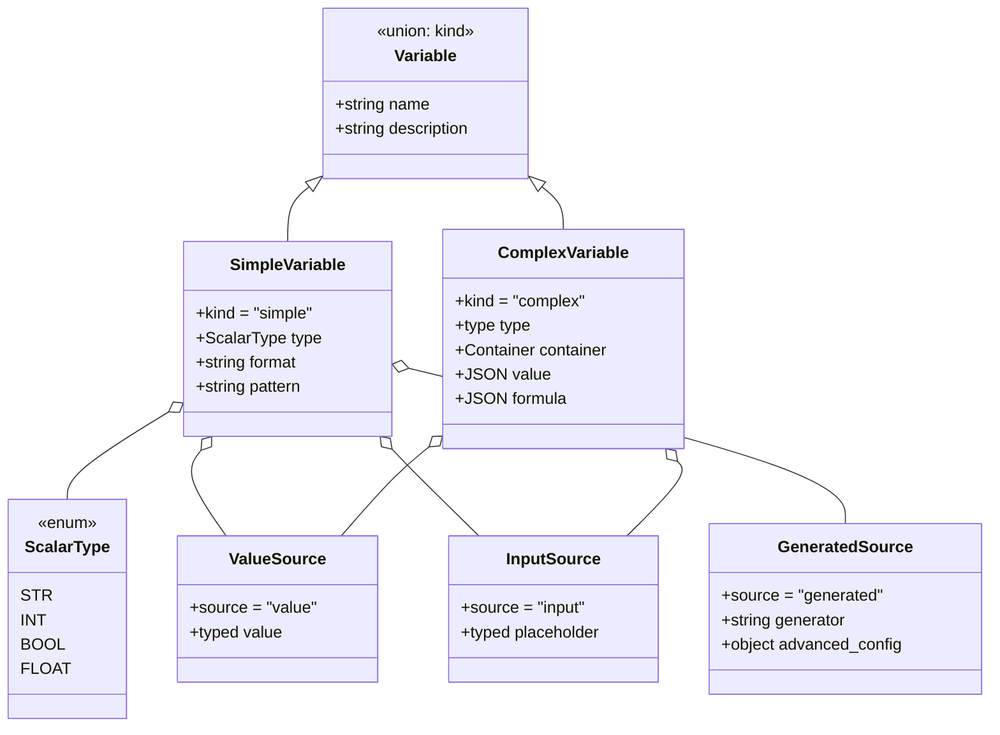
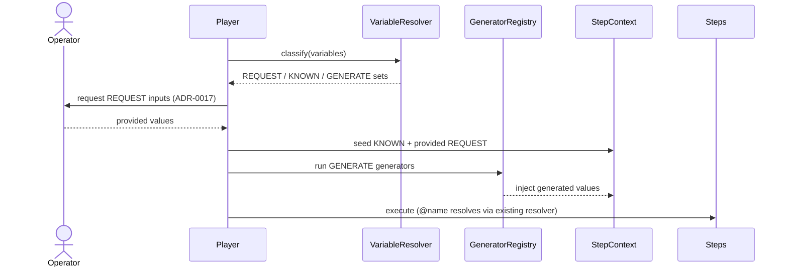
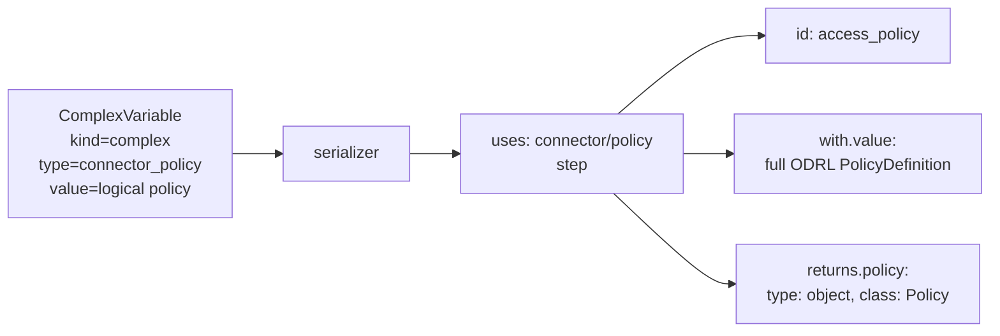

<!--
 Eclipse Tractus-X - Tractus-X TestLab

 Copyright (c) 2026 Contributors to the Eclipse Foundation

 See the NOTICE file(s) distributed with this work for additional
 information regarding copyright ownership.

 This work is made available under the terms of the
 Creative Commons Attribution 4.0 International (CC-BY-4.0) license,
 which is available at
 https://creativecommons.org/licenses/by/4.0/legalcode.

 SPDX-License-Identifier: CC-BY-4.0
-->

<!-- This code was partially generated using artificial intelligence (AI) (Tool: Copilot, Model: Claude Opus 4.8). -->
<!-- It was reviewed and tested by a human committer. -->

# ADR-0018: Unified Variables Model (Preconditions as Complex Variables)

## Status

Proposed

## Date

2026-06-04

## Context Reference

- Branch: `feat/refactor/ide_backend`
- Pull Request: #16
- Builds on: [ADR-0004 — Precondition as Distinct Step Phase](ADR-0004-precondition-as-distinct-step-phase.md),
  [ADR-0007 — Precondition Execution Logs Model](ADR-0007-precondition-execution-logs-model.md),
  [ADR-0009 — Typed Variable Class System](ADR-0009-typed-variable-class-system.md),
  [ADR-0010 — YAML Syntax v2](ADR-0010-yaml-syntax-v2.md),
  [ADR-0011 — Environment and Services](ADR-0011-environment-and-services.md),
  [ADR-0013 — Preconditions Specification](ADR-0013-preconditions-specification.md),
  [ADR-0017 — Input Callback Endpoint](ADR-0017-input-callback-endpoint.md)

---

## Context & Problem

Today a TCK author configures *two unrelated mechanisms* to describe everything a test needs
before steps run:

1. **Variables** — scalar/dict definitions authored in the manifest. The backend models them as
   `VariableDefinition` (`src/tractusx_testlab/models/authoring/definitions.py`, L42-48) and the
   player resolves `@name` references at runtime via the resolver
   (`src/tractusx_testlab/player/loading/resolver.py`, L38-62). These carry a name, a type and a
   value, and feed the `StepContext` (`src/tractusx_testlab/player/execution/context.py`).

2. **Preconditions** — declarative configuration contracts introduced by ADR-0013 and modelled in
   `src/tractusx_testlab/models/runtime/preconditions.py`. They describe policy/asset/contract/
   digital-twin artifacts the SUT operator must provide or that TestLab must generate, and they are
   executed as a distinct phase (ADR-0004) producing `PreconditionLog` entries (ADR-0007). The
   step executors live in `src/tractusx_testlab/steps/precondition/` (e.g. `asset_config.py`,
   `policy_config.py`). On the frontend, the dedicated authoring experience is the preconditions
   editor POC (`ide/src/poc/pocs/preconditions-editor/`).

These two surfaces overlap conceptually but diverge in code, model and UI. A user must learn that a
"UUID I need before the run" is a *variable*, while a "policy JSON I need before the run" is a
*precondition* — even though both answer the same question: **what does this test need to know
before it starts, and where does that value come from?**

This split causes:

- **Two authoring models** for one user intent ("prepare the run").
- **Duplicated runtime plumbing**: variable seeding and precondition execution are separate code
  paths that both populate context before steps run.
- **No single place** to see, at run start, which values must be *requested* from the operator,
  which are already *known*, and which must be *generated*.
- A growing generator concept (`generate_uuid` lives as a utility step,
  `src/tractusx_testlab/steps/utility/uuid_gen.py`) that has no catalog and no discoverable contract.

The product scope (`docs/developer/product-scope.md`) demands a non-technical, reuse-first authoring
model with one way to do each thing. The current duality violates the "one way to do things"
principle.

---

## Decision

We unify both concepts under a single user-facing concept: **Variables**. A *precondition* becomes a
*complex variable*. Everything a test needs before/around a run is a Variable.

### The Variable discriminated union

A `Variable` is a discriminated union on `kind ∈ { simple, complex }`, mirrored 1:1 between the
backend (Pydantic v2 models) and the frontend (TypeScript discriminated unions). Both definitions are
authoritative for their runtime; the backend remains the source of truth for shape and validation.

!!! note "In-memory model vs. on-disk serialization"
    The `kind`-tagged discriminated union below is the **authoring / in-memory model** only — it is
    how the IDE and backend reason about a variable while it is being edited and classified. It is
    **not** the persisted format. When a variable is written to YAML it **serializes to the canonical
    TCK step schema** (`id` / `uses` / `name` / `with` / `returns`) — the *same* schema every other
    TCK constraint uses. There is **no** bespoke `kind:`-tagged YAML block. The `kind: complex`
    union exists purely to drive the authoring experience; persistence emits a `uses:` step (see
    [Complex variables / types](#complex-variables--types-1)).


```text
Variable
├── kind: "simple"
│   ├── name: str
│   ├── type: "str" | "int" | "bool" | "float"   # PRIMITIVE programming types ONLY
│   ├── description?: str
│   ├── format?: <FormatId>    # Option D refinement: closed backend catalog id
│   │                           # (e.g. "uuid", "url", "bpn", "did"). Drives BOTH
│   │                           # validation (catalog-owned regex) AND generator
│   │                           # matching (outputKey = format ?? type).
│   ├── pattern?: str          # ADVANCED escape hatch: validation-ONLY regex.
│   │                           # Never participates in generator matching.
│   │                           # Effective validation = pattern ?? formatCatalog[format].validation_regex
│   └── source (discriminated on "source"):
│       ├── "value"      → { value: <typed> }                 # KNOWN
│       ├── "input"      → { placeholder?: <typed> }   # REQUEST
│       └── "generated"  → { generator: str, advanced_config?: object }  # GENERATE
│
└── kind: "complex"
    ├── name: str
    ├── description?: str
    ├── type: "connector_policy" | "connector_asset" | "connector_contract" | "digital_twin" | "json"
    ├── container: "atomic" | "several"
    ├── value: <JSON>         # canonical value 
    ├── formula?: <authoring>   # left-hand authoring lens (optional, derivable)
    └── source: "value" | "input"   # provide-now (KNOWN) | ask-operator (REQUEST)
```

Key rules:

- **`value` is canonical.** For complex variables the right-hand JSON is the source of truth; the
  `formula` is only an authoring lens that produces the `value`. Persistence and runtime read
  `value`, never re-derive from `formula`. On serialization, the canonical `value` becomes the
  `with.value` of a `uses:` step. For `connector_policy` specifically, `with.value` is the **full
  ODRL `PolicyDefinition`** (`@context` / `@type: PolicyDefinition` / `@id` + the nested `policy`),
  produced by `policyToOdrlJson` — **not** a trimmed logical shape.
- **`${{ ... }}`** is the reference syntax inside steps (the implemented convention, AD-6 /
  [ADR-0010](ADR-0010-yaml-syntax-v2.md)). A variable's `name` is its reference key, dereferenced as
  `${{ env.<NAME> }}` for inputs or `${{ steps.<id>.<output> }}` for step outputs.
- **Simple `type` is a primitive programming type ONLY** — `str | int | bool | float`. It never
  carries semantic notions like `url` or `uuid`; those are **formats** (the separate optional
  `format` field) or come from a generator. The backend Pydantic equivalent is
  `VariableScalarType = { STR, INT, BOOL, FLOAT }`.
- **`format` is Option D refinement** — a separate, optional field whose value is an id from a
  closed, backend-owned catalog (e.g. `uuid`, `url`, `bpn`, `did`). It drives **both** validation
  (each catalog entry carries a `validation_regex`) **and** generator matching
  (`outputKey = format ?? type`), without changing the primitive `type`.
- **`pattern` is the advanced escape hatch** — an optional raw regex string that is
  **validation-only** and **never** participates in generator matching. Effective validation is
  `pattern ?? formatCatalog[format].validation_regex`.

### Runtime classification rule (single rule)

Every variable resolves to exactly one of three runtime dispositions, computed from `source`:

| `source`     | Disposition | Meaning                                              |
|--------------|-------------|------------------------------------------------------|
| `input`      | **REQUEST** | Operator must supply the value at run start.         |
| `value`      | **KNOWN**   | Value is fixed (authored default / provided value).  |
| `generated`  | **GENERATE**| A generator produces the value at run start.         |

Complex variables only support `value` (KNOWN) and `input` (REQUEST); generation of full artifacts is
out of scope for the POC.

### Type-driven value editor (selected by primitive type)

For simple variables the UI renders a value widget chosen **by the primitive `type`** — a single
`valueFieldFor(type)` mapping owns this selection:

| `type`  | Value widget                |
|---------|-----------------------------|
| `str`   | text input                  |
| `int`   | integer number input        |
| `float` | decimal number input        |
| `bool`  | true/false toggle           |

Because the widget depends only on the primitive `type`, `format` never affects which editor is
shown — a `str` with `format: uuid` is still edited as text. `format` only drives validation and
generator matching.

### New resolution phase (seed-before-steps)

A **variable resolution phase** runs at the very start of a run, *before* preconditions/setup and
before any step. It:

1. Classifies all variables (REQUEST / KNOWN / GENERATE).
2. Requests REQUEST values from the operator (see ADR-0017 input callback).
3. Seeds KNOWN values directly into `StepContext`.
4. Runs generators for GENERATE values and injects their results into `StepContext`.

After this phase, the **existing** `@name` resolver
(`src/tractusx_testlab/player/loading/resolver.py`, L38-62) resolves references unchanged. It already
preserves complex typed values, so **no runtime rework of the resolver is required** — the new phase
simply seeds the context the resolver already reads. The step runner integration point is
`src/tractusx_testlab/player/execution/step_runner.py` (L141-172).

---

## Generators subsystem

Generators are the GENERATE backend. The backend `tractusx_testlab` is the **single source of truth**;
the IDE consumes a catalog and never hardcodes generator logic (mirrors ADR-0001 block catalog
principle).

### Backend registry

A new `generators/` package introduces a registry that mirrors the existing `@step` decorator
pattern. Each generator declares metadata:

```text
GeneratorMeta
├── id: str               # stable key, e.g. "uuid_v4"
├── label: str            # human label, e.g. "Random UUID"
├── output_type: str      # the produced variable type/format, e.g. "uuid"
└── params: [ParamSpec]   # typed parameters (name, type, required, default)
```

The existing `generate_uuid` step (`src/tractusx_testlab/steps/utility/uuid_gen.py`) is re-exposed as
the `uuid_v4` generator via a **shared helper** — the generation logic is extracted once and called by
both the legacy step and the generator, with no duplication (AD-4 modularity directive).

### Catalog contract: `GET /generators`

A new read-only endpoint returns a manifest analogous to `ide/public/blocks/index.json`:

```json
{
  "version": "1.0",
  "generators": [
    {
      "id": "uuid_v4",
      "label": "Random UUID",
      "output_type": "uuid",
      "params": []
    },
    {
      "id": "bpn",
      "label": "Business Partner Number",
      "output_type": "bpn",
      "params": [
        { "name": "country", "type": "str", "required": false, "default": "DE" }
      ]
    }
  ]
}
```

### UI consumption

The IDE adds a `useGeneratorCatalog()` hook (static stub now, HTTP fetch later) and a
`GeneratorPicker` that filters generators by `output_type`/`format` so a user only sees generators
compatible with the variable they are configuring.

### Format catalog contract: `GET /formats`

The `format` vocabulary (Option D) is a closed, backend-owned catalog exposed the same way as
generators. A read-only `GET /formats` endpoint mirrors `GET /generators` and returns one entry per
format:

```text
FormatMeta
├── id: str                    # stable catalog id, e.g. "uuid"
├── label: str                 # human label, e.g. "UUID"
├── validation_regex: str      # catalog-owned regex used for validation
└── default_generator_id?: str # optional generator pre-selected for this format
```

The IDE consumes it via a `useFormatCatalog()` hook (static stub now, HTTP fetch later) feeding a
**format dropdown** on the simple-variable editor. The advanced `pattern` field remains a free regex
override; effective validation is `pattern ?? formatCatalog[format].validation_regex`.

---

## Complex variables / types

Today's preconditions map directly onto complex variables:

| Precondition category (ADR-0013) | Complex variable `type` |
|----------------------------------|----------------------------|
| Policy                           | `connector_policy`         |
| Asset                            | `connector_asset`          |
| Contract                         | `connector_contract`       |
| Digital Twin                     | `digital_twin`             |
| (generic JSON)                   | `json`                     |

### Serialization: complex `type` → `uses`

When a complex variable is written to YAML it emits a canonical `uses:` step. The in-memory `type`
maps to a `uses` capability identifier (underscores become slashes):

| Complex variable `type` | Serialized `uses`              |
|-------------------------|--------------------------------|
| `connector_policy`      | `connector/policy`             |
| `connector_asset`       | `connector/asset`              |
| `connector_contract`    | `connector/contract`           |
| `digital_twin`          | `digital-twin-registry/twin`   |
| `json`                  | `value/json`                   |

The serialized step contract is:

- **`with.value`** — the full artifact JSON. For `connector_policy` this is the full ODRL
  `PolicyDefinition` (`@context` / `@type: PolicyDefinition` / `@id` + nested `policy`) produced by
  `policyToOdrlJson`; for the other types it is the corresponding full artifact JSON.
- **`returns`** — a typed output the rest of the test can reference. For `connector_policy`:
  `policy: { type: object, class: Policy }`. Each type declares the analogous return (e.g. an asset
  type returns `asset: { type: object, class: Asset }`).

A serialized `connector_policy` access policy therefore looks like:

```yaml
- id: access_policy
  uses: connector/policy
  name: SUT Access Policy
  with:
    value:
      "@context":
        "@vocab": https://w3id.org/edc/v0.0.1/ns/
        odrl: http://www.w3.org/ns/odrl/2/
        cx-policy: https://w3id.org/catenax/policy/
      "@type": PolicyDefinition
      "@id": access_policy
      policy:
        "@context": http://www.w3.org/ns/odrl.jsonld
        "@type": odrl:Set
        permission:
          - action: use
            constraint:
              "@type": Constraint
              odrl:leftOperand:
                "@id": tx:BusinessPartnerNumber
              odrl:operator:
                "@id": odrl:eq
              odrl:rightOperand: ${{ env.SUT_BPN }}
        prohibition: []
        obligation: []
  returns:
    policy:
      type: object
      class: Policy
```

The authoring experience reuses the existing preconditions editor POC
(`ide/src/poc/pocs/preconditions-editor/`): a **left formula / right JSON** type. The left pane is
a guided formula/templates lens (`editors/PolicyEditor.tsx`, `editors/templates/`,
`editors/SimpleEditors.tsx`); the right pane is the canonical JSON (`configuration/*`, `jsonCodec`).
The `value` field stores the right-hand JSON; `formula` stores the left-hand authoring state.

This means **no new type UI is invented** — the precondition editor is promoted to the complex
variable editor.

---

## Diagrams

### (a) Variable union — class / ER view



### (b) Run-start resolution — sequence



### (c) Complex variable serialization — in-memory union → `uses:` step



The `kind: complex` union is in-memory only; it serializes to a canonical `uses:` step
(`id` / `uses` / `with` / `returns`), never a `kind:`-tagged YAML block.

### (d) Migration flow — preconditions → variables

```mermaid
flowchart LR
    A[Legacy manifest] --> B{Field type?}
    B -->|preconditions[]| C[to_variable converter]
    B -->|scalar/dict var def| D[ValueVariable]
    C --> E[ComplexVariable<br/>type=category]
    D --> F[Unified Variables list]
    E --> F
    F --> G[Resolution phase seeds context]
    G --> H["Serialize to uses: step"]
```

---

## Migration & backward compatibility

Legacy TCK *manifests* continue to load, but the serialized step capability changes.

- **`connector/policy` fully replaces `precondition/provide`.** There is **no** back-compat alias
  (human decision). The serializer emits `uses: connector/policy` for every `connector_policy`
  complex variable; the legacy `precondition/provide` capability is retired, not aliased.
- **Keep the `preconditions` field** as a *load-time input* and **keep `PreconditionLog`**
  (`src/tractusx_testlab/models/runtime/preconditions.py`) so existing manifests and execution traces
  (ADR-0007, ADR-0016) still parse — but on save they are normalized to unified Variables that
  serialize to `connector/*` steps.
- **Converter `to_variable()`**: a pure function maps a legacy precondition to a `ComplexVariable`
  that targets `connector/policy` (and the sibling `connector/*` capabilities):
  `category → type`, `data → value`, `log_type → source`, `variable → name`. Both the converter and
  the serializer target `connector/policy` — never `precondition/provide`.
- **Parser synthesis**: when loading a legacy manifest, the parser synthesizes Variables from
  `preconditions` and from legacy scalar/dict variable definitions (`VariableDefinition`,
  `definitions.py` L42-48 → `ValueVariable`). The unified list is what the resolution phase consumes
  and what the serializer writes back as `connector/*` steps.
- **Phased rollout**:
  1. **Phase 1 (this ADR)** — model + converter + generators registry + `GET /generators`, no UI change.
  2. **Phase 2 (POC)** — Variables manager UI; legacy manifests load and re-serialize to `connector/*`.
  3. **Phase 3** — IDE authors emit unified Variables serialized as `connector/*` steps.
  4. **Phase 4 (future ADR)** — drop load-time acceptance of the legacy `preconditions` field.

---

## Open questions (resolved with recommendations)

1. **REQUEST input transport.** Reuse the `/jobs` start payload or add `/jobs/{id}/inputs`?
   **Recommendation:** reuse the ADR-0017 input callback endpoint for REQUEST values rather than
   inventing a new route — it already handles the pause/resume lifecycle, so REQUEST variables become
   run-start input callbacks. Add a new route only if run-start collection proves semantically
   distinct from mid-run pauses.

2. **Generator ↔ variable matching.** How does a variable select a compatible generator?
   **Resolution (supersedes the earlier 1:1 `output_type`→format wording):** matching uses
   `outputKey = format ?? type`. A variable computes its output key as its `format` when present,
   otherwise its primitive `type`, and matches generators whose `output_type` equals that key.
   Examples: a `str` with `format: uuid` matches the `uuid` generator; an `int` with no format
   matches an `int` generator. The `GET /generators` manifest carries `output_type`, so the
   `GeneratorPicker` filters trivially on `format ?? type`. The advanced `pattern` field is
   **explicitly excluded** from matching — it is validation-only and never affects which generator a
   variable can select.

3. **`format` catalog.** Closed backend enum mirroring generators, or free string?
   **Recommendation:** a closed, backend-owned catalog (e.g. `bpn`, `did`, `url`, `uuid`) exposed the
   same way as generators via `GET /formats`. Each catalog entry carries a `validation_regex`, so
   validation stays deterministic and the UI stays discoverable; free strings would reintroduce the
   stringly-typing this ADR rejects. The advanced `pattern` field is the escape hatch when a one-off
   regex is needed without minting a new catalog format.

4. **Complex variable → `@name` binding rule.** How does an object vs array root bind to one name?
   **Recommendation:** a complex variable binds to **exactly one** `@name` whose value is the entire
   `value` (object or array root). Sub-field references use the existing resolver path syntax on
   `@name`; we do not auto-explode array elements into multiple names.

5. **ODRL fidelity.** What does a serialized `connector_policy` emit?
   **Resolution (supersedes the earlier shape-agnostic / trimmed-value wording):** `with.value` is the
   **full ODRL `PolicyDefinition`** deliverable — `@context` / `@type: PolicyDefinition` / `@id` plus
   the nested `policy` — produced by `policyToOdrlJson` (Jupiter and Saturn dialect builders). It is
   the exact JSON the operator pastes into their connector, **not** a trimmed or shape-agnostic
   logical fragment. Track per-dialect Saturn sample coverage as a separate, non-blocking validation
   work item; the serializer already emits the full deliverable for both dialects.

6. **GENERATE failure semantics.** Abort the run on generator failure?
   **Recommendation:** yes — treat a failed generator like a failed precondition: abort the run with a
   typed error before steps execute, surfaced in the trace (ADR-0016). Fail fast, fail loud.

---

## Alternatives considered & rejected

### A. Keep preconditions and variables separate

Rejected. Preserves two authoring models and two runtime code paths for one user intent, violating the
"one way to do things" principle and continuing the duplication this ADR exists to remove.

### B. Stringly-typed variables (single flat dict of name→string)

Rejected. Loses the typed class system (ADR-0009), prevents compile-time validation, and cannot
represent complex artifacts (policy/asset JSON) without ad-hoc encoding. The discriminated union keeps
contracts explicit.

### C. UI-only generators (generator logic lives in the IDE)

Rejected. Generators must run at execution time on the backend (the IDE is not present during a
headless run). A frontend-only generator could not seed context during CLI/server execution and would
duplicate logic. The backend registry + catalog keeps a single source of truth (mirrors AD-1/AD-2).

---

## Consequences

### Positive

- **One concept** ("Variables") for everything a test needs before it runs.
- **One runtime phase** seeds context; the existing resolver is reused unchanged.
- **Discoverable generators** via a catalog, mirroring the proven block-catalog pattern.
- **Reuse-first**: the precondition editor becomes the complex-variable editor; no new type UI.
- **Backward compatible**: legacy `preconditions` manifests still load (and re-serialize to
  `connector/*` steps); `PreconditionLog` keeps working.

### Negative

- A converter and parser-synthesis layer must be maintained until the legacy field is deprecated.
- Two persisted representations (`value` canonical + `formula` lens) require careful sync rules.
- Generator registry and format catalog become new maintained surfaces.

### Risks

- **Formula/value drift** if the UI ever writes `formula` without regenerating `value`. Mitigation:
  `value` is canonical; `formula` is advisory and never read at runtime.
- **REQUEST transport coupling** to ADR-0017 — if run-start collection diverges from pause/resume,
  rework is needed (Open Question 1).
- **Scope creep** into generated complex artifacts; explicitly out of POC scope.

---

## POC plan (agreed scope)

The POC validates the model end-to-end on a thin slice:

1. **Variables manager** — list + detail view (new `VariablesManager`, `RunConfiguration` view).
2. **Simple variables** — all three sources: `value`, `input`, `generated` (with `GeneratorPicker`
   driven by `useGeneratorCatalog()`). Example: a UUID variable is modelled as `type: str` with
   `format: uuid` and typically `source: generated` (uuid generator) — **NOT** `type: uuid`. The
   value widget is a text input (driven by the `str` primitive type).
3. **Complex variables** — reuse the existing precondition JSON editor
   (`ide/src/poc/pocs/preconditions-editor/`) as the left-formula / right-JSON type.
4. **Backend** — Variable models + `to_variable()` converter + generators registry +
   `GET /generators` (static manifest), with `uuid_v4` re-exposing the existing UUID logic.

The POC starts only after the Chief Architect approves this ADR.
