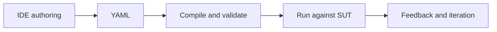
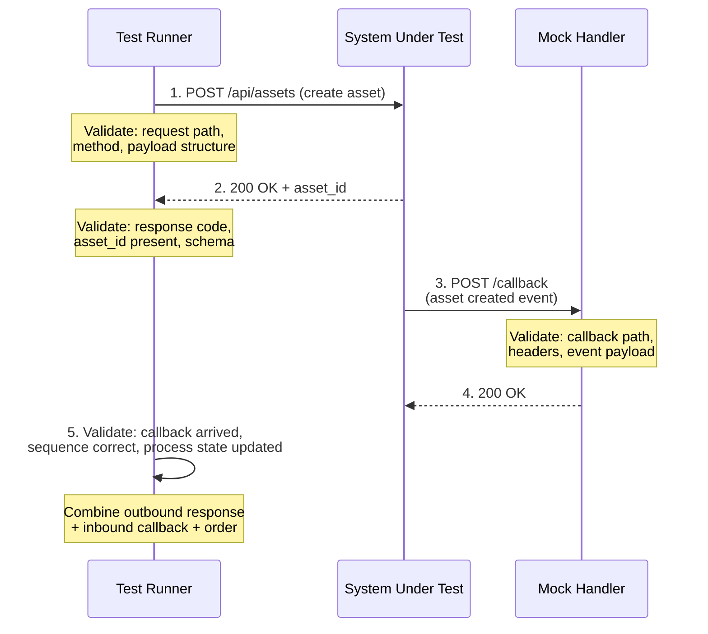

<!--
 Eclipse Tractus-X - Tractus-X TestLab

 Copyright (c) 2025 Contributors to the Eclipse Foundation

 See the NOTICE file(s) distributed with this work for additional
 information regarding copyright ownership.

 This program and the accompanying materials are made available under the
 terms of the Apache License, Version 2.0 which is available at
 https://www.apache.org/licenses/LICENSE-2.0.

 Unless required by applicable law or agreed to in writing, software
 distributed under the License is distributed on an "AS IS" BASIS, WITHOUT
 WARRANTIES OR CONDITIONS OF ANY KIND, either express or implied. See the
 License for the specific language governing permissions and limitations
 under the License.

 SPDX-License-Identifier: Apache-2.0
-->
<!-- This code was partially generated using artificial intelligence (AI) (Tool: Copilot, Model: GPT-5.3-Codex). -->
<!-- It was reviewed and tested by a human committer. -->

# Product Scope

This page defines what TestLab delivers, what MVP does not cover, and how the IDE and Python runtime work together to validate certification-relevant behavior against a system under test (SUT).

## Product mission

TestLab enables teams to author, version, compile, and execute certification TCKs for Tractus-X related standards with a visual workflow for domain experts and a deterministic runtime for automation.

The product has two integrated components:

1. IDE (authoring): users configure tests with reusable blocks and tck structure.
2. Python compiler and runner (execution): YAML is validated, compiled, and executed against the SUT with structured feedback.

## MVP scope

### In scope (MVP)

| Area | In scope definition |
|---|---|
| Test authoring | Create and maintain TCKs in the IDE, including setup, execution steps, and teardown. |
| Domain usability | Support non-technical users through labeled blocks, defaults, and guided structure. |
| YAML generation | Generate YAML from the IDE model and keep it synchronized with authoring state. |
| Compilation | Validate syntax and structural constraints before execution. |
| Execution | Run TCKs in defined order with prerequisite-aware workflows. |
| Validation | Validate inbound and outbound API interactions, payloads, assertions, and process outcomes. |
| Reuse | Reuse capabilities (blocks/step patterns/templates) across TCKs and standards. |
| Versioning | Support versioned standard profiles and extension via additive capabilities. |
| Traceability | Provide execution feedback that links outcomes back to tests and steps. |
| Determinism | Ensure reproducible runs given the same inputs, ordering, and SUT behavior. |

### Out of scope (MVP)

| Area | Out of scope definition |
|---|---|
| Full conformance governance | Legal certification issuance, auditor workflows, and governance portals. |
| Protocol re-implementation | Rebuilding full dataspace protocols in TestLab instead of delegating to SDK/services. |
| Arbitrary low-code platform | Generic workflow automation outside certification test authoring and execution. |
| AI auto-authoring | Automatic generation of full test suites without human review. |
| Performance benchmarking | Load/stress benchmarking as a primary runtime objective. |
| Long-term historical warehouse | Enterprise-grade analytics lake for multi-year result warehousing. |

## Core concepts glossary

| Term | Definition |
|---|---|
| Test case | Ordered container of tests that defines shared context, prerequisites, and execution intent for one certification scenario. |
| Test | Executable unit within a TCK, composed of setup, execution steps, assertions, and optional teardown/export logic. |
| Capability | Reusable functional building block that encodes a repeatable behavior pattern (for example, asset creation or schema validation). |
| Block | Visual IDE representation of a capability or structural element, mapped to typed step data in YAML. |
| Prerequisite | Condition or upstream output required before a step or test can execute safely and meaningfully. |
| Setup phase | Preparation segment that creates test preconditions (data, identities, contracts, mocks, or environment state). |
| Execution phase | Main segment that performs the target interaction flow and validates expected behavior. |
| Teardown phase | Cleanup/export segment that removes temporary artifacts and publishes selected outputs. |
| SUT | System under test, including APIs and processes that TestLab must stimulate or observe. |

## End-to-end lifecycle

The lifecycle is one continuous chain from visual authoring to actionable feedback:

1. Author in IDE: user assembles TCK/test logic using blocks and explicit ordering.
2. Produce YAML: IDE serializes the model into YAML for portability and review.
3. Compile: compiler validates structure, references, and executable consistency.
4. Execute: runner orchestrates setup, execution, validation, and teardown against the SUT.
5. Feedback: results return as step-level and test-level outcomes for correction and rerun.

## Execution model and ordering constraints

Execution semantics are strict because certification flows depend on prerequisites.

### Workflow model

1. Setup phase executes first and must establish required state.
2. Execution phase runs only when setup prerequisites are satisfied.
3. Teardown phase runs after execution to clean state and export selected outputs.

### Ordering and prerequisite rules

| Rule | Scope impact |
|---|---|
| Declaration order is meaningful | Tests and steps run in their configured order unless explicit dependencies require reordering. |
| Prerequisites are explicit | A step/test cannot run if required inputs or upstream outputs are missing. |
| Setup harmonization is mandatory | Setup semantics must be consistent across reusable capabilities and standards. |
| Failure handling is deterministic | Hard prerequisite failures stop dependent execution paths and surface clear errors. |
| Reuse must preserve behavior | Reused capability blocks keep stable contracts across TCKs. |

## Standard versioning strategy

TestLab supports standards that evolve over time (for example, yearly revisions) without forcing complete rewrites.

### Strategy

1. Maintain a stable base capability set for cross-version reuse.
2. Add version-specific extensions as additive capability profiles.
3. Keep compatibility boundaries explicit so older TCKs remain executable.
4. Version TCKs and capability packages together for traceable evolution.

### Practical model

| Layer | Purpose |
|---|---|
| Base capabilities | Common behaviors reused across multiple standard versions. |
| Version extension | Additional or adjusted capabilities for a specific standard release. |
| Test case mapping | Explicit link between TCK version and capability profile version. |

## Validation model

Validation targets both directions of interaction with the SUT and checks process integrity, not only single API responses.

### Inbound validation (SUT to TestLab)

The SUT calls mock or callback endpoints hosted by TestLab. MVP validates:

1. Request correctness (method, path, headers, payload structure).
2. Response expectations returned by TestLab mocks.
3. Process-level events such as callback arrival and sequence consistency.

### Outbound validation (TestLab to SUT)

TestLab calls SUT APIs directly. MVP validates:

1. Outbound request construction and deterministic test data input.
2. SUT response codes, payload semantics, and schema/concept checks.
3. Cross-step process expectations (for example, state transitions and handshakes).

### Process checks

The scope includes end-to-end process assertions that combine multiple interactions, such as:

- Ordered call chains.
- Required prerequisite completion before dependent actions.
- Expected progression of business-relevant states.

### Validation flow example

The following diagram shows a realistic scenario where TestLab validates both outbound and inbound interactions as part of a single test step. This illustrates how the validation model combines request correctness, response validation, callback sequence, and process state integrity.

## Non-functional goals

| Goal | Scope expectation |
|---|---|
| Usability for non-technical users | Domain-focused block labels, safe defaults, and minimal plumbing exposure. |
| Traceability | Every failed or passed outcome can be traced to TCK, test, and step intent. |
| Determinism | Given the same configuration and SUT behavior, runs produce reproducible outcomes. |

## Acceptance criteria: scope is clear

Project scope is considered clear when all criteria below are met:

1. Product mission states both components (IDE and Python runtime) and their shared purpose.
2. MVP in-scope and out-of-scope boundaries are explicit and non-overlapping.
3. Core terminology is defined in one glossary and matches execution behavior.
4. Lifecycle from authoring to feedback is documented as one end-to-end flow.
5. Execution model specifies setup/execution/teardown and prerequisite-driven ordering.
6. Versioning strategy explains reuse plus extension for evolving standards.
7. Validation model covers inbound and outbound SUT interactions plus process checks.
8. Non-functional goals include usability, traceability, and determinism.
9. The page is discoverable from Developer navigation and Developer overview.
