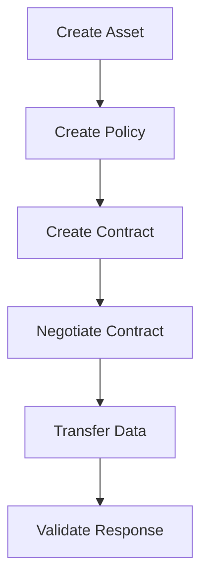
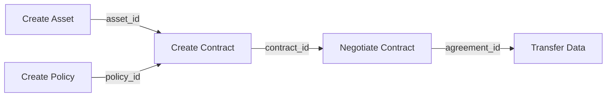

<!--
 Eclipse Tractus-X - Tractus-X TestLab

 Copyright (c) 2026 Contributors to the Eclipse Foundation

 See the NOTICE file(s) distributed with this work for additional
 information regarding copyright ownership.

 This program and the accompanying materials are made available under the
 terms of the Apache License, Version 2.0 which is available at
 https://www.apache.org/licenses/LICENSE-2.0.

 Unless required by applicable law or agreed to in writing, software
 distributed under the License is distributed on an "AS IS" BASIS, WITHOUT
 WARRANTIES OR CONDITIONS OF ANY KIND, either express or implied. See the
 License for the specific language governing permissions and limitations
 under the License.

 SPDX-License-Identifier: Apache-2.0
-->
<!-- This code was partially generated using artificial intelligence (AI) (Tool: Copilot, Model: Claude Opus 4.6). -->
<!-- It was reviewed and tested by a human committer. -->

# Graph View

The Graph View shows a visual diagram of your test's step sequence and data dependencies. It sits in the right panel, toggled via the **Graph** tab.

## Viewing Modes

The Graph View has two modes, toggled with buttons in the panel header:

### Execution Flow

Shows the **step execution order** as a directed graph. Each node is a step, and edges show the sequence from top to bottom.

Use this mode to understand:

- Which steps run in what order
- Where retry loops and conditional branches occur
- The overall test structure at a glance

### Data Flow

Shows how **data flows between steps** through variables. Edges connect step outputs to the inputs of downstream steps that consume them.

Use this mode to understand:

- Which variables are produced by each step
- Which steps depend on data from earlier steps
- Where data gaps or unused outputs exist

## Interacting with the Graph

| Action | Control |
|--------|---------|
| **Select a step** | Click a node — syncs with Block Editor and YAML |
| **Pan** | Click and drag on empty space |
| **Zoom** | Mouse scroll wheel |
| **View details** | Hover over a node or edge for a tooltip |

The graph auto-layouts using the Dagre algorithm and auto-centers when the data changes. A **mini-map** in the bottom-right corner shows an overview of the full graph for easy navigation.

## Node Colors

Nodes are color-coded by their block category — the same colors used in the Block Editor toolbox. This makes it easy to identify step types at a glance.

## Syncing with the Block Editor

Clicking a node in the graph selects the corresponding block in the Block Editor and highlights the matching YAML lines. This three-way sync (blocks ↔ graph ↔ YAML) works in all directions.
