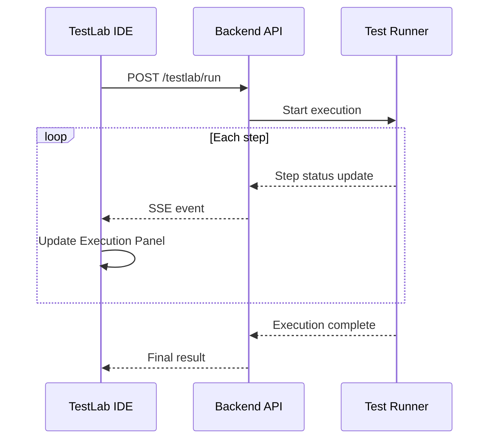

<!--
 Eclipse Tractus-X - Tractus-X TestLab

 Copyright (c) 2026 Contributors to the Eclipse Foundation

 See the NOTICE file(s) distributed with this work for additional
 information regarding copyright ownership.

 This program and the accompanying materials are made available under the
 terms of the Apache License, Version 2.0 which is available at
 https://www.apache.org/licenses/LICENSE-2.0.

 Unless required by applicable law or agreed to in writing, software
 distributed under the License is distributed on an "AS IS" BASIS, WITHOUT
 WARRANTIES OR CONDITIONS OF ANY KIND, either express or implied. See the
 License for the specific language governing permissions and limitations
 under the License.

 SPDX-License-Identifier: Apache-2.0
-->
<!-- This code was partially generated using artificial intelligence (AI) (Tool: Copilot, Model: Claude Opus 4.6). -->
<!-- It was reviewed and tested by a human committer. -->

# Live Execution

Run TCKs directly from the IDE and watch each step execute in real time. The IDE connects to a Python backend that orchestrates test execution and streams progress updates back to the editor.

## Overview

Live execution bridges the visual editor and the test runner. You author tests with blocks, then execute them without leaving the IDE. The **Execution Panel** shows step-by-step progress across all phases: Precondition, Setup, Steps, and Cleanup.



## Prerequisites

You need two things running:

| Component | Purpose |
|-----------|---------|
| **TestLab IDE** | Visual editor (React frontend) |
| **TestLab Backend** | Python API server that runs tests |

Install the Python package:

```bash
pip install tractusx-testlab
```

## Starting the Backend

=== "Installed package"

    ```bash
    testlab serve --port 8000
    ```

=== "From source"

    ```bash
    uvicorn tractusx_testlab.server.app:create_app --factory --port 8000
    ```

The server starts on `http://localhost:8000`. You can verify it is running:

```bash
curl http://localhost:8000/docs
```

This opens the auto-generated API documentation (Swagger UI).

!!! tip "Default port"
    The backend defaults to port `8000`. Change it with the `--port` flag.

## Connecting the IDE

1. Look for the **plug icon** (⚡) in the top bar
2. Click it to open the connection dialog
3. Enter the backend URL (e.g., `http://localhost:8000`)
4. Click **Connect**

A **green dot** next to the icon confirms the connection is active. A **red dot** means the IDE cannot reach the backend.

!!! note "Local development"
    When running both IDE and backend locally, use `http://localhost:8000` as the URL. The backend includes CORS middleware, so cross-origin requests work out of the box.

## Executing a Test

### Start execution

1. Open or create a TCK in the Block Editor
2. Click the **▶ Execute** button in the top bar
3. The Execution Panel opens at the bottom of the screen

### Monitor progress

The Execution Panel organizes steps into four phase tabs:

| Tab | Phase | Description |
|-----|-------|-------------|
| **Precondition** | `PRECONDITION` | Validates prerequisites before the test runs |
| **Setup** | `SETUP` | Prepares the test environment |
| **Steps** | `MAIN` | Executes the core test logic |
| **Cleanup** | `CLEANUP` | Tears down resources after the test |

Each step appears as a card showing:

- **Name** — the step label (e.g., "Create an Asset")
- **Status** — current state with a color indicator
- **Duration** — elapsed time once complete

### Step statuses

| Status | Indicator | Meaning |
|--------|-----------|---------|
| Pending | ⏳ Gray | Not started yet |
| Running | 🔄 Blue | Currently executing |
| Passed | ✅ Green | Completed successfully |
| Failed | ❌ Red | Completed with an error |
| Skipped | ⏭ Gray | Skipped due to a prior failure |

### Cancel execution

Click the **Cancel** button in the Execution Panel to abort a running test. The backend cancels the active job and marks remaining steps as skipped.

## Backend API Reference

The backend exposes these endpoints for test execution:

| Method | Endpoint | Description |
|--------|----------|-------------|
| `POST` | `/testlab/run` | Start a test execution |
| `GET` | `/jobs` | List all jobs |
| `GET` | `/jobs/{id}` | Get job status and results |
| `POST` | `/jobs/{id}/cancel` | Cancel a running job |

!!! info "Full API docs"
    Visit `http://localhost:8000/docs` for the interactive Swagger UI with request/response schemas.

## Troubleshooting

### Backend not reachable

**Symptom**: Red dot next to the plug icon. Connection dialog shows an error.

**Fix**:

1. Verify the backend is running: `curl http://localhost:8000/docs`
2. Check the URL in the connection dialog matches the server address
3. Ensure no firewall blocks the port

### CORS errors in browser console

**Symptom**: Browser console shows `Access-Control-Allow-Origin` errors.

**Fix**: The backend includes CORS middleware by default. If you see CORS errors, ensure you are connecting to the TestLab backend and not a different server.

### Connection lost during execution

**Symptom**: Steps stop updating. The panel shows a disconnected state.

**Fix**: The IDE handles connection loss gracefully. Reconnect using the plug icon. The backend continues execution independently — reconnecting shows the current state.

### Steps stuck in "Pending"

**Symptom**: Execution started but no steps transition to "Running".

**Fix**:

1. Check the backend terminal for error messages
2. Verify the TCK has valid steps (not empty)
3. Ensure all required services are configured in the test definition
