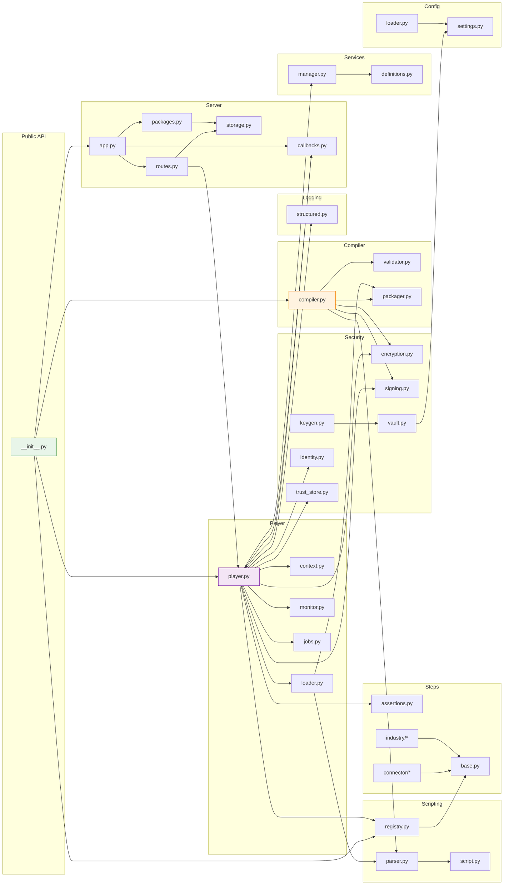

<!--

Eclipse Tractus-X - Software Development KIT

Copyright (c) 2026 Catena-X Automotive Network e.V.
Copyright (c) 2026 Contributors to the Eclipse Foundation

See the NOTICE file(s) distributed with this work for additional
information regarding copyright ownership.

This work is made available under the terms of the
Creative Commons Attribution 4.0 International (CC-BY-4.0) license,
which is available at
https://creativecommons.org/licenses/by/4.0/legalcode.

SPDX-License-Identifier: CC-BY-4.0

-->

# Module Structure

## Source Layout

```mermaid
graph TD
    ROOT["tractusx_sdk/extensions/testlab/"]

    ROOT --> INIT["__init__.py<br/><i>Public API exports</i>"]
    ROOT --> MODELS["models.py<br/><i>All Pydantic models</i>"]

    ROOT --> COMPILER["compiler/"]
    COMPILER --> C_INIT["__init__.py"]
    COMPILER --> C_COMP["compiler.py<br/><i>TestlabCompiler</i>"]
    COMPILER --> C_VAL["validator.py<br/><i>Static validation</i>"]
    COMPILER --> C_PKG["packager.py<br/><i>.testpkg ZIP builder/reader</i>"]

    ROOT --> PLAYER["player/"]
    PLAYER --> P_INIT["__init__.py"]
    PLAYER --> P_PLAY["player.py<br/><i>TestlabPlayer (singleton)</i>"]
    PLAYER --> P_CTX["context.py<br/><i>StepContext</i>"]
    PLAYER --> P_LOAD["loader.py<br/><i>Package/YAML loader</i>"]
    PLAYER --> P_MON["monitor.py<br/><i>ExecutionMonitor</i>"]
    PLAYER --> P_JOBS["jobs.py<br/><i>Job · JobMemory · JobEvent</i>"]

    ROOT --> SCRIPTING["scripting/"]
    SCRIPTING --> S_INIT["__init__.py"]
    SCRIPTING --> S_PARSE["parser.py<br/><i>YAML parser</i>"]
    SCRIPTING --> S_SCRIPT["script.py<br/><i>TestScript / TestCase wrappers</i>"]
    SCRIPTING --> S_REG["registry.py<br/><i>StepRegistry</i>"]

    ROOT --> STEPS["steps/"]
    STEPS --> ST_INIT["__init__.py"]
    STEPS --> ST_BASE["base.py<br/><i>BaseStep ABC + @step decorator</i>"]
    STEPS --> ST_ASSERT["assertions.py<br/><i>AssertionEngine</i>"]

    STEPS --> CONN["connector/"]
    CONN --> CO_INIT["__init__.py"]
    CONN --> CO_PROV["provision.py<br/><i>Asset provisioning steps</i>"]
    CONN --> CO_CONS["consume.py<br/><i>Catalog, negotiate, transfer</i>"]
    CONN --> CO_DATA["dataplane.py<br/><i>dataplane_call step</i>"]
    CONN --> CO_CLEAN["cleanup.py<br/><i>Resource cleanup</i>"]

    STEPS --> IND["industry/"]
    IND --> IN_INIT["__init__.py"]
    IND --> IN_SUB["submodel.py<br/><i>Submodel consumption</i>"]
    IND --> IN_VAL["validation.py<br/><i>Aspect model / schema validation</i>"]

    ROOT --> LOGGING["logging/"]
    LOGGING --> L_INIT["__init__.py"]
    LOGGING --> L_STRUCT["structured.py<br/><i>JSON-lines logger</i>"]

    ROOT --> SERVICES["services/"]
    SERVICES --> SV_INIT["__init__.py"]
    SERVICES --> SV_MGR["manager.py<br/><i>ServiceManager</i>"]
    SERVICES --> SV_DEFS["definitions.py<br/><i>ServiceDefinition models</i>"]

    ROOT --> SERVER["server/"]
    SERVER --> SR_INIT["__init__.py"]
    SERVER --> SR_APP["app.py<br/><i>FastAPI app factory</i>"]
    SERVER --> SR_CB["callbacks.py<br/><i>Callback route manager</i>"]
    SERVER --> SR_API["routes.py<br/><i>Execution API endpoints</i>"]
    SERVER --> SR_PKG["packages.py<br/><i>Package upload/list/delete API</i>"]
    SERVER --> SR_STORE["storage.py<br/><i>Package storage backend</i>"]

    ROOT --> SECURITY["security/"]
    SECURITY --> SEC_INIT["__init__.py"]
    SECURITY --> SEC_KEYGEN["keygen.py<br/><i>Key pair generation (RSA, Ed25519)</i>"]
    SECURITY --> SEC_ENC["encryption.py<br/><i>AES-256-GCM encrypt/decrypt<br/>RSA-OAEP key wrapping</i>"]
    SECURITY --> SEC_ID["identity.py<br/><i>PlayerIdentity, fingerprints</i>"]
    SECURITY --> SEC_TRUST["trust_store.py<br/><i>Compiler key trust management</i>"]
    SECURITY --> SEC_SIGN["signing.py<br/><i>Ed25519 package signing/verification</i>"]
    SECURITY --> SEC_VAULT["vault.py<br/><i>HashiCorp Vault key backend</i>"]

    ROOT --> CONFIG["config/"]
    CONFIG --> CF_INIT["__init__.py"]
    CONFIG --> CF_SETTINGS["settings.py<br/><i>TestlabConfig (Pydantic settings)</i>"]
    CONFIG --> CF_LOADER["loader.py<br/><i>Config file / env / CLI resolver</i>"]

    style ROOT fill:#e8f5e9,stroke:#388e3c
    style COMPILER fill:#fff3e0,stroke:#f57c00
    style PLAYER fill:#f3e5f5,stroke:#7b1fa2
    style SCRIPTING fill:#e1f5fe,stroke:#0288d1
    style STEPS fill:#fce4ec,stroke:#c62828
    style CONN fill:#fce4ec,stroke:#c62828
    style IND fill:#fce4ec,stroke:#c62828
    style LOGGING fill:#fff9c4,stroke:#f9a825
    style SERVICES fill:#e8eaf6,stroke:#3f51b5
    style SERVER fill:#dcedc8,stroke:#689f38
    style SECURITY fill:#ffccbc,stroke:#bf360c
    style CONFIG fill:#e0f2f1,stroke:#00796b
```

## Component Responsibilities

## Component Summary

| Component | File | Responsibility |
|-----------|------|---------------|
| **TestlabCompiler** | `compiler/compiler.py` | Orchestrates validation and compilation of YAML scripts into stamped, verified definitions |
| **Validator** | `compiler/validator.py` | Static analysis — variable reference checks, step type existence, version compatibility |
| **Packager** | `compiler/packager.py` | Builds `.testpkg` ZIP archives and unpacks them with checksum verification |
| **TestlabPlayer** | `player/player.py` | Singleton async executor — loads packages/YAML, runs scripts, coordinates all subsystems |
| **StepContext** | `player/context.py` | Per-script runtime state bag — holds variables, dataspace version, service references |
| **Loader** | `player/loader.py` | Loads test content from `.testpkg` files, raw YAML, or pre-compiled dicts |
| **ExecutionMonitor** | `player/monitor.py` | In-memory state store for active/completed runs, event callbacks, query API |
| **JobManager** | `player/jobs.py` | Manages Job lifecycle (creation, state transitions, memory persistence, event logging), coordinates wait/resume with the callback system |
| **Parser** | `scripting/parser.py` | YAML parsing with string-based `"!include"` directive and safe loading |
| **StepRegistry** | `scripting/registry.py` | Version-aware registry mapping `(step_type, dataspace_version)` to `BaseStep` classes |
| **TestScript / TestCase** | `scripting/script.py` | Runtime wrappers around parsed definitions with execution helpers |
| **BaseStep** | `steps/base.py` | Abstract base class for all steps, plus `@step` auto-registration decorator |
| **AssertionEngine** | `steps/assertions.py` | Evaluates assertion blocks against step outputs (5 types, 2 severities, 3 sources) |
| **Connector Steps** | `steps/connector/` | Predefined steps for connector operations (provision, catalog, negotiate, transfer, EDR, cleanup, dataplane) |
| **Industry Steps** | `steps/industry/` | Predefined steps for industry operations (submodel consumption, aspect model validation) |
| **StructuredLogger** | `logging/structured.py` | JSON-lines file logger with console summary output |
| **ServiceManager** | `services/manager.py` | Initializes, caches, and tears down managed SDK service instances (connector consumer, connector provider, DTR) based on script `services` declarations |
| **ServiceDefinitions** | `services/definitions.py` | Pydantic models for service declarations (`ServiceDefinition`, `ServiceType` enum) |
| **App Factory** | `server/app.py` | Creates the FastAPI application for standalone mode (`testlab serve`) or produces a mountable sub-app for embedded mode |
| **CallbackManager** | `server/callbacks.py` | Manages ephemeral callback routes — mounts/unmounts FastAPI routes at runtime, signals `asyncio.Event` on callback receipt |
| **Execution Routes** | `server/routes.py` | REST API endpoints for remote execution (`/run`) and job management (`/jobs`, `/jobs/{job_id}`, `/jobs/{job_id}/cancel`, `/jobs/{job_id}/memory`, `/jobs/{job_id}/events`) |
| **Package Routes** | `server/packages.py` | REST API endpoints for package upload, listing, metadata retrieval, and deletion (`/packages`) |
| **PackageStorage** | `server/storage.py` | Local filesystem backend for uploaded `.testpkg` files — stores, indexes, and retrieves packages by `package_id` |
| **KeyGenerator** | `security/keygen.py` | Generates RSA key pairs (Player identity) and Ed25519 key pairs (Compiler signing). Implements `testlab keygen` CLI |
| **Encryption** | `security/encryption.py` | AES-256-GCM content encryption/decryption and RSA-OAEP key wrapping/unwrapping. Used by the Packager for encrypted `.testpkg` |
| **PlayerIdentity** | `security/identity.py` | Manages Player identity — loads/stores RSA key pairs from `~/.testlab/keys/`, computes fingerprints, produces `player:sha256:` identifiers |
| **TrustStore** | `security/trust_store.py` | Manages the trusted compilers directory (`~/.testlab/trusted_compilers/`). Loads Ed25519 public keys, matches by fingerprint |
| **PackageSigner** | `security/signing.py` | Ed25519 package signing (Compiler-side) and signature verification (Player-side). Signs manifest + payload bytes |
| **VaultBackend** | `security/vault.py` | Optional HashiCorp Vault integration for key storage and retrieval. Reads/writes signing keys and Player keys from Vault KV v2 secrets engine when configured |
| **TestlabConfig** | `config/settings.py` | Pydantic settings model — resolves configuration from `testlab.config.yaml`, environment variables, and CLI flags with defined precedence |
| **ConfigLoader** | `config/loader.py` | Discovers and merges configuration sources (config file, env vars, CLI flags) into a `TestlabConfig` instance |

---

## NOTICE

This work is licensed under the [CC-BY-4.0](https://creativecommons.org/licenses/by/4.0/legalcode).

- SPDX-License-Identifier: CC-BY-4.0
- SPDX-FileCopyrightText: 2025, 2026 Contributors to the Eclipse Foundation
- SPDX-FileCopyrightText: 2025, 2026 Catena-X Automotive Network e.V.
- Source URL: [https://github.com/eclipse-tractusx/tractusx-sdk](https://github.com/eclipse-tractusx/tractusx-sdk)