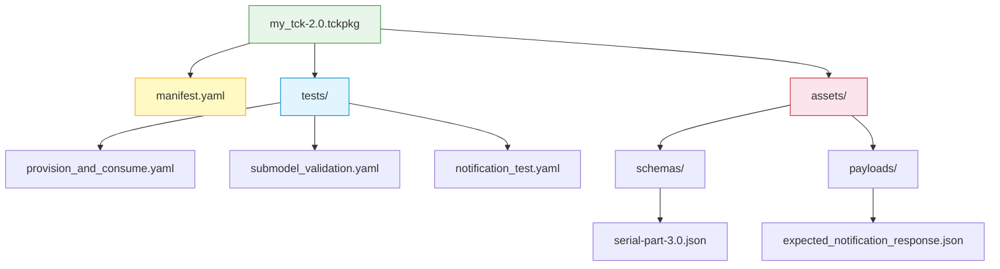
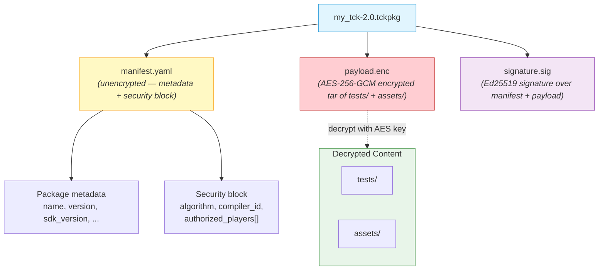
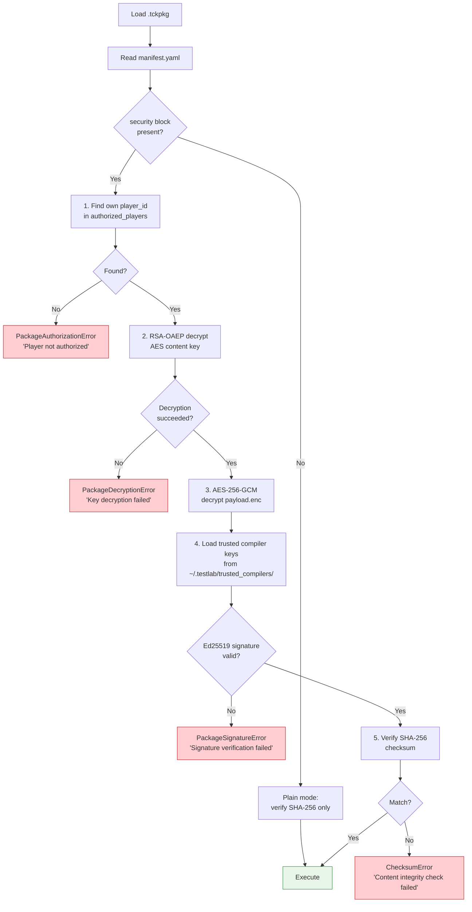

<!--

Eclipse Tractus-X - Software Development KIT

Copyright (c) 2026 Catena-X Automotive Network e.V.
Copyright (c) 2026 Contributors to the Eclipse Foundation

See the NOTICE file(s) distributed with this work for additional
information regarding copyright ownership.

This work is made available under the terms of the
Creative Commons Attribution 4.0 International (CC-BY-4.0) license,
which is available at
https://creativecommons.org/licenses/by/4.0/legalcode.

SPDX-License-Identifier: CC-BY-4.0

-->

# Package Format (.tckpkg)

## Overview

A `.tckpkg` file is a ZIP archive that bundles compiled test scripts, their required assets, and a manifest into a single portable, distributable artifact. Packages are produced by the Compiler and consumed by the Player.

Packages can be compiled in two modes:

- **Encrypted** (default) — Scripts and assets are encrypted with AES-256-GCM. Only authorized Player instances holding the correct RSA private key can decrypt and execute the package. Packages are non-human-readable and can only be decompiled by an authorized Player using `testlab decompile`. This protects secrets (OAuth2 credentials, service URLs, BPNs) embedded in test scripts.
- **Plain** (`--plain` opt-in) — Scripts and assets are stored as-is in the archive. Intended only for local development and debugging. A warning is emitted when plain mode is used.

## Package Lifecycle

```mermaid
flowchart LR
    subgraph Compiler
        A[YAML Scripts] --> B[Validate & Compile]
        C[Assets<br/>schemas · payloads] --> D[Bundle]
        B --> D
    end

    D --> MODE{--plain?}
    MODE -->|Yes| PLAIN[".tckpkg<br/>(plain ZIP, dev only)"]
    MODE -->|No| ENC[".tckpkg<br/>(encrypted, default)"]

    ENC --> SIGN[Sign with Ed25519<br/>compiler key]
    SIGN --> E[".tckpkg<br/>(encrypted + signed)"]

    PLAIN --> F[Share / Upload / Store]
    E --> F
    F --> G[Player loads .tckpkg]
    G --> DETECT{security block<br/>in manifest?}
    DETECT -->|No| H[Verify SHA-256 checksum]
    DETECT -->|Yes| DEC[Verify signature<br/>Decrypt payload]
    DEC --> H
    H --> I[Unpack & Execute]

    style PLAIN fill:#e8f5e9,stroke:#388e3c
    style E fill:#e1f5fe,stroke:#0288d1
    style ENC fill:#fff3e0,stroke:#f57c00
    style H fill:#fff3e0,stroke:#f57c00
    style DEC fill:#f3e5f5,stroke:#7b1fa2
```



## Archive Structure

### Plain Mode (`--plain`, Development Only)



### Encrypted Mode (Default)

In the default encrypted mode, scripts and assets are combined into a single encrypted blob (`payload.enc`). The manifest remains unencrypted for metadata inspection. A separate signature file provides authenticity verification. This ensures that compiled packages are **never human-readable** and can only be decompiled by an authorized Player holding the correct RSA private key.



## Manifest Example

The `manifest.yaml` at the root of the archive contains metadata about the package and its contents.

### Plain Package Manifest

```yaml
name: "connector_regression"
version: "2.0"
sdk_version: "0.5.0"
compiled_at: "2026-03-30T14:22:00Z"
dataspace_versions:
  - "saturn"
scripts:
  - "provision_and_consume"
  - "submodel_validation"
  - "notification_test"
checksum: "sha256:e3b0c44298fc1c149afbf4c8996fb92427ae41e4649b934ca495991b7852b855"
```

### Encrypted Package Manifest

```yaml
name: "connector_regression"
version: "2.0"
sdk_version: "0.5.0"
compiled_at: "2026-03-30T14:22:00Z"
dataspace_versions:
  - "saturn"
scripts:
  - "provision_and_consume"
  - "submodel_validation"
  - "notification_test"
checksum: "sha256:e3b0c44298fc1c149afbf4c8996fb92427ae41e4649b934ca495991b7852b855"

security:
  format: "encrypted-v1"
  algorithm: "AES-256-GCM"
  key_derivation: "RSA-OAEP-SHA256"
  compiler_id: "compiler:sha256:a1b2c3d4e5f6..."   # Compiler's public key fingerprint
  authorized_players:
    - player_id: "player:sha256:d4e5f6a1b2c3..."    # Player 1's public key fingerprint
      encrypted_key: "base64:EncryptedAESKeyForPlayer1=="  # AES key wrapped with Player 1's RSA pub key
    - player_id: "player:sha256:f6a1b2c3d4e5..."    # Player 2's public key fingerprint
      encrypted_key: "base64:EncryptedAESKeyForPlayer2=="  # AES key wrapped with Player 2's RSA pub key
```

!!! info "Manifest is always unencrypted"
    The `manifest.yaml` is stored in the clear even in encrypted packages. This allows tools
    and humans to inspect package metadata (name, version, authorized players) without
    possessing a decryption key. No secret material is stored in the manifest — only
    encrypted copies of the AES key (which are useless without the corresponding RSA private key).

## Manifest Fields

| Field | Type | Description |
|-------|------|-------------|
| `name` | `string` | Human-readable package name, matching the TCK name |
| `version` | `string` | Package version (SemVer recommended) |
| `sdk_version` | `string` | SDK version used to compile the package |
| `compiled_at` | `string` (ISO 8601) | Timestamp when the package was compiled |
| `dataspace_versions` | `list[string]` | All dataspace versions referenced across bundled scripts |
| `scripts` | `list[string]` | Names of the compiled tests in execution order |
| `checksum` | `string` | `sha256:<hex>` integrity hash computed over scripts and assets |
| `security` | `SecurityBlock?` | Present only in encrypted packages — contains algorithm, compiler ID, and authorized player key blocks |
| `security.format` | `string` | Encryption format version: `"encrypted-v1"` |
| `security.algorithm` | `string` | Content encryption algorithm: `"AES-256-GCM"` |
| `security.key_derivation` | `string` | Key wrapping algorithm: `"RSA-OAEP-SHA256"` |
| `security.compiler_id` | `string` | Compiler's public key fingerprint (`compiler:sha256:<hex>`) |
| `security.authorized_players` | `list` | One entry per authorized Player (see below) |
| `security.authorized_players[].player_id` | `string` | Player's public key fingerprint (`player:sha256:<hex>`) |
| `security.authorized_players[].encrypted_key` | `string` | AES-256 content key encrypted with this Player's RSA public key, base64-encoded |

## Integrity Verification

When the Player loads a `.tckpkg`, it:

1. Extracts the `checksum` field from `manifest.yaml`
2. Recomputes the SHA-256 hash over the `tests/` and `assets/` contents
3. Compares the computed hash with the declared checksum
4. **Rejects** the package if the hashes do not match (tamper detection)
5. **Warns** (but does not reject) if `sdk_version` differs from the running SDK version

### Encrypted Package Verification

When loading an encrypted `.tckpkg`, the Player performs additional verification:



---

## Key Management

### CLI Commands

| Command | Description | Output |
|---------|-------------|--------|
| `testlab keygen` | Generate a Player RSA key pair (2048-bit) | `~/.testlab/keys/player.pem` (private), `~/.testlab/keys/player.pub` (public) |
| `testlab keygen --compiler` | Generate a Compiler Ed25519 signing key pair | `compiler_signing.pem` (private), `compiler_signing.pub` (public) |
| `testlab export-key --player` | Export Player's public key for sharing with Compiler | Prints PEM-encoded public key to stdout |
| `testlab export-key --fingerprint` | Print Player's fingerprint | `player:sha256:<hex>` |

### Directory Layout

```
~/.testlab/
├── keys/
│   ├── player.pem              # Player RSA private key (file permissions: 600)
│   └── player.pub              # Player RSA public key
└── trusted_compilers/
    ├── team_compiler.pub       # Trusted Compiler Ed25519 public key
    └── ci_compiler.pub         # Another trusted Compiler key
```

### Key Generation Details

| Key Type | Algorithm | Size | Purpose |
|----------|-----------|------|---------|
| Player private key | RSA | 2048-bit (minimum) | Decrypt AES content keys from authorized_players blocks |
| Player public key | RSA | 2048-bit (minimum) | Shared with Compiler; used to wrap AES content key for this Player |
| Compiler signing key | Ed25519 | 256-bit | Sign packages for authenticity verification |
| Compiler verification key | Ed25519 | 256-bit | Stored in Player's trust store; used to verify package signatures |

### Trust Store

The Player's trust store (`~/.testlab/trusted_compilers/`) is a directory of Ed25519 public keys belonging to Compilers whose packages this Player will accept. When verifying a package signature:

1. The Player reads `security.compiler_id` from the manifest
2. It iterates over public keys in `~/.testlab/trusted_compilers/`
3. It computes the fingerprint of each key and compares against `compiler_id`
4. If a match is found, it uses that key to verify the Ed25519 signature in `signature.sig`
5. If no match is found, the package is rejected with `PackageSignatureError`

---

## Compilation with Encryption

### Command

```bash
testlab compile tck.yaml \
  --encrypt \
  --authorize-player ~/keys/player1.pub \
  --authorize-player ~/keys/player2.pub \
  --signing-key ./compiler_signing.pem \
  --output my_tck-2.0.tckpkg
```

### Compiler Workflow (Encrypted Mode)

1. Parse and validate all YAML scripts (identical to plain mode)
2. Generate a random 256-bit AES key
3. Create a tar archive of `tests/` and `assets/`
4. Encrypt the tar archive with AES-256-GCM → `payload.enc`
5. For each `--authorize-player` public key:
   - Load RSA public key from PEM file
   - Encrypt the AES key with RSA-OAEP (SHA-256 padding)
   - Record as `{player_id: fingerprint, encrypted_key: base64_blob}`
6. Build `manifest.yaml` with metadata + `security` block (no secret material)
7. Compute SHA-256 checksum over the original (unencrypted) scripts and assets
8. Sign (`manifest.yaml` bytes ‖ `payload.enc` bytes) with Ed25519 signing key → `signature.sig`
9. Package `manifest.yaml`, `payload.enc`, `signature.sig` into ZIP archive

### Plain vs. Encrypted Comparison

| Aspect | Plain Mode | Encrypted Mode |
|--------|-----------|----------------|
| Archive contents | `manifest.yaml` + `tests/` + `assets/` | `manifest.yaml` + `payload.enc` + `signature.sig` |
| Scripts readable by | Anyone with the file | Only authorized Players |
| Integrity check | SHA-256 checksum | SHA-256 checksum + Ed25519 signature |
| Compiler requirement | None (no key needed) | Ed25519 signing key (`--signing-key`) |
| Player requirement | None | RSA key pair + compiler in trust store |
| CLI flag | `testlab compile tck.yaml` | `testlab compile tck.yaml --encrypt ...` |
| Backward compatible | Yes (always) | Yes (Players without keys can still run plain packages) |

---

## NOTICE

This work is licensed under the [CC-BY-4.0](https://creativecommons.org/licenses/by/4.0/legalcode).

- SPDX-License-Identifier: CC-BY-4.0
- SPDX-FileCopyrightText: 2025, 2026 Contributors to the Eclipse Foundation
- SPDX-FileCopyrightText: 2025, 2026 Catena-X Automotive Network e.V.
- Source URL: [https://github.com/eclipse-tractusx/tractusx-sdk](https://github.com/eclipse-tractusx/tractusx-sdk)