<!--

Eclipse Tractus-X - Software Development KIT

Copyright (c) 2026 Catena-X Automotive Network e.V.
Copyright (c) 2026 Contributors to the Eclipse Foundation

See the NOTICE file(s) distributed with this work for additional
information regarding copyright ownership.

This work is made available under the terms of the
Creative Commons Attribution 4.0 International (CC-BY-4.0) license,
which is available at
https://creativecommons.org/licenses/by/4.0/legalcode.

SPDX-License-Identifier: CC-BY-4.0

-->

# Concepts & Terminology

## Conceptual Model

The Testlab framework is composed of five core layers — Authoring, Compilation, Packaging, Execution, and Server — supported by a versioned Step Library and Managed Services.

```mermaid
graph LR
    subgraph Testlab
        A["Authoring<br/><i>YAML Tests</i>"]
        B["Compiler<br/><i>Validate · Resolve · Stamp</i>"]
        C["Package<br/><i>.tckpkg (ZIP)</i><br/><i>manifest + scripts + assets</i>"]
        D[\"Player<br/><i>Load · Execute · Monitor · Assert · Log<br/>Job lifecycle · Wait/Resume</i>\"]
        E["Server<br/><i>Package upload · Execution API<br/>Callback endpoints<br/>Dynamic API routes</i>"]

        A --> B --> C --> D
        D <-.-> E
    end

    subgraph Step Library
        direction TB
        F["Connector Steps<br/><i>provision · negotiate<br/>transfer · retrieve_edr<br/>cleanup</i>"]
        G["Industry Steps<br/><i>consume_submodel<br/>validate_aspect<br/>compare_schema</i>"]
        H["Dataplane Steps<br/><i>dataplane_call<br/>(GET/POST/PUT/DELETE)<br/>with EDR auth</i>"]
        I["SDK Call Steps<br/><i>sdk_call<br/>Direct function invocation</i>"]
    end

    subgraph Managed Services
        direction TB
        J["Service Manager<br/><i>ConnectorConsumer<br/>ConnectorProvider<br/>DTR (AAS)</i>"]
    end

    D -.-> F
    D -.-> G
    D -.-> H
    D -.-> I
    D -.-> J

    style A fill:#e1f5fe,stroke:#0288d1
    style B fill:#fff3e0,stroke:#f57c00
    style C fill:#e8f5e9,stroke:#388e3c
    style D fill:#f3e5f5,stroke:#7b1fa2
    style E fill:#e8eaf6,stroke:#3f51b5
    style F fill:#fce4ec,stroke:#c62828
    style G fill:#fce4ec,stroke:#c62828
    style H fill:#fce4ec,stroke:#c62828
    style I fill:#fce4ec,stroke:#c62828
    style J fill:#fff9c4,stroke:#f9a825
```

## Lifecycle Flow

The lifecycle spans three phases: **Author** → **Compile** → **Execute**. Each phase produces artifacts consumed by the next.

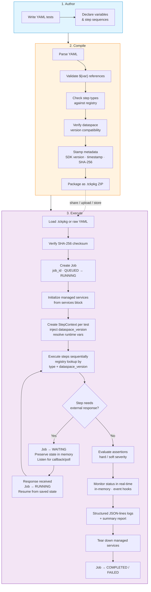

## Step Execution Detail

Within the Player, each step follows a precise execution sequence:

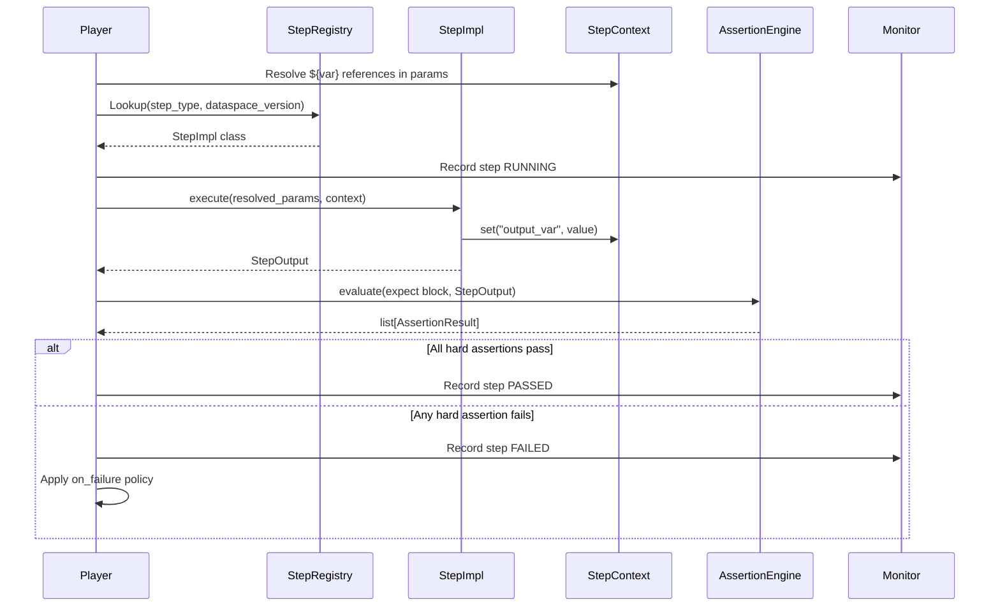

## SDK Function Invocation

The `sdk_call` step type enables direct invocation of any SDK module function from YAML, removing the need to write custom Python step classes for common SDK operations.

**Security model:** By default, only a curated allowlist of SDK functions may be called. Tests can opt in to unrestricted access by declaring `allow_sdk_calls: open` at the test level.

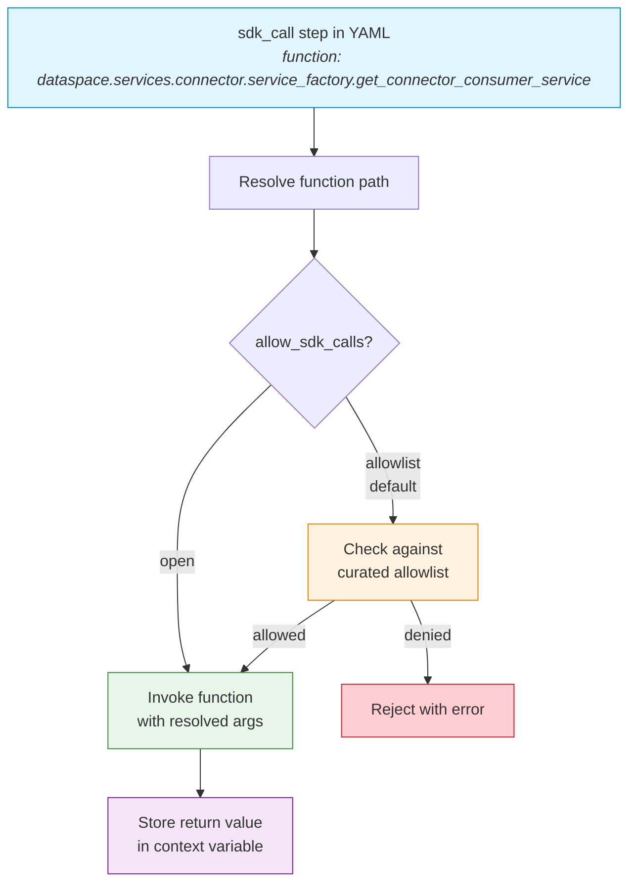

## Job-Based Execution Model

Every test execution is treated as a **Job** — a first-class, stateful entity with a unique identity, persistent memory, and the ability to pause and resume. This design supports long-running test scenarios where a step must wait for an external system to respond (e.g., notification acknowledgments, async transfer completions, webhook callbacks).

### Job Lifecycle

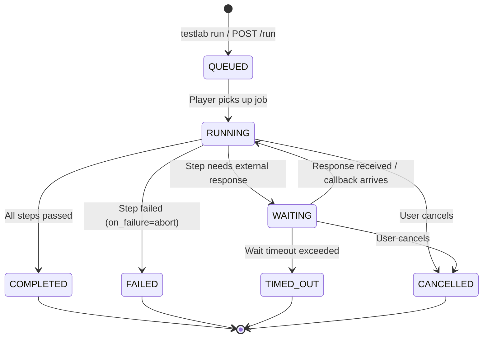

### How Jobs Work

1. **Creation** — When `testlab run` is invoked (CLI, API, or Python), a `Job` is created with a unique `job_id`, the provided runtime variables, and an empty `JobMemory`. Status: `QUEUED`.

2. **Execution** — The Player picks up the job and begins executing steps sequentially. Status: `RUNNING`. Each step can read from and write to the job's memory via `context.job.memory`.

3. **Waiting** — When a step requires an external response (e.g., `await_callback`, polling for a state transition), the job transitions to `WAITING`. The `waiting_for` field describes what the job is blocked on. The job's memory and full execution state are preserved.

4. **Resumption** — When the expected event arrives (callback received, poll condition met), the job automatically resumes from where it paused. Status returns to `RUNNING`. The received payload is stored in both the step context and the job memory.

5. **Completion** — When all steps finish, the job transitions to `COMPLETED` (all passed) or `FAILED` (any hard failure). The full `TckResult` is attached to the job.

### Wait and Resume Flow

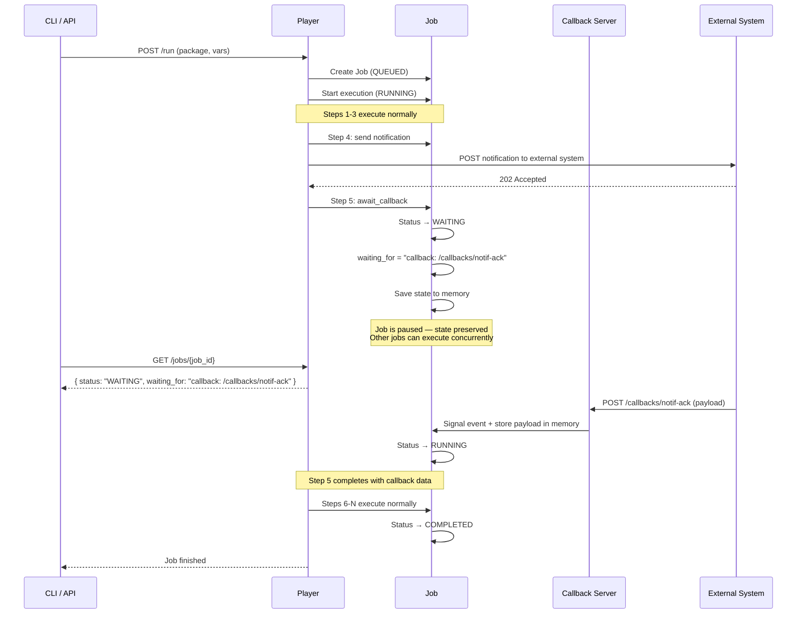

### Job Memory

The `JobMemory` is a persistent key-value store attached to each job. Unlike step context variables (scoped to a single test), job memory persists across:

- All tests within a TCK
- Wait/resume cycles
- Cleanup phases

This allows earlier steps to store state that later steps — or even steps after a wait/resume — can access:

```yaml
# Step 1: Send a notification and remember the correlation ID
steps:
  - type: send_notification
    name: notify_quality_alert
    params:
      service: "provider"
      payload: { ... }
    store_in_memory:
      notification_id: "notificationId"

  # Step 2: Wait for acknowledgment
  - type: await_callback
    name: wait_for_ack
    params:
      listener: "notification_ack"
      timeout_s: 120
    store_in_memory:
      ack_status: "payload.status"
      ack_timestamp: "payload.respondedAt"

  # Step 3: Verify the acknowledgment (uses memory from step 2)
  - type: sdk_call
    name: verify_ack
    params:
      function: "industry.services.notification.verify"
      args:
        notification_id: "${notification_id}"
        expected_status: "ACKNOWLEDGED"
        actual_status: "${ack_status}"
```

### Job Queries

Jobs are queryable at any time through the Monitor or API:

| Query | CLI | API | Returns |
|-------|-----|-----|---------|
| List all jobs | `testlab jobs` | `GET /api/v1/jobs` | All jobs with status, timing |
| Get job detail | `testlab job <job_id>` | `GET /api/v1/jobs/{job_id}` | Full job state, memory, result |
| Cancel a job | `testlab cancel <job_id>` | `POST /api/v1/jobs/{job_id}/cancel` | Cancellation confirmation |
| Get job memory | — | `GET /api/v1/jobs/{job_id}/memory` | Current memory key-value pairs |
| Get job events | — | `GET /api/v1/jobs/{job_id}/events` | Chronological event log |

The allowlist covers commonly used SDK entry points:

- `dataspace.services.connector.service_factory.get_connector_consumer_service`
- `dataspace.services.connector.service_factory.get_connector_provider_service`
- `industry.services.aas_service.AasService`
- `extensions.notification_api.*`

## Managed Service Lifecycle

Tests can declare required SDK services in a `services` block. These services are initialized once before step execution begins and remain available throughout the test's lifetime, avoiding repeated authentication and initialization overhead.

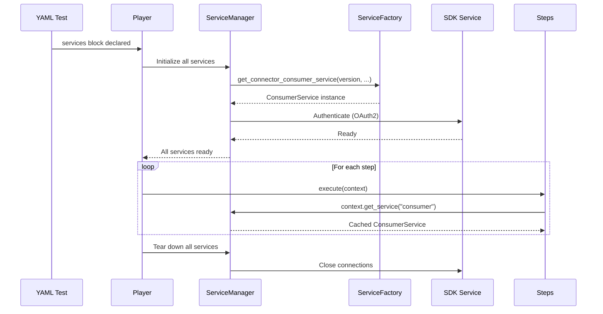

Additionally, `init_service` and `stop_service` step types allow mid-test service lifecycle changes:

- `init_service` — Initialize a new service (or replace an existing one) during step execution
- `stop_service` — Explicitly tear down a service before test completion

## Async Callbacks / Webhook Endpoints

For operations that require waiting for an external response (e.g., notification acknowledgments, async processing results), scripts can declare a `listen` block that starts a lightweight FastAPI endpoint. When a step enters `await_callback`, the parent Job transitions to `WAITING` state — preserving all execution context in its memory — and resumes automatically when the callback arrives.

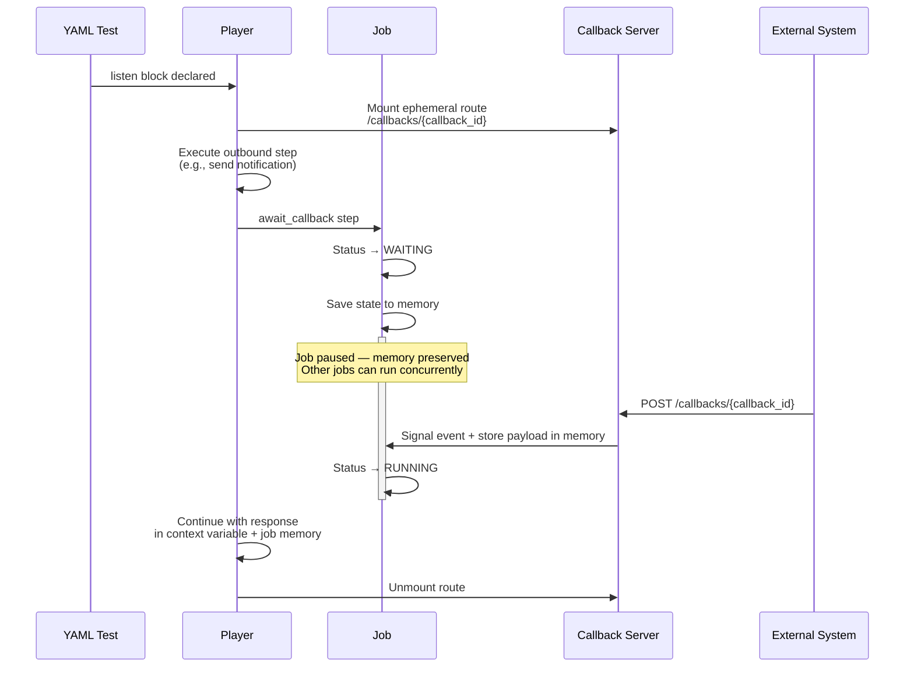

The callback server is either:

- **Auto-started** by the Player when a test declares a `listen` block (standalone mode)
- **Shared** with the host application’s FastAPI instance (embedded mode via `TestlabPlayer.from_app()`)

Timeouts are enforced via `asyncio.wait_for()`. If the callback is not received within `timeout_s`, the `await_callback` step fails according to its `on_failure` policy.

## Player Deployment Modes

The Player supports two deployment modes to accommodate different use cases:

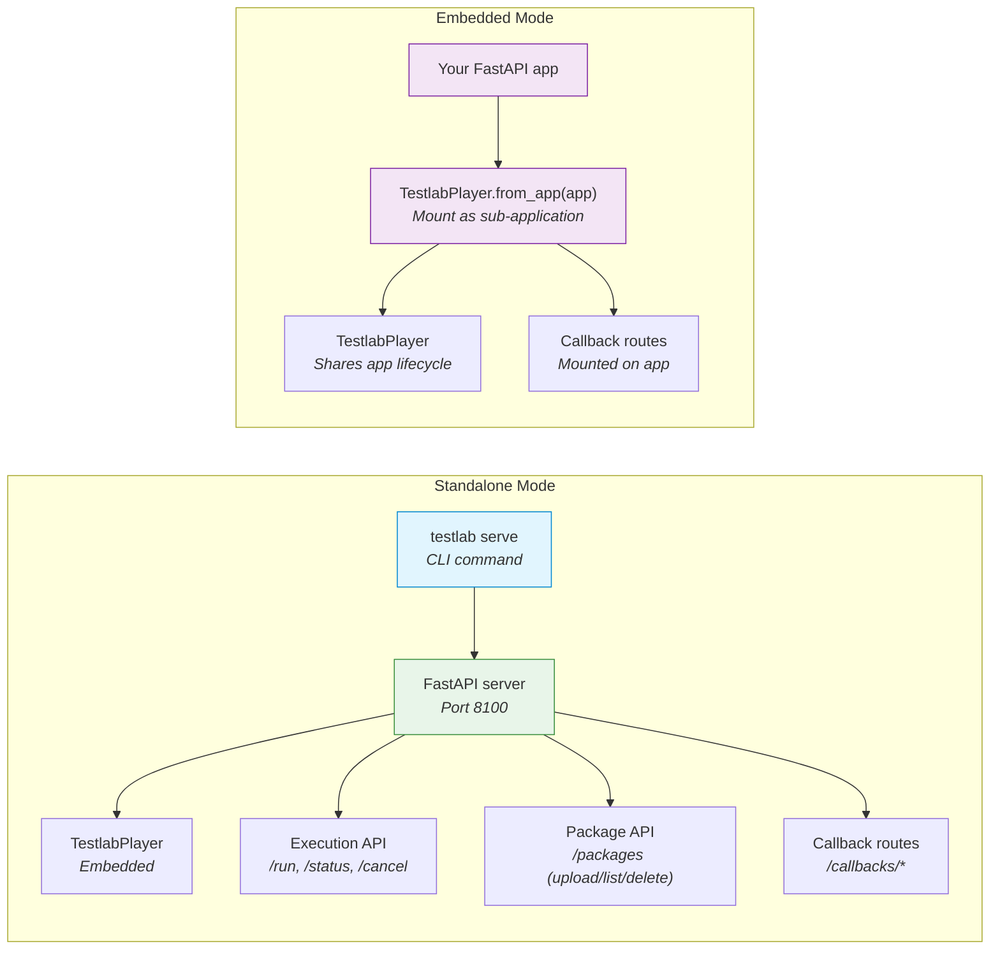

| Mode | Entry Point | Use Case |
|------|-------------|----------|
| **Standalone** | `testlab serve --port 8100` | CI/CD pipelines, dedicated test runners, quick local testing |
| **Embedded** | `TestlabPlayer.from_app(fastapi_app)` | Integrating testlab into an existing service, sharing infrastructure |

## Package Security & Encryption

Compiled `.tckpkg` packages can be encrypted so that only authorized Player instances can decrypt and execute them. This uses **hybrid encryption** (symmetric content encryption + asymmetric key wrapping) combined with **digital signatures** for authenticity.

### Encryption Flow (Compile-time)

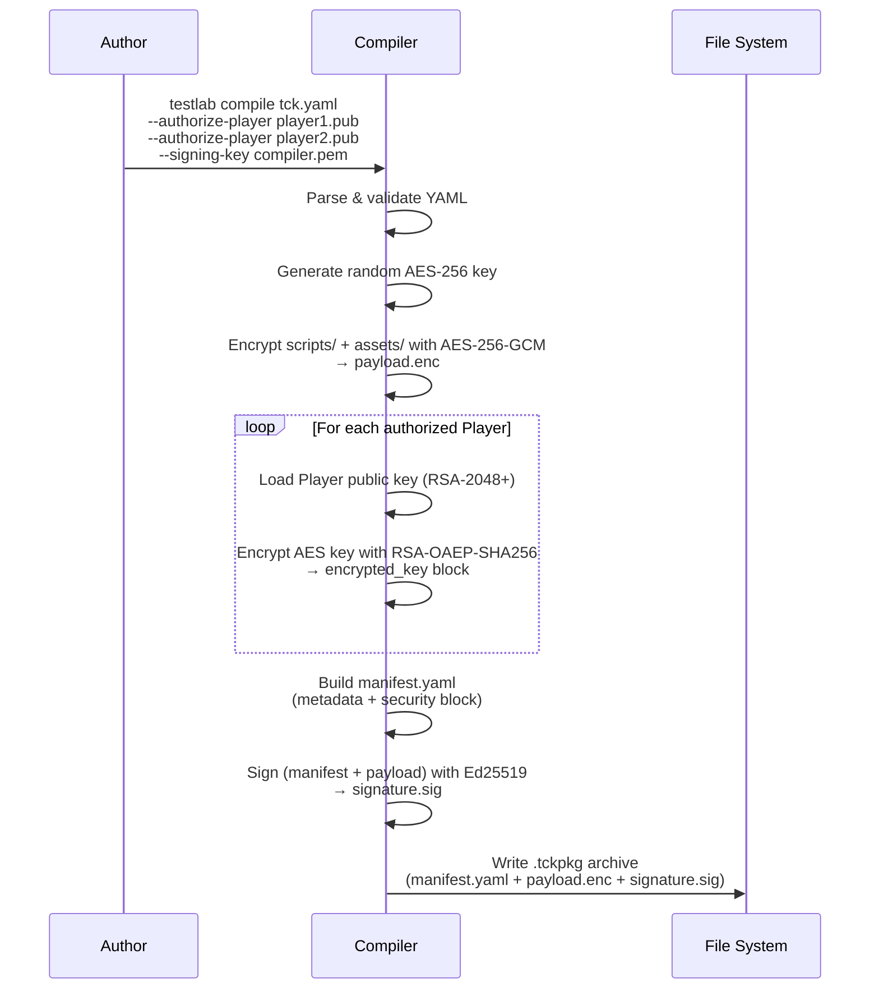

### Decryption Flow (Player-side)

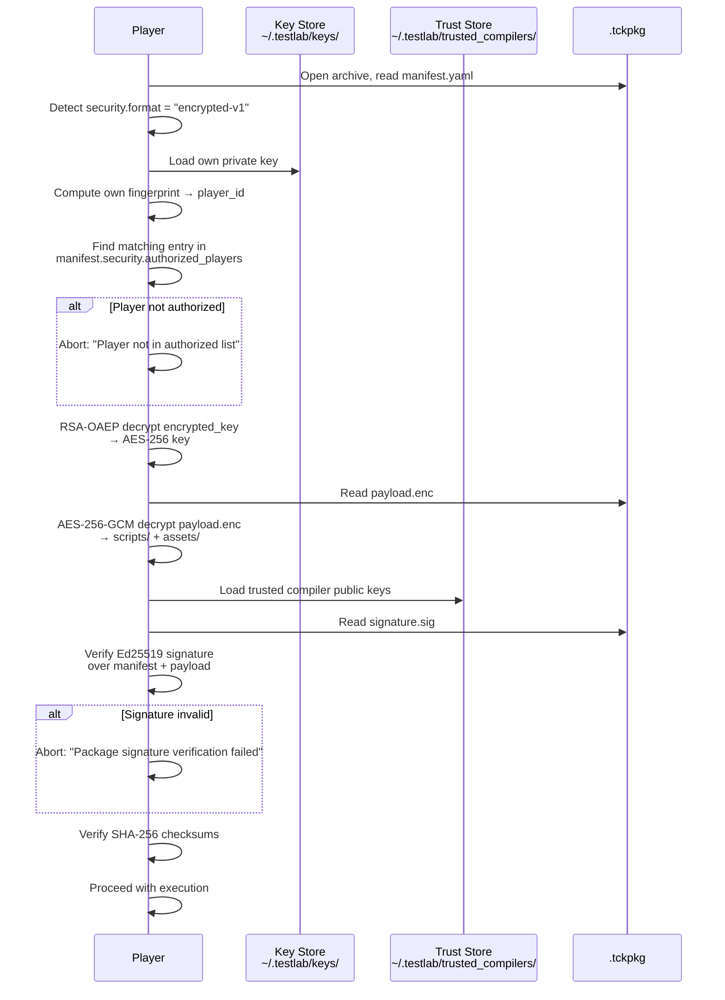

### Key Management Overview

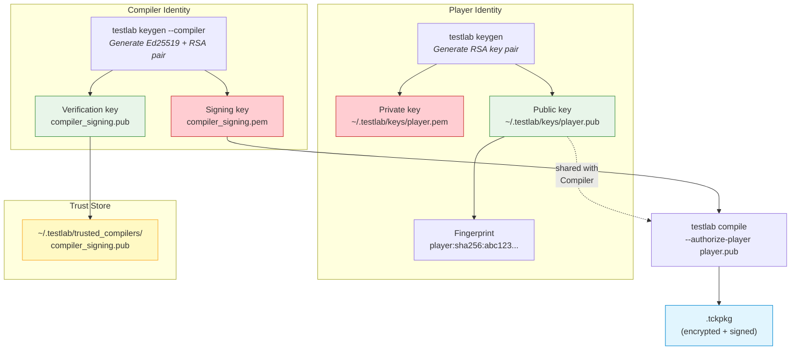

**Key Details:**

| Aspect | Detail |
|--------|--------|
| **Content encryption** | AES-256-GCM — authenticated encryption with associated data |
| **Key wrapping** | RSA-OAEP with SHA-256 — each authorized Player's public key wraps a copy of the AES key |
| **Package signing** | Ed25519 — Compiler signs `manifest.yaml` + `payload.enc` for authenticity |
| **Player identity** | RSA-2048+ key pair per Player instance; fingerprint = `SHA-256(DER-encoded public key)` |
| **Compiler identity** | Ed25519 key pair; public key distributed to Players via trust store |
| **Backward compatibility** | Packages without a `security` block remain valid and unencrypted (default for development) |
| **Cryptography library** | Python `cryptography` package (Fernet-free; direct primitives only) |

## Service-Step Binding

When a test declares a `services` block, those services are initialized by the **ServiceManager** at test start. Steps then reference these services by name via `params.service`. This section documents the exact resolution mechanism, type validation, and API contracts.

### Resolution Mechanism

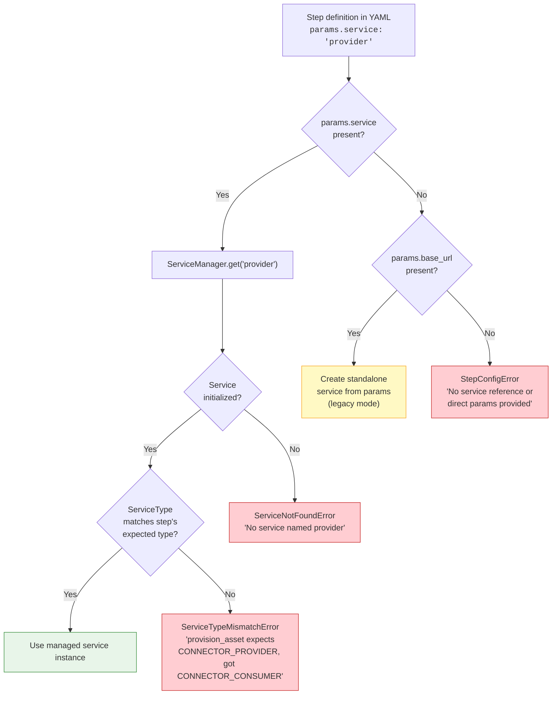

### Resolution Priority

| Priority | Condition | Behavior |
|----------|-----------|----------|
| **1 (highest)** | `params.service` is set | Look up managed service by name from `ServiceManager`. Validate type. Use cached instance. |
| **2** | `params.base_url` + auth params set | Create a one-off SDK service instance from direct parameters (legacy/standalone). |
| **3 (error)** | Neither present | Raise `StepConfigError` with a clear message listing required parameters. |

### Type Validation

Each predefined step declares the `ServiceType` it expects. When a managed service is resolved via `params.service`, the Player validates that the service's type matches the step's expectation.

| Step Type | Expected ServiceType | Validated At |
|-----------|---------------------|-------------|
| `provision_asset` | `CONNECTOR_PROVIDER` | Step execution start |
| `create_contract_definition` | `CONNECTOR_PROVIDER` | Step execution start |
| `catalog_search` | `CONNECTOR_CONSUMER` | Step execution start |
| `negotiate_contract` | `CONNECTOR_CONSUMER` | Step execution start |
| `initiate_transfer` | `CONNECTOR_CONSUMER` | Step execution start |
| `retrieve_edr` | `CONNECTOR_CONSUMER` | Step execution start |
| `dataplane_call` | `CONNECTOR_CONSUMER` | Step execution start |
| `http_request` | *(none — standalone)* | N/A |
| `consume_submodel` | `DTR` | Step execution start |
| `init_service` | *(any — creates new)* | N/A |
| `stop_service` | *(any — stops existing)* | N/A |

### Step Execution with Service Binding (Detailed Sequence)

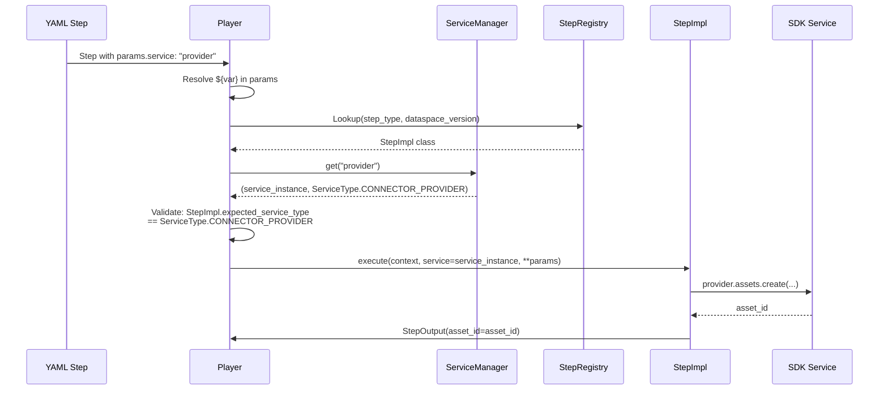

### StepContext API (Service Access)

The `StepContext` provides these methods for service access during step execution:

```python
class StepContext:
    def get_service(self, name: str) -> Any:
        """Get a managed service instance by name.

        Args:
            name: The service name as declared in the test's `services` block.

        Returns:
            The initialized SDK service instance (e.g., ConnectorConsumerService,
            ConnectorProviderService, AasService).

        Raises:
            ServiceNotFoundError: If no service with this name was declared.
            ServiceNotReadyError: If the service failed to initialize or was stopped.
        """

    def has_service(self, name: str) -> bool:
        """Check if a managed service exists and is ready.

        Returns:
            True if the service exists in the ServiceManager and is in a READY state.
        """

    def get_service_type(self, name: str) -> ServiceType:
        """Get the ServiceType of a managed service.

        Args:
            name: The service name.

        Returns:
            The ServiceType enum value (e.g., CONNECTOR_CONSUMER, CONNECTOR_PROVIDER, DTR).

        Raises:
            ServiceNotFoundError: If no service with this name exists.
        """

    def list_services(self) -> dict[str, ServiceType]:
        """List all available managed services and their types.

        Returns:
            A dict mapping service name → ServiceType for all services
            currently in READY state.
        """
```

### ServiceManager API

The `ServiceManager` manages the full lifecycle of SDK service instances:

```python
class ServiceManager:
    async def initialize_all(
        self,
        services: list[ServiceDefinition],
        dataspace_version: str
    ) -> None:
        """Initialize all services declared in the test's services block.

        For each ServiceDefinition:
          1. Resolve ${var} references in base_url and auth params.
          2. Create SDK service instance via ServiceFactory:
             - CONNECTOR_CONSUMER → ServiceFactory.get_connector_consumer_service()
             - CONNECTOR_PROVIDER → ServiceFactory.get_connector_provider_service()
             - DTR → AasService()
          3. Authenticate (OAuth2 via OAuth2Manager, or API key).
          4. Store in internal cache as: {name: (service_instance, service_type, state)}.

        Raises:
            ServiceInitError: If any service fails to initialize.
            DuplicateServiceError: If two services share the same name.
        """

    def get(self, name: str) -> tuple[Any, ServiceType]:
        """Return a cached service instance and its type.

        Raises:
            ServiceNotFoundError: If the service does not exist.
            ServiceNotReadyError: If the service is not in READY state.
        """

    async def replace(
        self,
        name: str,
        definition: ServiceDefinition,
        dataspace_version: str
    ) -> None:
        """Replace a running service (used by the init_service step).

        Steps:
          1. Stop existing service if present (close connections, release resources).
          2. Create and authenticate new service from definition.
          3. Replace entry in cache.

        Raises:
            ServiceInitError: If the new service fails to initialize.
        """

    async def stop(self, name: str) -> None:
        """Stop a specific service and remove it from the cache.

        Used by the stop_service step. After stopping, get() for this
        name will raise ServiceNotFoundError.

        Raises:
            ServiceNotFoundError: If the service does not exist.
        """

    async def teardown_all(self) -> None:
        """Tear down all managed services.

        Always called after test execution completes (success or failure).
        Stops each service, closes connections, and clears the cache.
        Errors during teardown are logged but do not raise.
        """
```

### Step Implementation Pattern

Predefined steps follow this pattern to support both managed-service and legacy-parameter modes:

```python
class ProvisionAssetStep(BaseStep):
    """Provision a digital twin asset on a connector provider."""
    expected_service_type = ServiceType.CONNECTOR_PROVIDER

    async def execute(self, context: StepContext, **params) -> StepOutput:
        # --- Service resolution ---
        if "service" in params:
            # Managed service path (preferred)
            svc = context.get_service(params["service"])
            actual_type = context.get_service_type(params["service"])
            if actual_type != self.expected_service_type:
                raise ServiceTypeMismatchError(
                    step="provision_asset",
                    expected=self.expected_service_type,
                    actual=actual_type,
                )
        elif "base_url" in params:
            # Legacy standalone path — create one-off service
            svc = ServiceFactory.get_connector_provider_service(
                dataspace_version=context.dataspace_version,
                base_url=params["base_url"],
                api_key=params.get("api_key"),
            )
        else:
            raise StepConfigError(
                "provision_asset requires either 'service' (managed) "
                "or 'base_url' + auth params (standalone)"
            )

        # --- Business logic ---
        asset_id = await svc.assets.create(
            asset_id=params["asset_id"],
            properties=params.get("properties", {}),
        )
        return StepOutput(asset_id=asset_id)
```

## Failure Policy Flow

When a step fails, the Player applies the step's `on_failure` policy:

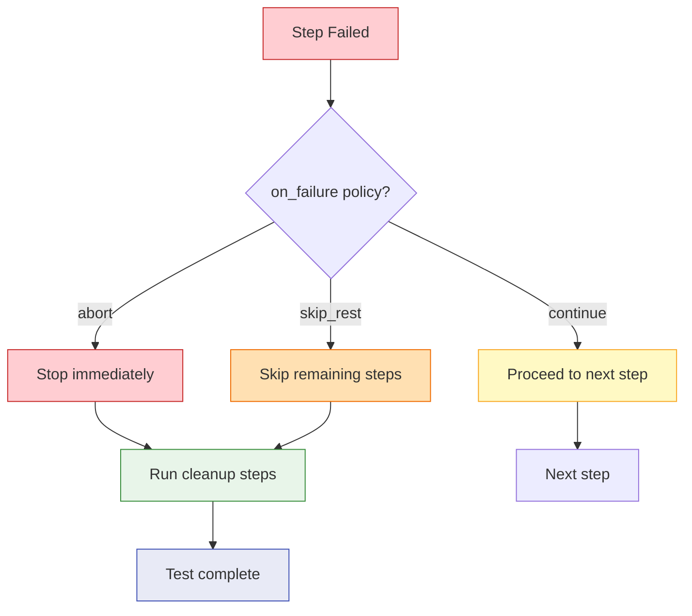

---

## Glossary

| Term | Definition |
|------|-----------|
| **Test** | A YAML file defining a single test (`kind: test`): its target dataspace version, variables, an ordered sequence of steps, and cleanup steps. Identified by `kind: test` or, for backward compatibility, by the presence of a `steps:` key without a `tests:` key. |
| **TCK** | An ordered collection of tests (`kind: tck`), optionally sharing variables, packaged together as one distributable unit. Identified by `kind: tck` or by the presence of a `tests:` key. Supports importing predefined tests with optional overrides. |
| **Kind** | The `kind:` field in a YAML header that explicitly declares the file type: `test` or `tck`. Follows the Kubernetes `kind:` convention. Optional for backward compatibility — the Player can infer the type from the document structure. |
| **Step** | An atomic, named unit of work within a test (e.g., "provision an asset", "negotiate a contract"). Implemented as a Python class registered in the Step Registry. |
| **Step Type** | The identifier that maps a step in YAML to its Python implementation (e.g., `provision_asset`, `dataplane_call`). |
| **Variable** | A named value declared in a test's `variables` block. Can have a default value or be marked `runtime: true` (must be provided at execution time). Steps produce output variables that subsequent steps can consume via `${var_name}` syntax. |
| **Assertion** | An expected-result check attached to a step via the `expect` block. Evaluated after step execution against the step's output. |
| **Compiler** | The component that parses YAML tests, validates them against the Step Registry and declared variables, and stamps metadata. |
| **Package (.tckpkg)** | A ZIP archive containing a manifest, compiled tests, and bundled assets (schemas, sample data). Portable, shareable, versionable. |
| **Player** | The singleton async executor that loads packages or raw YAML, creates Jobs, executes tests step-by-step, evaluates assertions, and reports results. |
| **Job** | A stateful execution entity created for every test run. Tracks lifecycle (`QUEUED` → `RUNNING` → `WAITING` → `COMPLETED`), maintains persistent memory across steps and wait/resume cycles, and provides query endpoints for status, memory, and events. |
| **Job Memory** | A persistent key-value store attached to each Job. Survives across all scripts, steps, wait/resume cycles, and cleanup phases. Accessible via `context.job.memory`. |
| **Monitor** | The in-memory state store that tracks execution progress in real-time — queryable for current step, status, timing, assertion results, and job state. |
| **Context** | The per-test runtime state bag (`StepContext`) that holds variables, configuration, the target dataspace version, and service references. Steps read from and write to the context. |
| **Dataspace Version** | The connector protocol version a test targets (e.g., `"jupiter"`, `"saturn"`). Determines which step implementations and SDK services are used. |
| **SDK Call** | A step type (`sdk_call`) that directly invokes an SDK module function by its dotted path. Subject to allowlist or open-mode security policy. |
| **Service** | A managed SDK service instance (e.g., `ConnectorConsumerService`, `ConnectorProviderService`, `AasService`) declared in a test's `services` block. Initialized once before steps execute and reused across steps. |
| **Service Manager** | The component that initializes, caches, and tears down managed SDK service instances based on the test's `services` declarations. |
| **Callback** | An async webhook pattern where the Player starts a temporary HTTP endpoint, sends a request to an external system, transitions the Job to `WAITING` state, and resumes automatically when the external system calls back with a response within a configurable timeout. |
| **Callback Server** | A FastAPI-based HTTP server (standalone or embedded) that hosts ephemeral callback routes mounted dynamically by the Player per test execution. |
| **Listener** | A `listen` block in YAML that declares callback endpoint configuration: the route path, expected HTTP method, and timeout. Creates an `asyncio.Event` that the `await_callback` step waits on. |
| **Allowlist** | A curated set of SDK function paths that `sdk_call` steps may invoke by default. Scripts must opt in to `allow_sdk_calls: open` to bypass this restriction. |
| **Encrypted Package** | A `.tckpkg` archive whose payload (scripts + assets) is encrypted with AES-256-GCM. Only authorized Players holding the matching RSA private key can decrypt and execute it. |
| **Player Identity** | An RSA key pair assigned to a Player instance. The public key's SHA-256 fingerprint serves as the Player's unique identifier for package authorization. |
| **Key Block** | An entry in the package manifest's `security.authorized_players` list. Contains a Player's fingerprint and the AES content-encryption key wrapped with that Player's RSA public key. |
| **Trust Store** | A directory (`~/.testlab/trusted_compilers/`) containing public keys of Compilers whose package signatures the Player will accept. |
| **Compiler Signature** | An Ed25519 digital signature created by the Compiler over the manifest and encrypted payload. Verified by the Player against the trust store before execution. |
| **Service Binding** | The mechanism by which a step's `params.service` reference is resolved to a managed SDK service instance via the `ServiceManager`. |
| **Resolution Priority** | The order in which the Player tries to resolve a step's service dependency: (1) managed service by name, (2) standalone from direct params, (3) error. |
| **Package Upload** | The ability to upload `.tckpkg` files (encrypted or plain) to the testlab server via `POST /api/v1/packages`. Uploaded packages are stored on the server and can be referenced by `package_id` in `/run` requests. |
| **Package Storage** | The server-side directory (default: `~/.testlab/packages/`) where uploaded packages are persisted and indexed by `package_id` (`name-version`). |
| **Vault Backend** | An optional integration with HashiCorp Vault's KV v2 secrets engine for centralized key management. When configured, signing keys and Player keys are stored in and retrieved from Vault instead of the local filesystem. |
| **Configuration** | The `TestlabConfig` settings model that resolves configuration from `testlab.config.yaml`, environment variables, and CLI flags with defined precedence (CLI > env > file > defaults). |
| **Dependency (`depends_on`)** | A list of test names or file references that must complete successfully before this test begins execution. The Player resolves the dependency graph using topological sort. If any dependency fails, the dependent test is skipped. Circular dependencies are detected and raise an error. |
| **File Dependency** | A `depends_on` entry that references an external YAML file (`file: "path.yaml"`) instead of a test name. The parser loads the test from the file, adds it to the TCK, and resolves the reference by name. An optional `outputs` list selects which exports from the file's test to promote. |
| **Output (`outputs`)** | A mapping from export name to context variable name on a test. After successful execution, the Player promotes the referenced variables into the shared tck context so downstream tests can reference them via `${export_name}`. |

---

## NOTICE

This work is licensed under the [CC-BY-4.0](https://creativecommons.org/licenses/by/4.0/legalcode).

- SPDX-License-Identifier: CC-BY-4.0
- SPDX-FileCopyrightText: 2025, 2026 Contributors to the Eclipse Foundation
- SPDX-FileCopyrightText: 2025, 2026 Catena-X Automotive Network e.V.
- Source URL: [https://github.com/eclipse-tractusx/tractusx-sdk](https://github.com/eclipse-tractusx/tractusx-sdk)