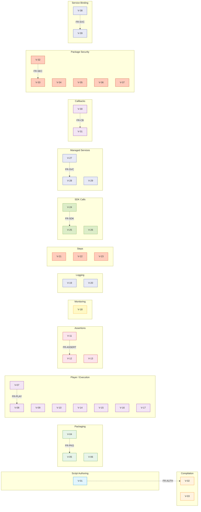

<!--

Eclipse Tractus-X - Software Development KIT

Copyright (c) 2026 Catena-X Automotive Network e.V.
Copyright (c) 2026 Contributors to the Eclipse Foundation

See the NOTICE file(s) distributed with this work for additional
information regarding copyright ownership.

This work is made available under the terms of the
Creative Commons Attribution 4.0 International (CC-BY-4.0) license,
which is available at
https://creativecommons.org/licenses/by/4.0/legalcode.

SPDX-License-Identifier: CC-BY-4.0

-->

# Constraints & Verification

## Technical Constraints

| ID | Constraint |
|----|-----------|
| TC-01 | Python 3.12+ required |
| TC-02 | Async execution via native `asyncio` (no external task broker) |
| TC-03 | Pydantic 2.6+ for model validation |
| TC-04 | PyYAML 6.0+ for YAML parsing |
| TC-05 | No `eval()` or dynamic code execution from YAML scripts — variable resolution limited to `${var_name}` lookups |
| TC-06 | Connector steps SHALL reuse existing `tractusx_sdk.dataspace` services via `ServiceFactory` — no duplication of connector logic |
| TC-07 | `sdk_call` step operates in allowlist mode by default — only curated SDK functions may be invoked unless `allow_sdk_calls: open` is declared |
| TC-08 | FastAPI required for callback server and Player deployment modes (already an SDK dependency) |
| TC-09 | Callback routes are ephemeral — mounted on demand and unmounted after use. No persistent route state between script executions |
| TC-10 | Managed services SHALL use `ServiceFactory` for connector services and direct instantiation for DTR/AAS services — no custom service constructors |
| TC-11 | Python `cryptography` library required for all cryptographic operations (AES-256-GCM, RSA-OAEP, Ed25519). No custom cryptographic implementations permitted |
| TC-12 | Player keys SHALL be stored in `~/.testlab/keys/` with `0600` file permissions (private key). Trust store keys in `~/.testlab/trusted_compilers/`. Key directories SHALL be created automatically on first use |

## Quality Attributes

| Attribute | Requirement |
|-----------|-------------|
| **Portability** | `.tckpkg` artifacts must be self-contained and executable on any machine with a compatible SDK version installed |
| **Extensibility** | Custom step types must be registrable without modifying SDK source code |
| **Observability** | Execution state must be queryable in real-time at step granularity; structured logs must be machine-parseable |
| **Safety** | Scripts parsed from untrusted sources (API, filesystem) must not allow arbitrary code execution. `sdk_call` in allowlist mode prevents access to internal SDK functions |
| **Reliability** | Cleanup steps must execute regardless of prior failures; resource leaks are unacceptable. Managed services must be torn down even on script failure |
| **Confidentiality** | Encrypted `.tckpkg` packages must be readable only by authorized Player instances. AES content keys must never be stored in plaintext. Private keys must be protected with appropriate file permissions |

---

## Verification Matrix

| ID | Verification | Type |
|----|-------------|------|
| V-01 | YAML parsing accepts valid scripts and rejects scripts missing `dataspace_version` | Unit |
| V-02 | Compiler fails on undeclared `${var}` references (not marked `runtime: true`) | Unit |
| V-03 | Compiler fails when step type doesn't exist in registry for the script's dataspace version | Unit |
| V-04 | Compile → package → unpack round-trip produces identical `CompiledTck` | Integration |
| V-05 | `.tckpkg` checksum is verified on load; tampered packages are rejected | Unit |
| V-06 | SDK version mismatch emits warning but does not block execution | Unit |
| V-07 | Player executes a compiled TCK and produces correct `TckResult` with step timings | Integration |
| V-08 | Step failure with `on_failure: abort` stops execution and runs cleanup | Integration |
| V-09 | Step failure with `on_failure: continue` proceeds to next step | Integration |
| V-10 | Step failure with `on_failure: skip_rest` skips remaining steps and runs cleanup | Integration |
| V-11 | Hard assertion failure causes step failure; soft assertion failure produces warning | Unit |
| V-12 | Assertion values from inline, file, and variable sources are resolved correctly | Unit |
| V-13 | JSON strings embedded in YAML are auto-parsed before assertion comparison | Unit |
| V-14 | `${var}` references are resolved correctly across steps (output of step N used by step N+1) | Integration |
| V-15 | Runtime variables override defaults at execution time | Unit |
| V-16 | Two TCKs running concurrently have isolated contexts and no variable leakage | Integration |
| V-17 | Script cancellation stops after current step and runs cleanup | Integration |
| V-18 | Monitor returns correct current step, status, and assertion results during execution | Integration |
| V-19 | JSON-lines log file contains correct entries with script_id, dataspace_version, step names | Integration |
| V-20 | Log file is renamed with `_PASS`/`_FAIL` suffix on completion | Integration |
| V-21 | `dataplane_call` step supports GET/POST/PUT/DELETE with custom headers, query params, and body | Integration |
| V-22 | `dataplane_call` step auto-injects EDR authorization header | Unit |
| V-23 | Custom step registered at runtime via `registry.register()` is available to scripts | Unit |
| V-24 | `sdk_call` in allowlist mode rejects functions not in the allowlist | Unit |
| V-25 | `sdk_call` in open mode (`allow_sdk_calls: open`) allows any `tractusx_sdk` function | Unit |
| V-26 | `sdk_call` correctly invokes an SDK function and stores the return value in context | Integration |
| V-27 | Managed services declared in `services` block are initialized before first step and torn down after completion | Integration |
| V-28 | `context.get_service("name")` returns the same cached instance across multiple steps | Unit |
| V-29 | `init_service` step replaces an existing service and `stop_service` tears it down | Integration |
| V-30 | Callback endpoint receives a POST, signals `asyncio.Event`, and `await_callback` step receives the payload | Integration |
| V-31 | `await_callback` step times out correctly when no callback is received within `timeout_s` | Integration |
| V-32 | Encrypted `.tckpkg` round-trip: compile with `--encrypt` → authorized Player decrypts and executes successfully | Integration |
| V-33 | Unauthorized Player (key not in `authorized_players`) is rejected with `PackageAuthorizationError` | Unit |
| V-34 | Tampered encrypted package (modified `payload.enc`) fails AES-256-GCM decryption | Unit |
| V-35 | Package signed by untrusted compiler (key not in trust store) is rejected with `PackageSignatureError` | Unit |
| V-36 | Package with invalid Ed25519 signature (modified after signing) is rejected | Unit |
| V-37 | `testlab keygen` generates valid RSA key pair and stores in `~/.testlab/keys/` with correct permissions | Unit |
| V-38 | Service-step type validation: `provision_asset` with `CONNECTOR_CONSUMER` service raises `ServiceTypeMismatchError` | Unit |
| V-39 | Service resolution priority: `params.service` takes precedence over direct `params.base_url`; absence of both raises `StepConfigError` | Unit |

---

## Traceability Matrix

The following diagram maps verification items to functional requirement areas:

---

## NOTICE

This work is licensed under the [CC-BY-4.0](https://creativecommons.org/licenses/by/4.0/legalcode).

- SPDX-License-Identifier: CC-BY-4.0
- SPDX-FileCopyrightText: 2025, 2026 Contributors to the Eclipse Foundation
- SPDX-FileCopyrightText: 2025, 2026 Catena-X Automotive Network e.V.
- Source URL: [https://github.com/eclipse-tractusx/tractusx-sdk](https://github.com/eclipse-tractusx/tractusx-sdk)