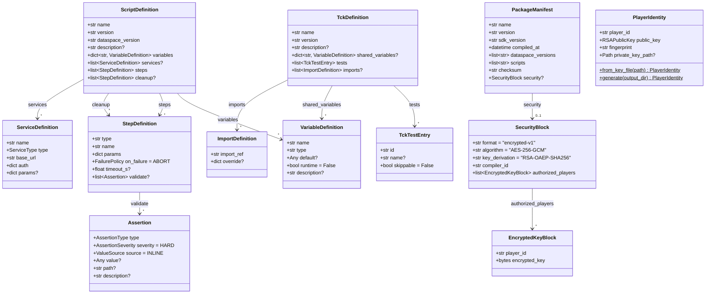
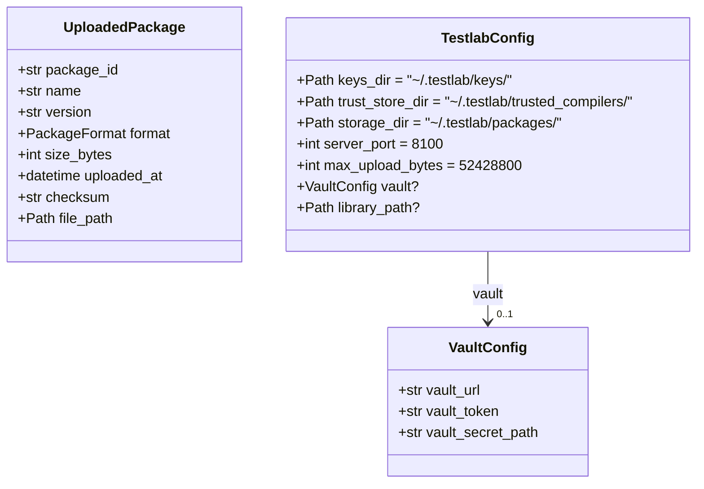
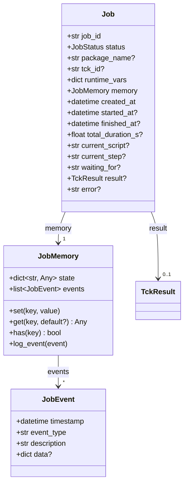
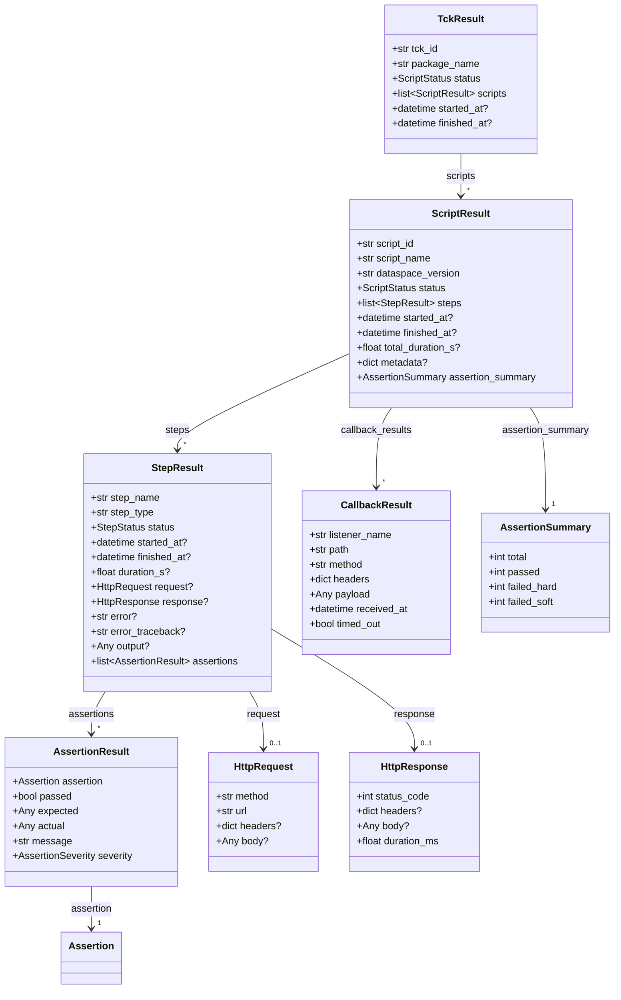
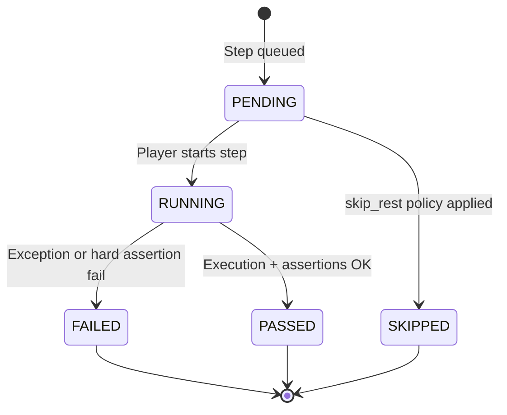
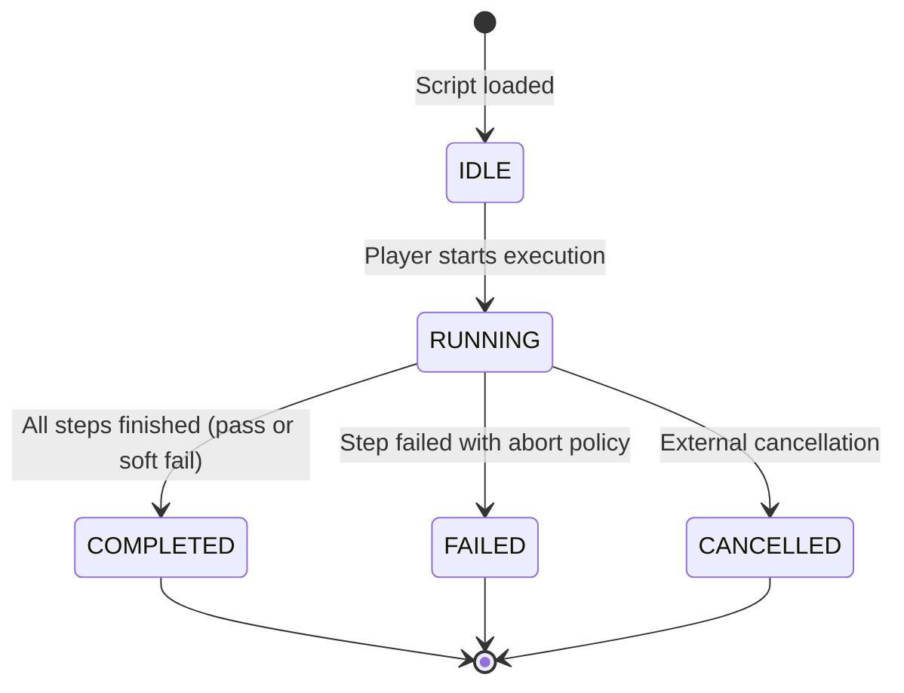
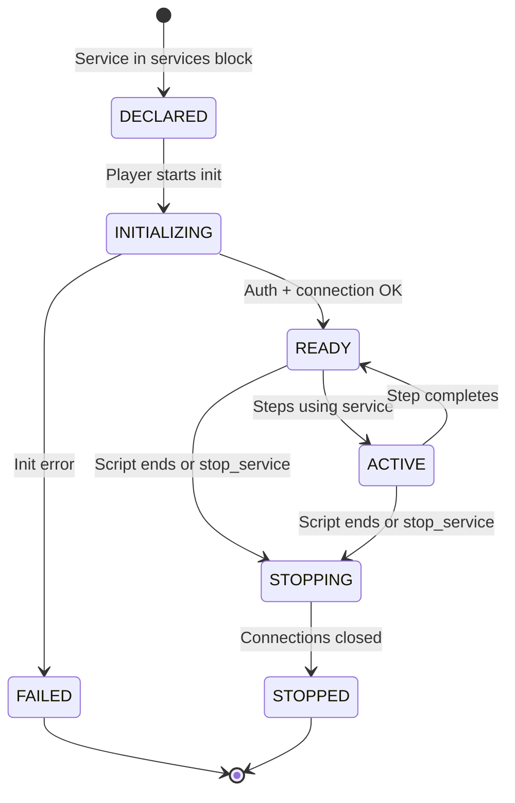
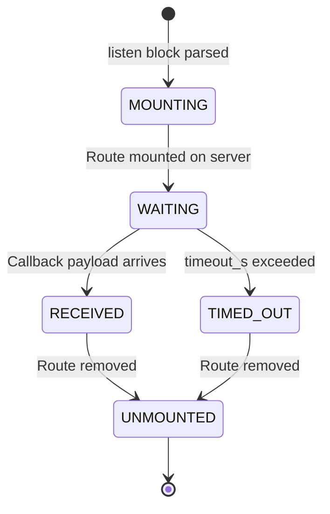

<!--

Eclipse Tractus-X - Software Development KIT

Copyright (c) 2026 Catena-X Automotive Network e.V.
Copyright (c) 2026 Contributors to the Eclipse Foundation

See the NOTICE file(s) distributed with this work for additional
information regarding copyright ownership.

This work is made available under the terms of the
Creative Commons Attribution 4.0 International (CC-BY-4.0) license,
which is available at
https://creativecommons.org/licenses/by/4.0/legalcode.

SPDX-License-Identifier: CC-BY-4.0

-->

# Data Models

## Enumerations

| Enum | Values | Description |
|------|--------|-------------|
| `StepStatus` | `PENDING`, `RUNNING`, `WAITING`, `PASSED`, `FAILED`, `SKIPPED` | Lifecycle state of a single step |
| `ScriptStatus` | `IDLE`, `RUNNING`, `COMPLETED`, `FAILED`, `CANCELLED`, `SKIPPED` | Lifecycle state of a script run |
| `JobStatus` | `QUEUED`, `RUNNING`, `WAITING`, `COMPLETED`, `FAILED`, `CANCELLED`, `TIMED_OUT` | Lifecycle state of a job (test execution) |
| `AssertionType` | `EXACT`, `SCHEMA`, `CONTAINS`, `REGEX`, `STATUS_CODE` | Type of assertion check |
| `AssertionSeverity` | `HARD`, `SOFT` | Whether assertion failure fails the step or is a warning |
| `FailurePolicy` | `ABORT`, `CONTINUE`, `SKIP_REST` | Step failure handling behavior |
| `ValueSource` | `INLINE`, `FILE`, `VARIABLE` | Where the expected assertion value originates |
| `SdkCallMode` | `ALLOWLIST`, `OPEN` | SDK function invocation security mode |
| `ServiceType` | `CONNECTOR_CONSUMER`, `CONNECTOR_PROVIDER`, `DTR` | Type of managed SDK service |
| `PackageFormat` | `PLAIN`, `ENCRYPTED` | Whether the `.tckpkg` payload is unencrypted or encrypted |
| `ServiceState` | `DECLARED`, `INITIALIZING`, `READY`, `ACTIVE`, `STOPPING`, `STOPPED`, `FAILED` | Lifecycle state of a managed service instance |

---

## Definition Models (Authoring / Compile-time)

These models represent the structure of YAML tests and TCKs as parsed by the Compiler.

---

## Server Models

These models represent the state of packages uploaded to the server and server-related configuration.

---

## Job Models (Execution-time)

Every test execution is modeled as a **Job** — a stateful, persistent entity that tracks the full lifecycle of a run. Jobs can pause (enter `WAITING` state) when a step needs to listen for an external callback, maintain in-memory state ("memory") across steps, and automatically resume when the expected response arrives.

### Job Fields

| Field | Type | Description |
|-------|------|-------------|
| `job_id` | `str` | Unique identifier (e.g., `a1b2c3d4-e5f6-7890-abcd-1234567890ab`) |
| `status` | `JobStatus` | Current lifecycle state (`QUEUED`, `RUNNING`, `WAITING`, `COMPLETED`, `FAILED`, `CANCELLED`, `TIMED_OUT`) |
| `package_name` | `str?` | Name of the `.tckpkg` being executed |
| `tck_id` | `str?` | Test case identifier |
| `runtime_vars` | `dict` | Runtime variables provided at job creation |
| `memory` | `JobMemory` | Persistent state bag — survives across steps and wait/resume cycles |
| `created_at` | `datetime` | When the job was created (enqueued) |
| `started_at` | `datetime?` | When execution began |
| `finished_at` | `datetime?` | When execution completed (success, failure, or timeout) |
| `current_script` | `str?` | Name of the script currently executing (null when waiting or finished) |
| `current_step` | `str?` | Name of the step currently executing or waiting on |
| `waiting_for` | `str?` | Description of what the job is waiting for (e.g., `"callback: /callbacks/notif-ack"`, `"poll: transfer state=COMPLETED"`) |
| `result` | `TckResult?` | Final result — populated when job completes |
| `error` | `str?` | Error message if the job failed or timed out |

### JobMemory

The `JobMemory` provides a persistent key-value store and event log that survives across the entire job lifecycle, including wait/resume cycles:

| Method | Signature | Description |
|--------|-----------|-------------|
| `set` | `set(key: str, value: Any)` | Store a value by key — persists across steps and wait/resume |
| `get` | `get(key: str, default: Any = None) -> Any` | Retrieve a stored value (returns default if missing) |
| `has` | `has(key: str) -> bool` | Check if a key exists |
| `log_event` | `log_event(event: JobEvent)` | Append a timestamped event to the history |

Steps can write to job memory via `context.job.memory.set(key, value)`. Unlike step context variables (which are scoped to a single script), job memory persists across all scripts in a TCK and survives wait/resume cycles.

---

## Result Models (Execution-time)

These models represent the runtime state and outcomes produced by the Player.

---

## Security Models Detail

### PlayerIdentity

Represents a Player's cryptographic identity. Generated via `testlab keygen` and stored in `~/.testlab/keys/`.

| Field | Type | Description |
|-------|------|-------------|
| `player_id` | `str` | Formatted identifier: `player:sha256:<hex_digest>` |
| `public_key` | `RSAPublicKey` | RSA public key (2048-bit minimum) |
| `fingerprint` | `str` | SHA-256 of DER-encoded public key (hex) |
| `private_key_path` | `Path?` | Path to private key PEM file (only on local Player) |

### EncryptedKeyBlock

One entry per authorized Player in a package's `security.authorized_players` list.

| Field | Type | Description |
|-------|------|-------------|
| `player_id` | `str` | Fingerprint-based Player identifier |
| `encrypted_key` | `bytes` | AES-256 content key encrypted with this Player's RSA public key via RSA-OAEP-SHA256 |

### SecurityBlock

Top-level security metadata in `manifest.yaml` for encrypted packages.

| Field | Type | Description |
|-------|------|-------------|
| `format` | `str` | Always `"encrypted-v1"` for the current encryption scheme |
| `algorithm` | `str` | Content encryption algorithm: `"AES-256-GCM"` |
| `key_derivation` | `str` | Key wrapping algorithm: `"RSA-OAEP-SHA256"` |
| `compiler_id` | `str` | Fingerprint-based Compiler identifier (`compiler:sha256:<hex>`) |
| `authorized_players` | `list[EncryptedKeyBlock]` | One key block per authorized Player |

### Service Binding Error Types

| Exception | Raised When | Contains |
|-----------|------------|----------|
| `ServiceNotFoundError` | `context.get_service(name)` called with unknown service name | `name` |
| `ServiceNotReadyError` | Service exists but is in FAILED or STOPPED state | `name`, `state` |
| `ServiceTypeMismatchError` | Managed service type doesn't match step's `expected_service_type` | `step_type`, `expected`, `actual` |
| `StepConfigError` | Step has neither `params.service` nor direct connection params | `step_type`, `message` |
| `DuplicateServiceError` | Two services in `services` block share the same name | `name` |
| `ServiceInitError` | Service fails to initialize (connection, auth failure) | `name`, `cause` |
| `SkipNotAllowedError` | `skip_tests` runtime variable references an unknown ID or one not marked `skippable: true` | `test_ids`, `reason` |

---

## State Transitions

### Step Status

### Script Status

---

## Service Lifecycle

### Managed Service Status

### Callback Lifecycle

---

## NOTICE

This work is licensed under the [CC-BY-4.0](https://creativecommons.org/licenses/by/4.0/legalcode).

- SPDX-License-Identifier: CC-BY-4.0
- SPDX-FileCopyrightText: 2025, 2026 Contributors to the Eclipse Foundation
- SPDX-FileCopyrightText: 2025, 2026 Catena-X Automotive Network e.V.
- Source URL: [https://github.com/eclipse-tractusx/tractusx-sdk](https://github.com/eclipse-tractusx/tractusx-sdk)