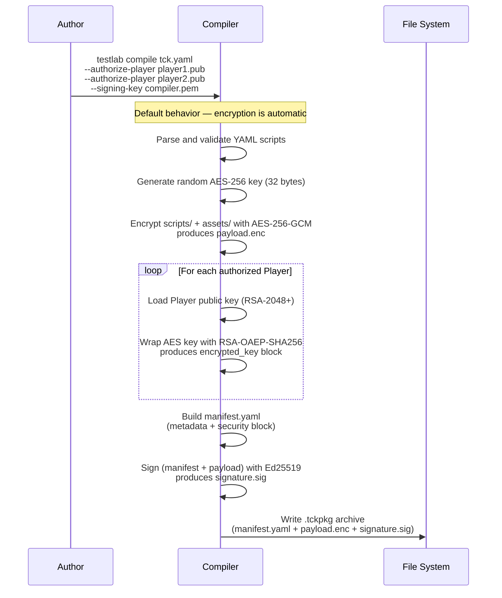
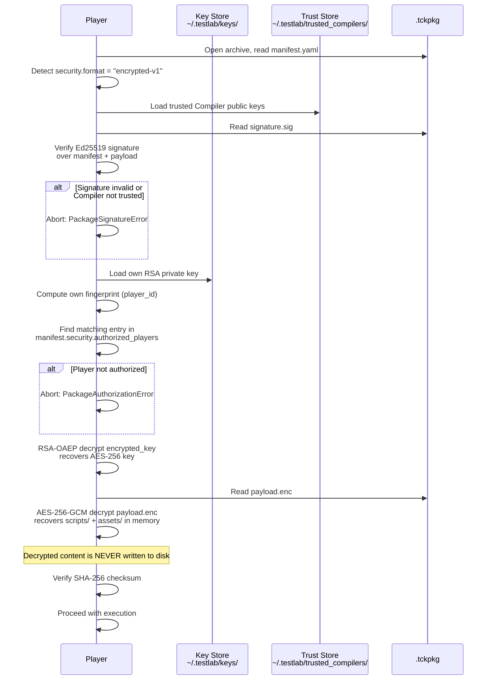
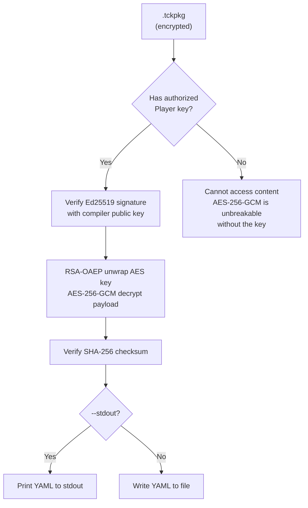

<!--

Eclipse Tractus-X - Software Development KIT

Copyright (c) 2026 Catena-X Automotive Network e.V.
Copyright (c) 2026 Contributors to the Eclipse Foundation

See the NOTICE file(s) distributed with this work for additional
information regarding copyright ownership.

This work is made available under the terms of the
Creative Commons Attribution 4.0 International (CC-BY-4.0) license,
which is available at
https://creativecommons.org/licenses/by/4.0/legalcode.

SPDX-License-Identifier: CC-BY-4.0

-->

# Package Security

## Motivation

Test scripts frequently contain sensitive material: OAuth2 client credentials, service URLs, Business Partner Numbers, and endpoint data that describe the internal topology of a dataspace deployment. If a compiled `.tckpkg` is exfiltrated — through a compromised CI runner, a leaked artifact store, or accidental public upload — all embedded secrets are exposed.

To mitigate this risk, **Testlab encrypts packages by default**. Every compiled `.tckpkg` is a non-human-readable, encrypted artifact. Only Players that hold a valid private key and are explicitly authorized by the Compiler can decrypt and execute the package. A plain-text (unencrypted) mode is available as an explicit opt-in for local development only.

---

## Design Principles

| Principle | Description |
|-----------|-------------|
| **Encrypted by default** | `testlab compile` always produces an encrypted package. Authors must explicitly opt out with `--plain` for local development use. |
| **Defense in depth** | Secrets are protected at rest (AES-256-GCM), in transit (signature verification), and at access (RSA key authorization). |
| **Compiler-controlled access** | The Compiler decides which Players may decrypt a package by wrapping the content key with each authorized Player's RSA public key. |
| **Decompilation requires the Compiler key** | Only the Compiler that originally compiled the package (or a holder of its signing key) can re-sign or re-authorize the package for additional Players. Without the Compiler key, the package cannot be modified, re-authorized, or decompiled. |
| **Non-repudiation** | Every encrypted package is signed with the Compiler's Ed25519 key. Players verify the signature against their trust store before decryption, ensuring the package has not been tampered with and originated from a trusted source. |
| **Minimal metadata exposure** | The `manifest.yaml` remains unencrypted to allow tooling to inspect package metadata (name, version, authorized players) without decryption. No secrets are stored in the manifest. |

---

## Threat Model

| Threat | Scenario | Mitigation |
|--------|----------|------------|
| **Package theft** | An attacker obtains a `.tckpkg` file from CI artifacts, an S3 bucket, or a shared drive. | The `payload.enc` blob is encrypted with AES-256-GCM. Without an authorized Player's RSA private key, the content is indecipherable. |
| **Credential extraction** | An attacker attempts to read OAuth2 secrets, service URLs, or BPN values from the YAML scripts inside the package. | Scripts are never stored in plaintext inside a default-compiled package. All script and asset content is inside the encrypted `payload.enc`. |
| **Package tampering** | An attacker modifies the manifest or payload to inject malicious steps or alter assertions. | The Ed25519 signature covers both manifest and payload. Any modification invalidates the signature. Players reject packages with invalid or missing signatures. |
| **Unauthorized execution** | An attacker attempts to run a stolen package on their own Player instance. | The AES content key is wrapped individually for each authorized Player's RSA public key. An unauthorized Player's fingerprint will not appear in `authorized_players`, and it cannot unwrap the AES key. |
| **Compiler impersonation** | An attacker creates a fake Compiler identity and signs a malicious package. | Players only accept packages signed by Compilers whose Ed25519 public keys are present in the Player's trust store (`~/.testlab/trusted_compilers/`). An unknown Compiler is rejected. |
| **Key compromise (Player)** | A Player's RSA private key is leaked. | The compromised Player's public key should be removed from future compilations. Existing packages remain at risk, but new packages will not authorize the compromised Player. Key rotation is supported — generate a new key pair and re-share the public key. |
| **Key compromise (Compiler)** | A Compiler's Ed25519 signing key is leaked. | Remove the compromised key from all Players' trust stores. Re-compile and re-sign all packages with a new Compiler key pair. |

---

## Encryption Architecture

### Overview

Testlab uses a **hybrid encryption** scheme:

1. **Content encryption** — AES-256-GCM (symmetric) encrypts the actual test scripts and assets into `payload.enc`.
2. **Key wrapping** — RSA-OAEP with SHA-256 (asymmetric) wraps the AES key individually for each authorized Player.
3. **Package signing** — Ed25519 (asymmetric) provides authenticity and tamper detection.

This architecture ensures that:

- A single random AES key encrypts the content (fast, regardless of Player count).
- Each Player receives a copy of the AES key encrypted with its own RSA public key.
- The Compiler signs the entire package, binding the manifest metadata to the encrypted payload.

### Encryption Flow (Compile-time)



### Decryption Flow (Player-side)



### Decompilation

"Decompiling" a package — extracting the original YAML scripts and assets in readable form — requires an authorized Player's private key **and** the Compiler's public signing key (for signature verification):

| Actor | Can decompile? | How |
|-------|---------------|-----|
| **Authorized Player** | Yes | Automatically decrypts during `testlab run` (in memory only). Use `testlab decompile` to extract the original YAML to disk. |
| **Unauthorized Player** | No | Cannot unwrap the AES key. The encrypted payload is opaque binary data. |
| **Third party (no keys)** | No | Cannot bypass AES-256-GCM. Cannot forge Ed25519 signatures. Package is indecipherable. |

#### Command

```bash
testlab decompile connector_e2e-1.0.tckpkg \
  --player-keys .keys/player \
  --compiler-pub .keys/compiler/signing.pub
```

| Flag | Required | Description |
|------|----------|-------------|
| `--player-keys` / `-k` | Yes | Directory containing the Player identity (`encryption.pem`). The Player must be in the package's `authorized_players` list. |
| `--compiler-pub` / `-c` | Yes | Path to the Compiler's Ed25519 public key (`signing.pub`). Used to verify the package signature before decryption. |
| `--output` / `-o` | No | Output YAML file path. Defaults to `<package_name>.yaml`. |
| `--stdout` | No | Print decrypted YAML to stdout instead of writing a file. |

#### Verification Steps

The `decompile` command performs the same security checks as `testlab run`:

1. **Signature verification** — Ed25519 signature is verified against the Compiler's public key.
2. **Key unwrapping** — The AES content key is unwrapped using the Player's RSA private key.
3. **Payload decryption** — AES-256-GCM decrypts the payload.
4. **Integrity check** — SHA-256 checksum of the decrypted content is verified against the manifest.

If any step fails, the command aborts with an error and no output is written.



---

## Key Management

### Identity Model

Every Compiler and Player has a cryptographic identity:

| Entity | Key Type | Purpose | Fingerprint Format |
|--------|----------|---------|-------------------|
| **Player** | RSA-2048+ key pair | Decrypt AES content keys from `authorized_players` blocks | `player:sha256:<hex>` |
| **Compiler** | Ed25519 key pair | Sign packages for authenticity; required for decompilation | `compiler:sha256:<hex>` |

Fingerprints are computed as `SHA-256(DER-encoded public key)` and are used to match identities across manifest entries and trust stores.

### Key Generation

```bash
# Generate Player identity (RSA key pair)
testlab keygen
# Output:
#   ~/.testlab/keys/player.pem  (private, permissions 0600)
#   ~/.testlab/keys/player.pub  (public — share with Compiler)

# Generate Compiler identity (Ed25519 key pair)
testlab keygen --compiler
# Output:
#   ./compiler_signing.pem  (private — keep secure)
#   ./compiler_signing.pub  (public — share with Players)
```

### Directory Layout

```
~/.testlab/
├── keys/
│   ├── player.pem              # Player RSA private key (permissions: 0600)
│   └── player.pub              # Player RSA public key
└── trusted_compilers/
    ├── team_compiler.pub       # Trusted Compiler Ed25519 public key
    └── ci_compiler.pub         # Another trusted Compiler key
```

### Trust Store

The Player's trust store (`~/.testlab/trusted_compilers/`) contains the Ed25519 public keys of Compilers whose packages this Player will accept. The signature verification process:

1. Read `security.compiler_id` from the manifest.
2. Iterate over public keys in `~/.testlab/trusted_compilers/`.
3. Compute the fingerprint of each key and compare against `compiler_id`.
4. If a match is found, verify the Ed25519 signature in `signature.sig`.
5. If no match is found, reject the package with `PackageSignatureError`.

### Key Rotation

| Scenario | Procedure |
|----------|-----------|
| **Rotate Player key** | Generate new key pair (`testlab keygen --force`). Share new `player.pub` with all Compilers. Old packages remain openable with the old key until it is deleted. |
| **Rotate Compiler key** | Generate new key pair (`testlab keygen --compiler`). Distribute new `compiler_signing.pub` to all Players' trust stores. Re-compile and re-sign affected packages. Remove old key from trust stores. |
| **Revoke a Player** | Simply do not include the Player's public key in future `--authorize-player` arguments. Existing packages remain decryptable by the revoked Player until they are re-compiled. |
| **Revoke a Compiler** | Remove the Compiler's public key from all Players' trust stores. Existing packages signed by that Compiler will no longer be accepted. |

### HashiCorp Vault Integration

For production deployments, signing keys can be stored in and retrieved from a [HashiCorp Vault](https://www.vaultproject.io/) KV v2 secrets engine instead of the local filesystem. This centralizes key management, provides audit logging, and avoids distributing private keys to individual machines.

#### Configuration

Vault integration is configured via `testlab.config.yaml`, environment variables, or CLI flags. The precedence order is: CLI flags > environment variables > configuration file > filesystem defaults.

**Configuration file** (`testlab.config.yaml`):

```yaml
vault:
  url: "https://vault.example.com"
  token: "${VAULT_TOKEN}"
  secret_path: "secret/data/testlab/keys"
```

**Environment variables:**

```bash
export TESTLAB_VAULT_URL="https://vault.example.com"
export TESTLAB_VAULT_TOKEN="hvs.CAES..."      # Vault user token
export TESTLAB_VAULT_SECRET_PATH="secret/data/testlab/keys"
```

**CLI flags:**

```bash
testlab keygen --compiler \
  --vault-url https://vault.example.com \
  --vault-token hvs.CAES... \
  --vault-secret-path secret/data/testlab/keys
```

#### Vault Secret Layout

When Vault is configured, keys are stored under the configured `secret_path`:

```
secret/data/testlab/keys/
  player/
    private_key    # PEM-encoded RSA private key
    public_key     # PEM-encoded RSA public key
    fingerprint    # player:sha256:<hex>
  compiler/
    signing_key    # PEM-encoded Ed25519 private key
    verification_key  # PEM-encoded Ed25519 public key
    fingerprint    # compiler:sha256:<hex>
  trusted_compilers/
    <fingerprint>  # PEM-encoded Ed25519 public key per trusted compiler
```

#### Behavior When Vault Is Configured

| Command | Filesystem (default) | Vault |
|---------|---------------------|-------|
| `testlab keygen` | Writes to `~/.testlab/keys/` | Writes to `vault_secret_path/player/` |
| `testlab keygen --compiler` | Writes to current directory | Writes to `vault_secret_path/compiler/` |
| `testlab compile` | Reads `--signing-key` from filesystem | Reads compiler signing key from `vault_secret_path/compiler/signing_key` |
| `testlab run` (encrypted) | Reads Player key from `~/.testlab/keys/` | Reads Player private key from `vault_secret_path/player/private_key` |
| Trust store lookup | Reads from `~/.testlab/trusted_compilers/` | Reads from `vault_secret_path/trusted_compilers/` |

When Vault is configured, the `--signing-key` and `--authorize-player` CLI flags become optional for `compile` — the Compiler reads keys directly from Vault. You can still provide explicit file paths to override the Vault-stored keys.

#### Fallback Behavior

If Vault is unreachable or the token is expired, the security module raises a `VaultConnectionError` with guidance:

```
Error: Cannot connect to Vault at https://vault.example.com
  Verify TESTLAB_VAULT_URL, TESTLAB_VAULT_TOKEN, and network connectivity.
  To use local filesystem keys instead, remove the vault configuration.
```

---

## Compilation Modes

### Default: Encrypted

Every `testlab compile` invocation produces an encrypted package by default:

```bash
# Default behavior — encrypted output
testlab compile tck.yaml \
  --authorize-player player1.pub \
  --authorize-player player2.pub \
  --signing-key compiler.pem \
  --output my_tck-1.0.tckpkg
```

The Compiler requires:

- At least one `--authorize-player` (whose Player can run the package)
- A `--signing-key` (the Compiler's Ed25519 private key)

If `--authorize-player` or `--signing-key` is missing, the Compiler will raise an error:

```
Error: Encryption is enabled by default. You must provide:
  --authorize-player <player.pub>   (at least one authorized Player)
  --signing-key <compiler.pem>      (Compiler signing key)

To compile without encryption (development only), use --plain.
```

### Opt-in: Plain Mode (Development Only)

For local development and debugging, plain mode disables encryption:

```bash
# Development-only — human-readable output
testlab compile tck.yaml --plain --output my_tck-1.0.tckpkg
```

When `--plain` is used:

- No encryption is applied — scripts and assets are stored as-is in the ZIP.
- No `--authorize-player` or `--signing-key` is required.
- A warning is emitted:

```
WARNING: Package compiled in plain mode. Scripts and assets are NOT encrypted.
         Do not distribute plain packages — they may contain secrets.
         Use encrypted mode (default) for any shared or production package.
```

- The `manifest.yaml` will NOT contain a `security` block.
- The archive contains `manifest.yaml`, `scripts/`, and `assets/` in the clear.

### Mode Comparison

| Aspect | Encrypted (default) | Plain (`--plain`) |
|--------|:-------------------:|:-----------------:|
| Scripts readable? | No | Yes |
| Assets readable? | No | Yes |
| Requires Player key? | Yes | No |
| Requires Compiler key? | Yes | No |
| Archive structure | `manifest.yaml` + `payload.enc` + `signature.sig` | `manifest.yaml` + `scripts/` + `assets/` |
| Suitable for distribution? | Yes | No |
| Suitable for CI/CD? | Yes | No (secrets exposed) |
| Decompilable? | Only with Compiler or Player key | Anyone with `unzip` |

---

## CLI Reference

### Compilation Commands

| Command | Description |
|---------|-------------|
| `testlab compile <tck.yaml>` | Compile with encryption (default) — requires `--authorize-player` and `--signing-key` |
| `testlab compile <tck.yaml> --plain` | Compile without encryption (development only) |
| `testlab compile <tck.yaml> --authorize-player <key.pub>` | Authorize a Player to decrypt (repeatable) |
| `testlab compile <tck.yaml> --signing-key <key.pem>` | Sign with Compiler Ed25519 key |
| `testlab compile <tck.yaml> --output <file>` | Specify output filename |

### Key Management Commands

| Command | Description |
|---------|-------------|
| `testlab keygen` | Generate Player RSA key pair (`~/.testlab/keys/`) |
| `testlab keygen --compiler` | Generate Compiler Ed25519 key pair (current directory) |
| `testlab keygen --force` | Overwrite existing keys (key rotation) |
| `testlab export-key --player` | Print Player public key to stdout |
| `testlab export-key --fingerprint` | Print Player fingerprint |
| `testlab keygen --vault-url <url> --vault-token <token> --vault-secret-path <path>` | Generate keys and store in HashiCorp Vault |
| `testlab keygen --compiler --vault-url <url> --vault-token <token> --vault-secret-path <path>` | Generate Compiler keys and store in Vault |

### Inspection and Decompilation Commands

| Command | Description |
|---------|-------------|
| `testlab inspect <package>` | Show manifest metadata (works on both plain and encrypted) |
| `testlab inspect <package> --decrypt` | Decrypt and display script contents (requires authorized Player key) |
| `testlab decompile <package> --signing-key <key.pem>` | Export decrypted scripts and assets to filesystem (requires Compiler key) |
| `testlab decompile <package> --signing-key <key.pem> --output-dir <dir>` | Export to a specific directory |

---

## Error Handling

| Error | Cause | Resolution |
|-------|-------|------------|
| `PackageAuthorizationError` | Player's fingerprint not found in `authorized_players` | Ask the Compiler to re-compile with your Player's public key |
| `PackageDecryptionError` | RSA key unwrapping or AES decryption failed | Verify the correct Player private key is at `~/.testlab/keys/player.pem` |
| `PackageSignatureError` | Compiler not in trust store, or signature is invalid | Add the Compiler's `*.pub` to `~/.testlab/trusted_compilers/`, or the package may be tampered |
| `ChecksumError` | SHA-256 mismatch after decryption | Package content was corrupted — re-obtain from the Compiler |
| `MissingEncryptionArgsError` | `--authorize-player` or `--signing-key` not provided (and `--plain` not set) | Provide the required keys, or use `--plain` for development |
| `VaultConnectionError` | Cannot reach Vault server, or token is expired/invalid | Verify `TESTLAB_VAULT_URL`, `TESTLAB_VAULT_TOKEN`, and network connectivity. Remove vault config to use local keys |

---

## NOTICE

This work is licensed under the [CC-BY-4.0](https://creativecommons.org/licenses/by/4.0/legalcode).

- SPDX-License-Identifier: CC-BY-4.0
- SPDX-FileCopyrightText: 2025, 2026 Contributors to the Eclipse Foundation
- SPDX-FileCopyrightText: 2025, 2026 Catena-X Automotive Network e.V.
- Source URL: [https://github.com/eclipse-tractusx/tractusx-sdk](https://github.com/eclipse-tractusx/tractusx-sdk)