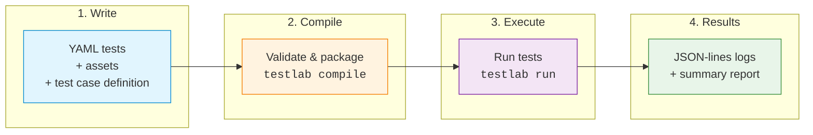

<!--

Eclipse Tractus-X - Software Development KIT

Copyright (c) 2026 Catena-X Automotive Network e.V.
Copyright (c) 2026 Contributors to the Eclipse Foundation

See the NOTICE file(s) distributed with this work for additional
information regarding copyright ownership.

This work is made available under the terms of the
Creative Commons Attribution 4.0 International (CC-BY-4.0) license,
which is available at
https://creativecommons.org/licenses/by/4.0/legalcode.

SPDX-License-Identifier: CC-BY-4.0

-->

# Walkthrough

This walkthrough guides you through the complete Testlab lifecycle — from writing your first YAML test scripts, through compiling them into a portable `.testpkg` package, to executing tests and interpreting results.

## What You'll Build

By the end of this walkthrough, you will have:

1. **Written** two YAML test scripts that validate connector data exchange end-to-end
2. **Organized** them into a test case with shared variables and supporting assets
3. **Compiled** the test case into a distributable `.testpkg` package
4. **Executed** the tests against live connectors and reviewed the results

## Workflow Overview

## Prerequisites

- Python 3.12+
- `tractusx-sdk` installed (`pip install tractusx-sdk`)
- Access to a provider and consumer connector (URLs + API keys or OAuth2 credentials)

## Sections

| Section | Description |
|---------|-------------|
| [Writing Test Scripts](writing-test-scripts.md) | Create YAML tests, declare variables, define steps and assertions, organize into a test case with assets |
| [Compiling Packages](compiling-packages.md) | Validate and package scripts into `.testpkg`, inspect the compiled output, compile with encryption |
| [Executing Tests](executing-tests.md) | Run tests via CLI, provide runtime variables, read results, use the Player API programmatically |

---

## NOTICE

This work is licensed under the [CC-BY-4.0](https://creativecommons.org/licenses/by/4.0/legalcode).

- SPDX-License-Identifier: CC-BY-4.0
- SPDX-FileCopyrightText: 2025, 2026 Contributors to the Eclipse Foundation
- SPDX-FileCopyrightText: 2025, 2026 Catena-X Automotive Network e.V.
- Source URL: [https://github.com/eclipse-tractusx/tractusx-sdk](https://github.com/eclipse-tractusx/tractusx-sdk)