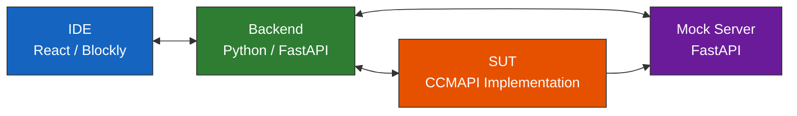
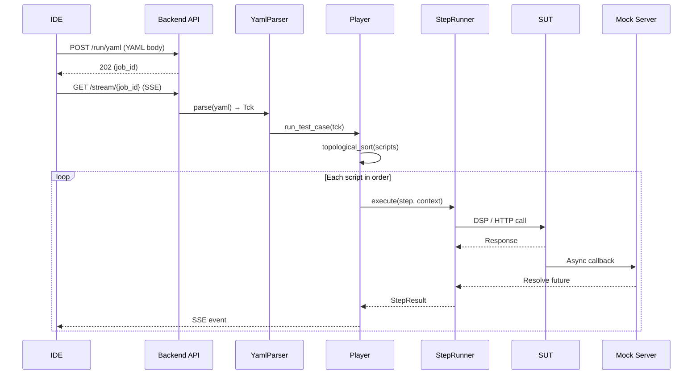
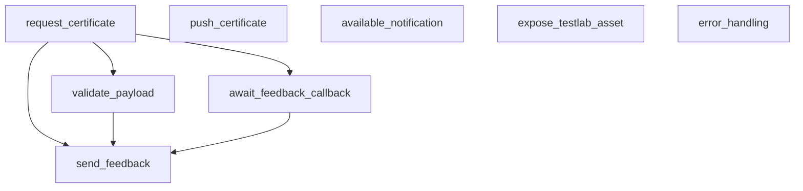
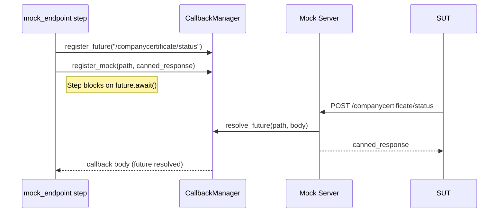
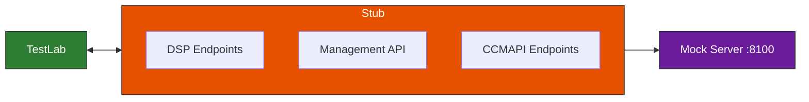

<!--
 Eclipse Tractus-X - Tractus-X TestLab

 Copyright (c) 2026 Contributors to the Eclipse Foundation

 See the NOTICE file(s) distributed with this work for additional
 information regarding copyright ownership.

 This program and the accompanying materials are made available under the
 terms of the Apache License, Version 2.0 which is available at
 https://www.apache.org/licenses/LICENSE-2.0.

 Unless required by applicable law or agreed to in writing, software
 distributed under the License is distributed on an "AS IS" BASIS, WITHOUT
 WARRANTIES OR CONDITIONS OF ANY KIND, either express or implied. See the
 License for the specific language governing permissions and limitations
 under the License.

 SPDX-License-Identifier: Apache-2.0
-->
<!-- This documentation was partially generated using artificial intelligence (AI) (Tool: Copilot, Model: Claude Opus 4.6). -->
<!-- It was reviewed and tested by a human committer. -->

# Company Certificate Management — Architecture Guide

This guide explains the system architecture, execution design, and extension points of the CX-0135 conformity test suite.

## System Architecture

Four components collaborate during a test run:



| Component | Technology | Role |
|-----------|-----------|------|
| **IDE** | React 19, Blockly 12, TypeScript | Visual test authoring and real-time execution monitoring |
| **Backend** | Python 3.12, FastAPI | YAML parsing, test orchestration, step execution |
| **Mock Server** | Embedded FastAPI | Callback endpoints, canned responses for inbound SUT calls |
| **SUT** | Any CX-0135 implementation | The system being validated |

## Execution Architecture

When a user clicks Execute in the IDE, this sequence runs:



### IDE → Backend handoff

1. `ExecuteButton.handleExecute()` converts the Blockly workspace to YAML via `modelToYaml()`
2. `useExecutionStore.execute(yaml)` sends `POST /testlab/test-execution/run`
3. The backend returns HTTP 202 with a `job_id`
4. The IDE opens an SSE stream at `GET /testlab/test-execution/{job_id}/stream`
5. The backend emits `step.started`, `step.completed`, and `step.failed` events
6. The `ExecutionPanel` renders results as they arrive

### Backend orchestration

1. `YamlParser` deserializes the YAML into a `Tck` model (metadata + variables + test references)
2. Each test reference resolves to a `Script` (setup steps + main steps + teardown steps)
3. The `Player` calls `topological_sort(scripts)` to order scripts by `depends_on` edges
4. For each script: run setup → run main steps → run teardown (even if main steps fail)
5. Per step: resolve `@variable` references → call `step.execute()` → evaluate assertions → store outputs

## Test Orchestration Design

### Why topological sorting?

Tests declare dependencies via `import_variable`. For example, `validate_payload` imports `document_id` from `request_certificate`. The player builds a dependency graph and runs scripts in an order that satisfies all imports.



Independent scripts (no inbound edges) can run in any order. The player preserves declaration order for independent scripts.

### Variable flow

Variables propagate through three mechanisms:

| Mechanism | Scope | Example |
|-----------|-------|---------|
| `store_in_variable` | Within a single script | `json_path_extract` stores `ccmapi_asset_id` |
| `store_in_memory` | Within a single script | `http_call_dataplane` stores `document_id` from response |
| `export_variable` / `import_variable` | Across scripts | `request_certificate` exports `request_id`; `send_feedback` imports it |

All variables use `@name` syntax in YAML. The step runner resolves them from the execution context before calling the step executor.

### Callback handling

The CCM suite uses asynchronous callbacks: the SUT processes a request and later POSTs a status update to a TestLab endpoint. The `CallbackManager` handles this:



1. `mock_endpoint` registers an `asyncio.Future` for a specific HTTP path
2. The step blocks waiting for the future to resolve
3. When the SUT sends an HTTP request to the mock server at that path, the mock server resolves the future
4. The mock server also returns a canned response to the SUT
5. The original step unblocks with the received callback body

## CX-0135 Compliance Mapping

Each CX-0135 requirement maps to a specific test and step type:

| CX-0135 Requirement | Test | Step Type | What Is Validated |
|---------------------|------|-----------|-------------------|
| §2.1.1.1 REQUEST mechanism | `request_certificate` | `http_call_dataplane` | POST with header+content envelope returns 200 |
| §3.1 Semantic model | `validate_payload` | `validate_schema` | Payload matches BusinessPartnerCertificate v3.1.0 |
| §2.1.1.3 FEEDBACK inbound | `await_feedback_callback` | `wait_for_call` | SUT sends callback to `/companycertificate/status` |
| §2.1.1.3 FEEDBACK outbound | `send_feedback` | `http_call_dataplane` | Feedback notification via EDC data plane |
| §2.1.1.2 PUSH mechanism | `push_certificate` | `http_call_dataplane` | Push via data plane to `/companycertificate/push` |
| §2.1.1.4 AVAILABLE notification | `available_notification` | `http_call_dataplane` | Notification to `/companycertificate/available` |
| §2.1.4.1 Provider asset exposure | `expose_testlab_asset` | `create_asset` + `wait_for_call` | SUT discovers and pulls from TestLab EDC |
| §2.1.1.1.4 Error handling | `error_handling` | `http_call_dataplane` | REJECTED status in response envelope |

### Dataspace protocol mapping

Every test that communicates with the SUT follows the standard EDC flow:

| DSP Phase | TestLab Step Type | Purpose |
|-----------|-------------------|---------|
| Catalog discovery | `query_catalog` | Find the CCMAPI asset in the provider's catalog |
| Contract negotiation | `negotiate` | Agree on usage policies (e.g., `cx.ccm.base:1`) |
| Transfer initiation | `initiate_transfer` | Get an EDR with data plane auth credentials |
| Data plane call | `http_call_dataplane` | Send the actual CCMAPI message via the EDR |

## Mock Server Architecture

The embedded mock server serves two purposes: it provides canned responses to the SUT and it captures inbound requests for assertion.

### Registration flow

The `mock_endpoint` step type registers both a canned response and a callback future:

```python
# Simplified — actual implementation in step executors
mock_server.register_mock(path="/companycertificate/status", response=canned_body)
future = callback_manager.register_future(path="/companycertificate/status")
```

When the SUT hits the mock path, the server:

1. Returns the canned response to the SUT (so the SUT sees a valid response)
2. Resolves the future with the request body (so the test step can assert on it)

### wait_for_call

The `wait_for_call` step blocks on the registered future with a configurable timeout (`sut_response_timeout`). If the SUT never calls back, the step fails with a timeout error.

## SUT Stub Architecture

The stub at `stubs/ccm-sut/` replaces a real EDC connector and CCMAPI service for local testing.

### What the stub replaces



### Endpoint behavior

| Endpoint | Behavior |
|----------|----------|
| `POST /api/v1/dsp/catalog/request` | Returns catalog with 2 datasets: CCMAPI (`ccm-offer-001`) and Submodel (`cert-asset-001`) |
| `POST /api/v1/dsp/negotiations/initial` | Auto-finalizes, returns agreement ID |
| `POST /management/v3/transferprocesses` | Returns static transfer ID |
| `GET /management/v3/edrs/{id}/dataaddress` | Returns EDR: `endpoint=localhost:8090`, `authCode=edr-token-xxx` |
| `POST /companycertificate/request` | Returns `{requestStatus: COMPLETED}` + schedules 10s callback |
| `POST /companycertificate/push` | Returns OK + schedules 1s feedback callback |
| `POST /companycertificate/available` | Returns OK (no callback) |
| `POST /companycertificate/notification/receive` | Returns OK + schedules 1s ack callback |

### Callback mechanism

The stub sends three types of async callbacks to the TestLab mock server:

| Trigger | Callback URL | Delay | Payload |
|---------|-------------|-------|---------|
| `/companycertificate/request` | `/companycertificate/status` | 10s | `{certificateStatus: RECEIVED, documentId}` |
| `/companycertificate/push` | `/companycertificate/status` | 1s | `{certificateStatus: RECEIVED}` |
| `/companycertificate/notification/receive` | `/companycertificate/notification/receive` | 1s | Notification ack |

### Startup consumer simulation

On startup, the stub waits 20s then GETs `{TESTLAB_CALLBACK_URL}/api/v1/companycertificate` to simulate a real SUT pulling TestLab's exposed asset (for `expose_testlab_asset`).

### Extending the stub

Add routes in `app.py`, response builders in `responses.py`. See `stubs/ccm-sut/README.md` for details.

## Extension Points

### Adding a new standard's test suite

1. Create a directory under `ide/public/examples/` (e.g., `quality-management-v1.0/`)
2. Write an `index.yaml` with `kind: tck`, metadata, variables, and test references
3. Write individual test YAML files with `kind: test`
4. Add the example to the IDE's example project list

### Creating custom step executors

Implement a new step executor in `src/tractusx_testlab/steps/` that inherits from the base step executor protocol. Register it in the step executor registry with a unique `type` string.

### Adding new assertion types

Define a new assertion type in the assertion evaluator. Each assertion receives the step output and evaluates a condition (e.g., `EQUALS`, `NOT_NULL`, `ASSERT_FIELD`, `SCHEMA_VALID`).

### CI/CD integration

Run the test suite headless via CLI:

```bash
testlab run index.yaml --config run-config.yaml --output results.json
```

Parse `results.json` for pass/fail status in your CI pipeline.

## Design Decisions

| Decision | Rationale | Reference |
|----------|-----------|-----------|
| SSE over WebSocket | Simpler server push, no bidirectional channel needed | [ADR-0003](../developer/decision-records/shared/ADR-0003-sse-for-live-ide-execution.md) |
| YAML over JSON for tests | Human-readable, supports comments, familiar to DevOps | Project convention |
| Topological sort over linear | Enables parallel-safe independent tests, enforces dependencies | Player design |
| `asyncio.Future` for callbacks | Native async/await integration, no polling, timeout support | Mock server design |
| `@variable` syntax | Distinct from shell `${var}`, readable in YAML without escaping | [Specification](../specification/reference/yaml-format.md) |

## Next Steps

- **[Developer Guide](ccm-developer-guide.md)** — Setup, running, and debugging
