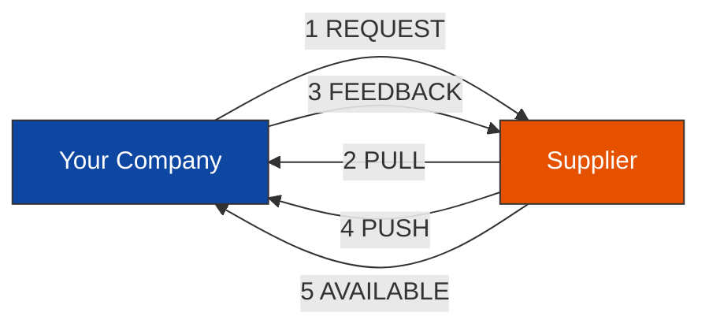
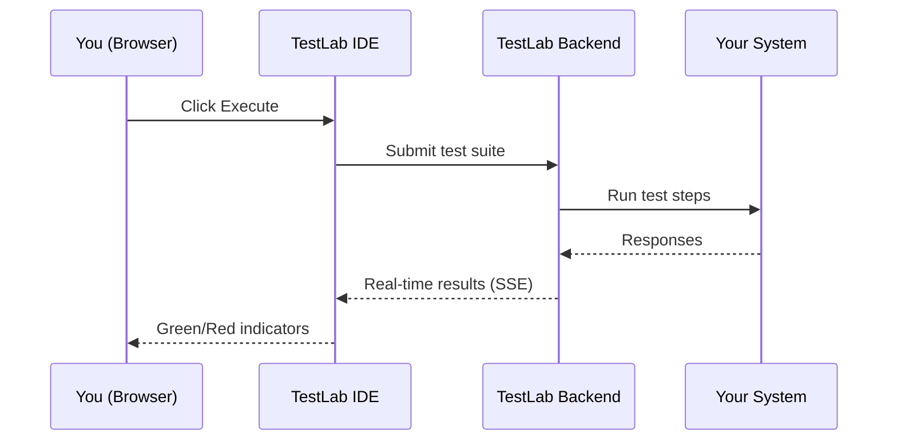

<!--
 Eclipse Tractus-X - Tractus-X TestLab

 Copyright (c) 2026 Contributors to the Eclipse Foundation

 See the NOTICE file(s) distributed with this work for additional
 information regarding copyright ownership.

 This program and the accompanying materials are made available under the
 terms of the Apache License, Version 2.0 which is available at
 https://www.apache.org/licenses/LICENSE-2.0.

 Unless required by applicable law or agreed to in writing, software
 distributed under the License is distributed on an "AS IS" BASIS, WITHOUT
 WARRANTIES OR CONDITIONS OF ANY KIND, either express or implied. See the
 License for the specific language governing permissions and limitations
 under the License.

 SPDX-License-Identifier: Apache-2.0
-->
<!-- This documentation was partially generated using artificial intelligence (AI) (Tool: Copilot, Model: Claude Opus 4.6). -->
<!-- It was reviewed and tested by a human committer. -->

# Company Certificate Management — Business Guide

This guide explains what the CX-0135 certificate management test suite validates and how to run it — no coding required.

## What This Tests

The Catena-X standard **CX-0135** defines how companies exchange certificates (ISO 9001, IATF 16949, ISO 14001, etc.) through secure data channels. TestLab validates that your company's implementation handles the complete certificate lifecycle correctly.

**Why it matters:** Companies in the Catena-X network must prove compliance. Automated conformity testing catches problems before they block real business transactions.

## The Certificate Lifecycle

CX-0135 defines five mechanisms for exchanging certificates between companies:

| Mechanism | What Happens | Business Example |
|-----------|--------------|------------------|
| **REQUEST** | You ask a supplier for a certificate | "Send us your ISO 9001 certificate" |
| **PULL** | You download the certificate through a secure channel | "Download the certificate document" |
| **FEEDBACK** | You confirm receipt and validity of the certificate | "We received your certificate — it's valid" |
| **PUSH** | A supplier proactively sends you a new certificate | "Here's our renewed IATF 16949 certificate" |
| **AVAILABLE** | A supplier notifies you a certificate is ready | "A new ISO 14001 certificate is available" |

All exchanges happen through Eclipse Dataspace Connectors (EDCs) — secure gateways that enforce access policies and data sovereignty.

## What TestLab Validates

The test suite runs 8 scenarios covering the full CX-0135 standard:

| Test | What It Checks | Business Meaning |
|------|----------------|------------------|
| Request Certificate | Can your system accept certificate requests? | Suppliers can ask you for certificates |
| Validate Payload | Does the certificate data match the standard format? | Your certificates are machine-readable |
| Await Feedback | Does your system send status callbacks? | Partners know their request is being processed |
| Send Feedback | Can your system receive feedback notifications? | You get confirmation when certificates arrive |
| Push Certificate | Can your system send certificates proactively? | You can distribute new certificates automatically |
| Available Notification | Can your system notify about available certificates? | Partners know when to download new certificates |
| Expose Asset | Can your system publish certificate data for download? | Your certificates are discoverable in the network |
| Error Handling | Does your system reject invalid requests correctly? | Bad requests get clear error responses |

**Pass** (green) = your implementation meets the CX-0135 requirement.
**Fail** (red) = your implementation needs changes before certification.

## Running the Tests

### Step 1: Open the TestLab IDE

Open your browser and navigate to the TestLab IDE (your administrator provides the URL). You see a visual editor with blocks on a canvas.

### Step 2: Load the Certificate Management Example

1. Click **"Example Projects"** in the welcome screen
2. Select **"Certificate Management (CX-0135)"**
3. The editor loads the pre-built test suite with 8 test scenarios

### Step 3: Configure Your Test Environment

Click the **run configuration** panel and fill in your company details:

| Field | What to Enter |
|-------|---------------|
| Provider Address | Your EDC connector's DSP endpoint URL |
| Provider BPN | Your company's Business Partner Number (BPNL) |
| Consumer BPN | The test partner's Business Partner Number |

!!! tip "Using the stub for a quick demo"
    You can run the tests against a local stub server without a real EDC connector. See the [Developer Guide](ccm-developer-guide.md) for instructions.

### Step 4: Click Execute

Press the **Execute** button in the toolbar. The IDE sends the test suite to the backend and streams results back in real-time.

### Step 5: Read the Results

The execution panel shows each test step with a status indicator:

- **Green checkmark** — the step passed
- **Red X** — the step failed (expand for details)
- **Spinner** — the step is running

Each failed step includes an explanation: what was expected, what was received, and what to do next.

## Understanding Failures

| Failure | What It Means | Next Step |
|---------|---------------|-----------|
| "Catalog query returned no datasets" | Your EDC connector doesn't advertise a CCMAPI asset | Register a CCMAPI-type asset in your EDC |
| "Contract negotiation failed" | Your access policies rejected the test partner | Check your EDC policies allow the test BPN |
| "Schema validation failed" | Your certificate data is missing required fields | Compare your payload against the CX-0135 v3.1.0 schema |
| "Timed out waiting for callback" | Your system didn't send a status callback | Verify your system sends HTTP callbacks after processing |
| "Unexpected status: REJECTED" | Your system rejected a valid request | Check your validation logic for false rejections |

## Glossary

| Term | Plain-English Meaning |
|------|----------------------|
| **BPN / BPNL** | Business Partner Number — a unique company ID in the Catena-X network |
| **EDC** | Eclipse Dataspace Connector — a secure gateway for data exchange |
| **CCMAPI** | Company Certificate Management API — the standard interface for certificate exchange |
| **DSP** | Dataspace Protocol — the communication standard between EDC connectors |
| **SUT** | System Under Test — your implementation being validated |
| **TCK** | Technology Compatibility Kit — a suite of tests that verifies standard compliance |
| **CX-0135** | The Catena-X standard for company certificate management |

## Next Steps

- **[Developer Guide](ccm-developer-guide.md)** — Set up the test environment and debug failures
- **[Architecture Guide](ccm-architecture-guide.md)** — Understand the system design and extension points
- **[CCM Conformity Testing](ccm-conformity-testing.md)** — Detailed test reference
