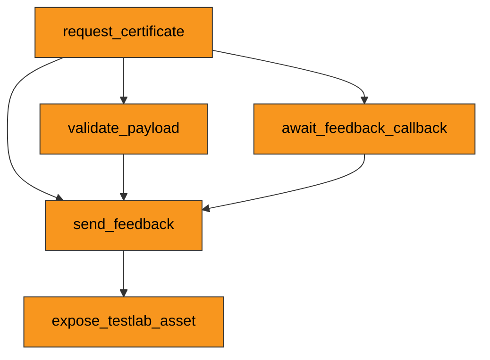

<!--
 Eclipse Tractus-X - Tractus-X TestLab

 Copyright (c) 2026 Catena-X Automotive Network e.V.
 Copyright (c) 2026 Contributors to the Eclipse Foundation

 Licensed under the Creative Commons Attribution 4.0 International License
 (the "License"); you may not use this file except in compliance with the
 License. You may obtain a copy of the License at

    https://creativecommons.org/licenses/by/4.0/

 Unless required by applicable law or agreed to in writing, software
 distributed under the License is distributed on an "AS IS" BASIS,
 WITHOUT WARRANTIES OR CONDITIONS OF ANY KIND, either express or implied.
 See the License for the specific language governing permissions and
 limitations under the License.

 SPDX-License-Identifier: CC-BY-4.0
-->
<!-- This documentation was partially generated using artificial intelligence (AI) (Tool: Copilot, Model: Claude Sonnet 4). -->
<!-- It was reviewed and tested by a human committer. -->

# CCM Conformity Testing

Run Certificate Credential Management (CCM) conformity tests against a System Under Test (SUT) to verify compliance with the Catena-X CX-0135 standard.

## What is CCM Conformity Testing?

The CX-0135 standard defines how Catena-X participants exchange company certificates (ISO 9001, IATF 16949, etc.) through EDC connectors using the CCMAPI. TestLab provides a ready-made test suite that validates whether your implementation handles the full certificate lifecycle correctly.

**Who should use this guide:**

- Developers implementing a CCMAPI-compliant service
- Quality engineers validating CX-0135 conformity before release
- Test architects adapting this suite as a template for other Catena-X standards

## CCM Test Suite Overview

The suite contains five tests executed in sequence. Each test builds on outputs from previous tests.

| Test | Purpose |
|------|---------|
| `request_certificate` | Query provider catalog, negotiate contract, POST certificate request |
| `validate_payload` | Fetch certificate and validate against BusinessPartnerCertificate v3.1.0 schema |
| `await_feedback_callback` | Expose callback endpoint; wait for provider to POST status feedback |
| `send_feedback` | Send feedback notification via EDC dataplane; await provider acknowledgment |
| `expose_testlab_asset` | Register CCMAPI asset in TestLab EDC; verify SUT discovers and pulls data |

### Test Flow



## Test Suite Structure

### Index file and test references

The suite uses an `index.yaml` file that declares metadata, variables, and references individual test files:

```yaml
kind: test-case
name: certificate-management
version: "1.0"

standards:
  - id: CX-0135
    version: "2.4.0"

variables:
  provider_address:
    type: str
    description: Provider EDC DSP endpoint
    runtime: true
  # ... more variables

tests:
  - test: tests/request_certificate.yaml
    description: Query provider catalog for CCMAPI offer
  - test: tests/validate_payload.yaml
    description: Validate certificate payload against schema
```

Each `test:` entry points to a YAML file with `kind: test`. Tests declare dependencies using `depends_on` to share outputs.

### Step types used in CCM

| Step Type | When to Use |
|-----------|-------------|
| `query_catalog` | Discover assets in an EDC connector's catalog |
| `extract_dataset` | Extract asset/offer IDs from a catalog response |
| `negotiate` | Negotiate an EDC contract for an asset |
| `initiate_transfer` | Get dataplane access credentials (EDR token) |
| `http_call` | Make HTTP requests to dataplane endpoints |
| `validate_semantic_schema` | Validate JSON against a SAMM semantic model |
| `json_path_extract` | Extract values from JSON using a path expression |
| `mock_endpoint` | Expose a temporary HTTP endpoint for callbacks |
| `wait_for_call` | Block until a mock endpoint receives a request |
| `create_asset` | Register an asset in an EDC connector |
| `create_policy` | Create an access/contract policy |
| `create_contract_def` | Link an asset to policies via a contract definition |
| `send_notification` | Send a CX notification through the EDC dataplane |
| `generate_uuid` | Generate a random UUID |

### Variable flow between steps

Variables flow through two mechanisms:

1. **`store_in_memory`** — saves step outputs into named variables:

    ```yaml
    store_in_memory:
      contract_agreement_id: "agreement_id"
    ```

2. **`@variable_name`** — references a stored variable in subsequent steps:

    ```yaml
    params:
      agreement_id: "@contract_agreement_id"
    ```

3. **`depends_on`** — shares variables across test files:

    ```yaml
    depends_on:
      - file: tests/request_certificate.yaml
        outputs:
          - request_id
    ```

### Assertions

Each step can include `expect` blocks with four assertion types:

```yaml
expect:
  - output: status_code
    equals: 200              # exact match
  - output: request_id
    not_null: true           # value exists and is not null
  - output: response_body
    not_empty: true          # value is not empty string/list
  - output: value
    equals: "@certificate_type"  # match against a variable
```

### Service configuration

Tests declare EDC connector services with connection details:

```yaml
services:
  - name: provider_edc
    type: edc_connector_saturn
    config:
      management_url: "@provider_address"
```

### Adapting for other standards

To create a test suite for a different Catena-X standard:

1. Copy `ide/public/examples/certificate-management-v1.0/` to a new directory
2. Update `index.yaml`: change `name`, `standards`, and `variables`
3. Replace test files with steps matching your standard's API
4. Keep the same patterns: catalog query → negotiate → transfer → call → assert

## Understanding Test Results

### Exit codes

| Exit Code | Meaning |
|-----------|---------|
| `0` | All tests passed |
| `1` | One or more assertions failed |

### Reading results programmatically

The `TestCaseResult` object contains the full execution tree:

```
TestCaseResult
├── status: PASSED | FAILED
├── scripts: list[ScriptResult]
│   ├── script_name: "request-certificate"
│   ├── status: PASSED | FAILED
│   ├── assertion_summary: {total, passed, failed_hard, failed_soft}
│   └── steps: list[StepResult]
│       ├── step_name: "POST certificate request"
│       ├── status: PASSED | FAILED
│       ├── error: "Expected 200, got 403"
│       └── assertions: list[AssertionResult]
│           ├── passed: bool
│           ├── expected: 200
│           └── actual: 403
```

### Identifying failures

When a test fails, check these fields on each `StepResult`:

- **`step_name`** — which step failed (matches the `description` in YAML)
- **`step_type`** — what kind of step it was (`http_call`, `negotiate`, etc.)
- **`error`** — human-readable error message
- **`assertions`** — list of individual assertion results with `expected` vs `actual`

## Integrating into Another Application

### Running tests programmatically

```python
import asyncio
from tractusx_testlab.player.execution.player import TestlabPlayer

async def run_ccm_tests():
    player = TestlabPlayer()
    result = await player.run(
        "path/to/certificate-management-v1.0/index.yaml",
        runtime_vars={
            "provider_address": "https://provider-edc.example.com/api/v1/dsp",
            "provider_bpn": "BPNL000000000001",
            "consumer_bpn": "BPNL000000000002",
            "location_bpns": "BPNS000000000001",
            "testlab_management_url": "https://testlab-edc.example.com/management",
            "testlab_dsp_url": "https://testlab-edc.example.com/api/v1/dsp",
        },
    )

    # Check overall result
    print(f"Status: {result.status}")
    print(f"Steps passed: {result.passed}/{result.total}")

    # Inspect individual scripts
    for script in result.scripts:
        summary = script.assertion_summary
        print(f"  {script.script_name}: {script.status}")
        print(f"    Assertions: {summary.passed}/{summary.total} passed")

        # Show failures
        for step in script.steps:
            if step.error:
                print(f"    FAILED: {step.step_name} — {step.error}")

    # CI/CD exit code
    return 0 if result.status.value == "PASSED" else 1

exit_code = asyncio.run(run_ccm_tests())
raise SystemExit(exit_code)
```

### Validating without executing

Use the `Compiler` to validate test YAML syntax before running:

```python
from pathlib import Path
from tractusx_testlab.compiler.compiler import Compiler

compiler = Compiler()
validation = compiler.validate(Path("path/to/index.yaml"))
print(f"Valid: {validation}")
```
